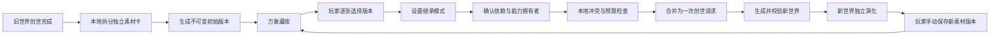

# 创世素材库（万象藏库）设计

日期：2026-07-21
状态：已确认，待实施

## 1. 目标

让后续创造世界时能够复用过去世界的独立卡片，同时满足：

- 已完成创世的卡片自动收录，删除来源世界后仍永久保留。
- 玩家手动逐张选择素材，不调用模型推荐。
- 收藏素材优先显示；素材可隐藏。
- 支持“融合改写”“原样继承”“完全锁定”三种约束强度。
- 卡片存在不可变版本；创世初始版自动保存，剧情当前版由玩家手动保存。
- 能力既随所属卡片保存，也可作为独立素材复用。
- 依赖关系、独立能力拥有者和冲突处理在创世前明确决定。
- 所有素材在一次现有的流式创世请求中使用，不因素材数量拆成多次模型调用。

## 2. 非目标

首版不包含：

- 根据神谕调用模型推荐素材。
- 每章自动为变化卡片生成版本。
- 修改或覆盖历史版本。
- 在不同世界之间持续同步同一素材对象。
- 通过额外模型调用压缩素材或预判语义冲突。

## 3. 核心概念

### 3.1 MaterialCard（素材卡）

代表一个可复用对象，保存可查询的索引信息：

- `userId`
- 素材类型
- 展示名称、摘要
- 收藏状态 `favorite`
- 隐藏状态 `hidden`
- 来源世界 ID（可为空）
- 来源世界名称快照
- 来源对象类型及稳定引用
- 默认版本 ID
- 最近使用时间
- 创建、更新时间

收藏与隐藏属于素材卡，不属于某个版本。来源世界删除后，来源 ID 可被清空，但来源名称快照和素材内容保留。

### 3.2 MaterialVersion（素材版本）

代表不可变内容快照，保存：

- 素材卡 ID
- 版本序号、版本名称和备注
- 完整 JSON 内容
- `schemaVersion`
- 是否创世初始版
- 来源版本 ID（复制编辑链）
- 依赖清单
- 隐藏内容与可见性
- 创建时间

版本一旦保存不得覆盖。编辑历史版本必须“复制为新版本”。每张素材卡至少保留一个版本。

### 3.3 素材类型

独立保存：

- 玩家神、主要神
- 主要人物
- 种族
- 势力
- 地点
- 能力
- 宇宙论
- 融合公理（存在时）
- 时代冲突
- 叙事风格
- 世界主题

能力默认属于人物、神或种族卡的状态，同时拥有可单独选择的独立能力素材卡。所属卡保存必要能力快照/引用，独立能力卡是跨世界单独复用的主入口。

## 4. 收录与版本生命周期

### 4.1 自动收录

世界创世成功并完成落地后，本地拆分完整卡组：

1. 按独立对象粒度创建素材卡。
2. 为每张素材卡生成“初始版 · 创世时”。
3. 保存稳定引用、依赖、能力和隐藏内容。
4. 默认不收藏、不隐藏。
5. 使用“来源对象稳定引用 + 初始版本类型”保证幂等。

自动收录不调用模型。收录失败不得阻塞世界落地；记录待补收录状态并允许本地重试。

### 4.2 剧情版本

原世界对象继续独立演化，不自动产生素材版本。玩家可在神明、人物、种族、势力、地点或能力详情页点击“保存为创世素材版本”，填写：

- 版本名称
- 版本备注
- 是否设为默认版本

保存当前完整状态，包括能力、关系、所属、来源能力、依赖以及已揭示/隐藏内容。已有素材卡则追加版本；没有则新建素材卡。

### 4.3 复制编辑

历史版本只读。复制编辑时：

1. 复制完整 JSON。
2. 在素材编辑器修改。
3. 本地执行 Schema、稳定引用、能力类型及依赖校验。
4. 保存成新的不可变版本。
5. 记录来源版本 ID。

不影响来源世界、旧版本或已创建的新世界。

### 4.4 删除

- 删除来源世界：素材永久保留，并标记“来源世界已删除”。
- 删除版本：若尚未启动的创世草稿引用它，先要求解除引用；已启动任务使用自己的快照。
- 删除整张素材卡：删除所有版本；已经创建的新世界不受影响。
- 初始版允许删除，但素材卡不能没有版本。

## 5. 万象藏库

主界面增加“万象藏库”入口。

默认排序：

1. 已收藏
2. 最近使用
3. 最近保存版本
4. 其他素材

支持按素材类型、来源世界、收藏状态、隐藏状态、版本类别和关键词筛选。隐藏素材默认不显示，可通过“显示隐藏素材”查看。

每张素材卡支持：

- 收藏/取消收藏
- 隐藏/取消隐藏
- 查看完整内容和全部版本
- 选择默认版本
- 复制版本进行编辑
- 删除版本或整张素材卡
- 查看来源世界

所有列表、排序、收藏、隐藏和搜索均使用本地数据库，不调用模型。

## 6. 新世界选择流程

### 6.1 入口

原初神谕区域增加“引用创世素材（已选 N 项）”。打开后由玩家手动逐张选择素材与具体版本，不提供模型智能推荐。

### 6.2 复用模式

#### 融合改写

保留灵感核心，允许模型重构名称、身份、阵营、关系、表现形式和能力体系适配。

#### 原样继承（默认核心锁定）

默认锁定：

- 名称与身份
- 核心背景、性格和理念
- 能力名称、效果、代价和限制
- 种族核心特征
- 势力核心理念

允许适配：

- 登场方式
- 地域、时代与世界内称谓
- 与新对象的关系
- 不影响核心内容的措辞

#### 完全锁定

所有字段不可修改。若与其他完全锁定素材存在不可调和冲突，禁止开始创世。

### 6.3 依赖逐次确认

选择有依赖的卡片时展示依赖清单（如人物依赖种族、势力、能力来源）。玩家可：

- 带入全部依赖
- 只带入勾选的依赖
- 不带入，并要求模型在新世界重建关系
- 取消选择当前素材

未带入的引用必须转换成明确的“待重建关系”，不得把旧稳定引用原样留下形成悬空关系。

### 6.4 独立能力

能力可随所属卡片带入，也可独立选择。独立能力可由玩家指定已选素材中的新拥有者；未指定时允许模型分配。

本地类型规则：

- `divine` 只能属于神明。
- `personal` 只能属于人物。
- `racial_innate`、`racial_tradition` 只能属于种族。

若没有合法拥有者，必须要求玩家补充合法拥有者，或明确允许模型创建对应类型的新拥有者；不得强行分配给错误类型。

### 6.5 隐藏内容

素材版本完整保存秘密议程、隐藏能力、人物秘密和时代暗流。玩家可在素材库查看；创世时作为幕后约束传入。新世界落地后继续遵守原有可见性，不得在公开卡片或叙事中直接泄露。

## 7. 冲突处理

采用三级规则：

1. **完全锁定 × 完全锁定**：显式硬冲突阻止创世，列出冲突字段；玩家必须取消素材、关闭完全锁定或改为融合改写。
2. **至少一张为核心锁定**：要求玩家指定冲突项优先级；低优先素材只调整发生冲突的字段，其余核心内容保留。
3. **融合改写 × 融合改写**：交由同一次创世模型请求融合，并要求结果通过 `fusionAxiom` 解释兼容方式。

本地只检查可确定的结构/字段冲突。复杂语义冲突不额外调用模型预判，而是在正式创世请求中处理。

## 8. 创世任务与模型请求

创建创世任务时持久化：

- 素材卡 ID、版本 ID
- 启动时的版本内容快照
- 复用模式和锁定字段
- 依赖处理决定
- 独立能力拥有者决定
- 冲突优先级

刷新页面、随后删除素材或修改默认版本都不会改变已启动任务。

正式创世时，将以下内容合并进现有的一次流式请求：

- 原初神谕
- 世界书
- 所选素材快照
- 每张素材的复用模式和锁定约束
- 依赖处理决定
- 能力拥有者决定
- 冲突优先级

素材不得触发逐张模型调用，也不得在超限时偷偷拆成多个请求。

## 9. 上下文预算与 API 消耗

创世前显示：

- 已选素材数量
- 预计输入体积
- 超限提示
- 占用最多的素材

超出上下文预算时，玩家必须减少素材，或选择“压缩为核心摘要”。核心摘要采用确定性的本地字段提取，不调用模型。

以下操作均不消耗模型 API：

- 自动拆卡和初始版保存
- 收藏、隐藏、筛选和搜索
- 版本保存和复制编辑
- 依赖分析
- 能力类型检查
- 可确定的字段冲突检查
- 本地核心摘要

## 10. 生成后校验

单次创世响应完成后，本地验证：

- 原样继承的核心字段是否保留。
- 完全锁定字段是否逐字段一致。
- 稳定引用是否全部有效且无重复。
- 独立能力是否分配给合法拥有者。
- 未带入的依赖是否已正确重建。
- 隐藏内容是否保持可见性。
- 是否存在重复对象或悬空引用。

普通结构错误沿用现有创世修复流程。继承约束被违反时，不悄悄接受；结果页列出具体违反项，允许玩家接受结果、返回调整素材选择，或使用现有重试机制重新生成。

## 11. 数据流

## 12. 异常处理

- 自动收录失败：不阻塞世界落地，记录待补收录并可重试。
- 重复收录：幂等返回已有素材及初始版本。
- 来源世界删除：只解除来源关联，保留名称快照及内容。
- 依赖版本被删除：已启动任务使用快照；未启动草稿标记引用失效。
- 完全锁定硬冲突：阻止开始并展示字段。
- 无合法能力拥有者：阻止开始，除非允许模型创建合法类型对象。
- 旧结构版本：按 `schemaVersion` 在读取时迁移，不原地覆盖历史 JSON。
- 自动收录/保存并发：使用稳定来源键及版本序号唯一约束，避免重复版本。

## 13. 测试范围

### 单元测试

- 素材拆分与稳定来源键。
- 收藏优先、隐藏过滤和搜索排序。
- 版本不可变、复制链和默认版本。
- 依赖分析及待重建关系。
- 独立能力拥有者类型限制。
- 三级冲突决策。
- 本地核心摘要和上下文预算。
- 锁定字段及隐藏可见性校验。

### 集成测试

- 创世完成后所有独立对象与能力被正确收录。
- 重复执行自动收录不产生重复素材/版本。
- 删除来源世界后素材永久保留。
- 手动保存剧情当前版本。
- 删除素材不影响已创建的新世界。
- 创世任务刷新后恢复相同的素材快照和决定。
- 同一批素材只进入一次创世模型请求。
- 完全锁定、核心锁定、依赖重建和能力分配在结果中被验证。
- 没有选择素材时，现有原创世流程行为保持不变。

## 14. 验收标准

1. 每个完成创世的世界都会自动生成独立素材卡和初始版本。
2. 收藏素材始终优先展示；隐藏素材默认不可见。
3. 玩家可选择具体版本和复用模式，并逐次处理依赖。
4. 历史版本不能覆盖，只能复制生成新版本。
5. 删除来源世界不删除素材；新世界与来源世界互不同步。
6. 独立能力只能交给合法类型拥有者。
7. 完全锁定硬冲突会阻止创世；其他冲突按已确认的三级规则处理。
8. 素材选择、管理和校验不额外调用模型。
9. 正式创世仍是一次流式模型请求，不因素材拆分调用。
10. 创世任务使用启动时快照，可在刷新和素材变更后稳定恢复。
