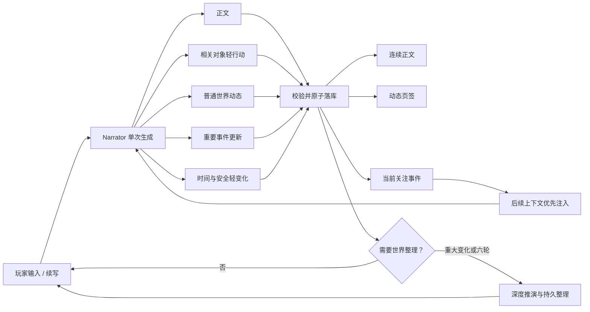

# Autonomous World Activity and Durable Task Progress Design

**Date:** 2026-07-23
**Status:** Confirmed design
**Scope:** 世界自主发展、动态页签、重要事件追踪、真实任务进度与断点重试

## 1. 目标

在现有连续世界流程上增加两项能力：

1. **世界自主发展**：每轮 Narrator 在生成正文的同时，推进少量相关对象行动，记录普通动态，并在必要时新建或更新重要事件链。
2. **真实任务进度**：普通叙事、世界整理和现实分叉均显示真实后端阶段；失败停在具体步骤并从持久断点重试。

最终体验应满足：

- 玩家不主动推动时，相关神、势力和人物仍会行动；
- 世界变化自然进入正文，同时可在独立「动态」页签查看；
- 诸神共世只看合理已知信息，Creator 可查看幕后变化并区分世界内可见性；
- 玩家一次追踪一个重要事件，后续叙事优先关注它，但不会立即打断当前场景；
- 每轮轻推演不增加额外 LLM 调用；
- 已生成完整正文不会因后续数据库失败而重新消耗一次模型调用；
- 已有正文始终可读，不再被笼统“读取中”遮挡。

## 2. 非目标

本阶段不实现：

- 每轮推演全部活跃对象；
- 多个同时追踪的事件；
- 点击动态后立即自动生成下一轮正文；
- 所有普通动态都维护完整状态机；
- 前端模拟进度、百分比或预计剩余时间；
- 额外的每轮幕后模型调用；
- 多现实并行模拟或分支合并；
- 从旧正文回填历史动态。

## 3. 核心循环



### 3.1 每轮轻推演

Narrator 只处理与当前内容直接相关的对象：

- 当前在场人物；
- 玩家输入明确提及的神、势力和人物；
- 当前关注事件的参与者；
- 近期冲突的直接相关者；
- 最多额外加入一项远方变化。

每轮限制：

- `0–3` 个对象轻行动；
- `0–3` 条普通动态；
- `0–1` 个重要事件的新建或推进；
- 不强制每轮产生动态；
- 不额外调用幕后模型。

### 3.2 深度推演

现有自动世界整理继续负责高成本、持久性强的变化：

- 诸神后台行动；
- 复杂实体和能力变化；
- 编年史压缩；
- 热度衰减和快照；
- 重要事件的深度推进、合并、升级、解决或派生。

轻推演保证世界每轮有机会发生变化；深度推演保证长期状态一致。

## 4. 世界动态与重要事件

### 4.1 普通动态

普通动态是一次性信息，不维护事件阶段，例如：

- 人物启程；
- 某地出现传闻；
- 短暂异象；
- 使团调动；
- 小规模会面或发现。

普通动态后续若升级为战争、阴谋或灾难，可成为重要事件的起源记录，但自身不转化为可变状态对象。

### 4.2 重要事件

以下类型维护持续事件链：

- 战争；
- 阴谋；
- 灾难；
- 大规模宗教冲突；
- 势力剧变；
- 世界危机。

标准阶段：

```text
emerging → developing → escalating → resolved
```

允许突发事件直接进入 `escalating`。`resolved` 事件只读，不可重新开放；余波必须创建新事件并关联旧事件。

### 4.3 单一关注事件

每个现实最多有一个当前关注事件：

- 点击“追踪”后替换原关注事件；
- 不立即调用 LLM，也不切换当前场景；
- 后续 Context Builder 优先注入事件概要、最近进展、参与者与相关历史；
- 世界其他事件仍继续发展；
- 玩家可以取消关注。

关注状态属于当前 Timeline 的观察状态，分叉后各现实可以不同。

## 5. 动态页签

右侧符文列新增独立「动态」入口。页面包含三部分。

### 5.1 当前关注

展示：

- 事件名称和当前阶段；
- 最新摘要；
- 最近进展；
- 主要参与者；
- 可见性；
- “取消追踪”。

无关注事件时提示玩家可从重要事件中选择一项。

### 5.2 重要事件

排序优先级：

1. 尚未解决；
2. 最近更新；
3. 当前关注。

事件卡显示阶段、标题、时间、进展数和“追踪”。展开后按时间展示事件发展链。已解决事件折叠到下方。

### 5.3 近期动态

- 按时间倒序；
- 每页约 20 条；
- 相同对象的低价值重复动态可在世界整理时合并；
- 普通动态可打开相关神谱或众生录对象，但不能追踪；
- 若其后形成重要事件，则显示关联事件入口。

### 5.4 点击行为

- 点击对象名称：打开神谱或众生录，不改变正文焦点；
- 点击重要事件：打开详情；
- 点击“追踪”：只更新关注事件，不立即生成正文；
- 输入区上方显示“当前关注：事件名”。

### 5.5 未读反馈

- 动态符文显示未读数量；
- 重要事件进入新阶段时短暂烫金；
- 当前关注事件有进展时显示更明显的圆点；
- 打开动态页后标记当前内容已读；
- 未读状态仅属于 UI，不改变世界可见性或 LLM 状态。

## 6. 双模式可见性

### 6.1 诸神共世

只返回玩家合理已知的信息：

- `public`：世界公开；
- `player_known`：玩家通过在场、调查或关系得知；
- `hidden`：不下发浏览器。

幕后行动、真实动机和未揭露阴谋不能依靠前端折叠保密。

### 6.2 Creator

Creator 的 `omniscient` 可看全部记录，并标记：

- 世人皆知；
- 局部知晓；
- 天外批注 · 世界内尚未知晓。

Creator 的 `limited` 复用玩家安全投影。看到隐藏动态不会自动令 NPC 得知它。

## 7. Narrator 输出契约

现有连续 META 增加：

```ts
type ContinuousNarratorMeta = {
  suggestions: string[];
  operation: "continue" | "retroactive_rewrite";
  temporalState?: { era?: string; time?: string };
  immediateChanges: ImmediateChange[];
  worldActions: WorldAction[];
  activityEntries: ActivityEntry[];
  importantEventMutation?: ImportantEventMutation;
  significantEvent: boolean;
  settlementReasons: SettlementReason[];
};
```

### 7.1 对象轻行动

```ts
type WorldAction = {
  actorType: "god" | "entity";
  actorId: string;
  action: string;
  targetIds: string[];
  visibility: "public" | "player_known" | "hidden";
  consequence: string;
};
```

约束：

- 最多 3 条；
- actor 和 target 必须属于活动现实；
- actor 类型必须和 ID 类型匹配；
- 只推进当前正文、关注事件或近期冲突相关对象；
- `consequence` 是叙事依据，不能直接修改数据库；
- 真实状态改变仍必须通过 `immediateChanges` 白名单。

### 7.2 普通动态

```ts
type ActivityEntry = {
  kind:
    | "movement"
    | "rumor"
    | "omen"
    | "meeting"
    | "relation"
    | "conflict"
    | "discovery";
  text: string;
  subjectIds: string[];
  visibility: "public" | "player_known" | "hidden";
  importance: "normal";
};
```

每轮最多 3 条。动态必须由本轮正文、轻行动或既有事件支持，不能为填充列表生成无关新闻。

### 7.3 重要事件变化

```ts
type ImportantEventMutation =
  | {
      operation: "create";
      tempRef: string;
      kind:
        | "war"
        | "conspiracy"
        | "disaster"
        | "religious_conflict"
        | "faction_shift"
        | "world_crisis";
      title: string;
      summary: string;
      phase: "emerging" | "escalating";
      participantIds: string[];
      visibility: "public" | "player_known" | "hidden";
      progressText: string;
      originActivityId?: string;
    }
  | {
      operation: "advance";
      eventId: string;
      phase: "emerging" | "developing" | "escalating" | "resolved";
      summary: string;
      participantIds: string[];
      visibility: "public" | "player_known" | "hidden";
      progressText: string;
    };
```

模型只能更新 Context Builder 明确提供的活动事件 ID，不允许凭标题猜测事件。

## 8. 持久化模型

### 8.1 WorldEvent

持续事件字段：

```text
id
timelineId
kind
title
summary
phase
visibility
participantIds
originMessageId
originActivityId?
latestMessageId
parentEventId?
createdAt
updatedAt
resolvedAt
```

### 8.2 WorldActivity

统一保存轻行动、普通动态和事件进展：

```text
id
timelineId
eventId?
recordType       action | activity | event_progress
kind
text
visibility
actorId?
targetIds[]
subjectIds[]
sourceMessageId
eraLabel
timeLabel
createdAt
```

语义：

- `action`：对象轻行动，可作为后续上下文依据；
- `activity`：动态页显示的一次性记录；
- `event_progress`：指向 WorldEvent 的阶段进展。

隐藏 `action` 可进入后续服务端上下文，但诸神模式不下发浏览器。

### 8.3 关注事件

在 `ObserverState` 增加：

```ts
focusedEventId: string | null;
```

引用必须属于当前 Timeline 且未解决。事件解决后，关注值由服务端清空。

## 9. 服务端校验和事务

### 9.1 校验

1. actor、target、subject、participant 属于活动现实；
2. 神和实体类型匹配；
3. `advance.eventId` 属于当前现实且未解决；
4. `sourceMessageId`、时间标签和来源信息由服务端填写；
5. 普通动态不能伪装为重大事件；
6. LLM 不能指定任意数据库字段；
7. `hidden` 内容不进入不具权限的 state DTO。

### 9.2 非法项策略

为了避免一条坏动态丢失整轮正文：

- 正文、时间和原有安全轻变化保持原子完成；
- 世界行动和普通动态逐项验证，非法项被拒绝；
- 重要事件变化以整项为单位验证，非法时不留下半个事件；
- 最终 META 记录接受和拒绝数量，但不向玩家显示模型内部错误。

数据库写入错误仍使整个事务回滚；语义校验拒绝只过滤对应世界动态项。

### 9.3 普通完成顺序

```text
写玩家消息
→ 写 Narrator 正文
→ 更新时间与安全轻变化
→ 写合法轻行动
→ 写合法普通动态
→ 新建或推进重要事件及进展
→ 计算世界整理
→ 保存 durable completion
```

事务提交后，正文与动态同时可见。

### 9.4 追溯路径

- 不向源现实写正文、行动、动态或事件；
- 新现实建立后写入改写结果；
- 结果标记需要世界整理；
- 深度整理校正新现实中的事件状态；
- 事件、动态和关注事件随现实克隆并重映射。

## 10. 真实任务进度

### 10.1 输入区状态条

普通叙事：

```text
✓ 接收请求
✓ 组装上下文
● 生成正文
○ 校验模型输出
○ 写入正文与状态
○ 更新世界动态
○ 刷新界面
```

世界整理：

```text
✓ 读取检查点
✓ 推演诸神行动
● 抽取持久变化
○ 更新编年史
○ 生成内部快照
○ 开放后续记录段
```

现实分叉：

```text
✓ 理解追溯意图
✓ 建立改写计划
● 克隆现实
○ 应用新历史
○ 生成结果正文
○ 整理新现实
○ 切换活动现实
```

状态：

- `pending`：灰色空心圆；
- `running`：烫金高亮；
- `completed`：淡金或绿色勾；
- `failed`：朱红错误；
- 已完成步骤不倒退；
- 不显示虚假百分比或预计时间。

### 10.2 统一 SSE 协议

```ts
type TaskProgressEvent =
  | {
      type: "progress";
      taskId: string;
      taskKind: "chat" | "settlement" | "rewrite";
      stage: string;
      status: "running" | "completed";
      detail?: string;
      occurredAt: string;
    }
  | {
      type: "text";
      taskId: string;
      content: string;
    }
  | {
      type: "failed";
      taskId: string;
      stage: string;
      message: string;
      retryable: boolean;
    }
  | {
      type: "done";
      taskId: string;
      followUp: ChatFollowUp;
    };
```

后端事件必须在真实步骤开始或完成时发送。仅“刷新界面”由前端在 state 与动态请求完成后标记。

## 11. 可恢复生成状态机

普通生成持久阶段：

```text
reserved
→ context_ready
→ generating
→ output_stored
→ applying
→ completed
```

### 11.1 私有输出快照

LLM 成功后先在 `GenerationRequest` 保存服务端私有结果：

```ts
{
  prose,
  parsedMeta,
  generatedAt,
  contractVersion
}
```

此时世界尚未改变。随后进入应用事务。

### 11.2 重试

- `generating` 前失败：复用同一 `generationId`，重新生成；
- `output_stored` 或 `applying` 失败：直接重新应用保存结果，不调用 LLM；
- 完成重放：只返回既有 durable completion；
- 应用必须用 generationId 和稳定记录 ID 保证消息、动态和事件推进幂等。

### 11.3 错误分类

可重试：

- 网络中断；
- LLM 临时错误；
- 数据库短暂连接失败；
- SSE 断开；
- 世界整理中断；
- 无其他 owner 时的租约过期。

不可直接重试：

- 活动现实已经变化；
- 来源检查点已成史或变化；
- 保存输出的契约版本失效；
- 引用对象已被用户删除；
- 另一个 owner 正在合法推进同一世界。

不可重试时只提供“刷新世界”，不暴露堆栈、SQL、Key、租约 token 或内部 ID。

## 12. 断线与恢复

持久任务摘要：

```ts
type DurableTaskProgress = {
  taskKind: "chat" | "settlement" | "rewrite";
  taskId: string;
  stage: string;
  status: "running" | "failed" | "completed";
  retryable: boolean;
  safeError?: string;
  updatedAt: string;
};
```

重新进入游玩页时：

- 运行中：重连对应 SSE 或事件查询；
- 已完成：刷新正文和动态，不重复执行；
- 失败且可恢复：恢复具体失败步骤和“从此处重试”；
- 租约过期：重新领取后从持久断点续跑；
- 仅浏览器 SSE 断开：后端任务继续，不误标失败。

流式正文提交前属于预览。应用失败时预览保留并标记“尚未写入世界”；重试成功后替换为正式消息。预览期间输入锁定。

## 13. 模块边界

新增模块：

```text
src/lib/world-activity/contracts.ts
src/lib/world-activity/apply.ts
src/lib/world-activity/projection.ts
src/lib/world-activity/context.ts
src/lib/world-activity/clone.ts

src/lib/tasks/progress.ts
src/lib/tasks/progress-events.ts

src/app/api/worlds/[id]/activities/route.ts
src/app/api/worlds/[id]/events/[eventId]/focus/route.ts

src/components/play/WorldActivityPanel.tsx
src/components/play/TaskProgressBar.tsx
```

职责：

- `contracts`：LLM 与 API Zod 契约；
- `apply`：事务内校验和写入；
- `projection`：模式与观察视角过滤；
- `context`：关注事件和近期相关行动注入；
- `clone`：分叉复制和 ID 重映射；
- `progress`：持久阶段及合法转换；
- `progress-events`：统一 SSE 事件；
- UI 组件仅消费真实状态，不猜测阶段。

## 14. 数据迁移与兼容

新增：

- `WorldEvent`；
- `WorldActivity`；
- `ObserverState.focusedEventId`；
- `GenerationRequest` 的可恢复阶段和私有输出快照。

兼容规则：

- 旧世界动态为空，不回填；
- 缺少 `focusedEventId` 时为 `null`；
- 旧消息不重新调用 LLM；
- 分叉复制事件和动态并重映射参与者、来源消息、事件引用；
- 私有存档升级版本，旧版本补空集合；
- 导出保留隐藏动态，但不导出任务租约、私有输出和内部错误；
- 世界或现实子树删除时级联删除事件与动态；
- 已解决事件只读。

## 15. 测试

### 15.1 契约

- 数量上限；
- 任意字段拒绝；
- 错误类型和跨现实 ID 拒绝；
- resolved 事件不可推进；
- 行动文本不能代替 `immediateChanges`。

### 15.2 原子和幂等

- 正文、时间、轻变化、动态和事件同时提交；
- 数据库错误整体回滚；
- 非法动态逐项过滤；
- 非法事件不留半项；
- generation 重放不重复写动态或推进事件；
- `output_stored` 后重试不再次调用 LLM。

### 15.3 可见性

- Pantheon 不收到 hidden；
- player_known 正确投影；
- Creator omniscient 收到全部并带标记；
- Creator limited 复用安全投影；
- 未读不改变世界可见性。

### 15.4 现实树和存档

- 分叉完整重映射；
- 冻结现实不可推进事件；
- 导入导出保持事件链；
- 删除子树不影响其他现实；
- 旧存档动态为空但可继续生成。

### 15.5 进度

- 阶段只在真实操作时发送；
- 阶段单向且幂等；
- SSE 断开后可重连；
- 失败停在正确步骤；
- 从断点重试不重复完成步骤；
- 世界变化后转为不可重试；
- UI 不出现永久“读取中”。

## 16. 分阶段上线

### Phase 1：真实任务进度

- 三类任务统一真实进度；
- 输入区状态条；
- 断线恢复；
- 失败步骤原地重试；
- 移除笼统读取遮挡。

### Phase 2：轻行动和动态页

- 扩展 Narrator META；
- 写入 WorldActivity；
- 动态符文与近期动态；
- 双模式可见性；
- 对象跳转。

### Phase 3：重要事件和追踪

- WorldEvent 与事件进展；
- 单一关注事件；
- Context Builder 优先注入；
- 追踪、替换、取消和未读。

### Phase 4：世界整理整合

- 深度推进事件；
- 合并重复动态；
- 从普通动态建立重要事件；
- 解决或派生事件；
- 追溯新现实的事件校正。

## 17. 验收标准

1. 每次发送都能看到真实执行步骤；
2. 数据库失败不浪费完整生成正文；
3. 每轮世界有机会自主行动，但不制造无关新闻；
4. 动态页解释其他地方正在发生什么；
5. 重要冲突具有连续发展历史；
6. 追踪事件后，后续正文稳定提高其权重；
7. Pantheon 保持迷雾，Creator 能区分幕后变化；
8. 轻推演仍只调用一次 Narrator；
9. 刷新或断线后能恢复真实任务状态；
10. 正文、世界状态和动态在事务提交后保持一致。
