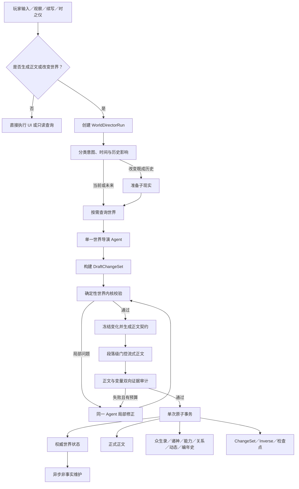
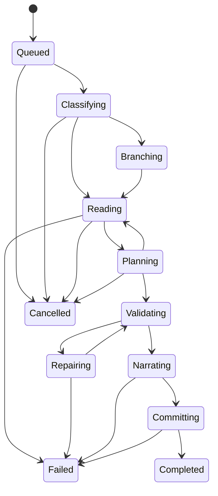

# 世界导演 Agent 运行时架构设计

**日期：** 2026-07-24

**状态：** 已完成产品评审，待实施计划

**目标项目：** 创世

**架构名称：** World Director Runtime（世界导演运行时）

---

## 1. 摘要

本设计用一条新的持久化 Agent 主链路，完整替换当前的“正文 + 尾部 META + 后续世界整理”流程。

最终运行原则是：

> 单一世界导演负责理解、查询、推演和叙事；确定性世界内核负责因果、证据、现实、事务、撤销和恢复；正文与世界变化作为同一个历史单位原子提交。

新架构不使用多个 Agent，也不让第二个 LLM 重新解释正文。世界导演先按需读取世界，再构建暂存变化；变化通过确定性校验后，模型才根据冻结的事实编织正文。正文、人物、神明、能力、关系、世界动态、编年史、时间和现实树最终在同一个事务中提交。

该设计主要解决以下现有问题：

- 正文出现新能力，但众生录和能力库没有更新；
- 人物关系在正文中变化，却没有进入关系数据；
- 神明参与事件，但诸神、编年史或世界动态不显示神名；
- 世界动态缺少实际内容或只显示“查看对象”；
- 正文已经显示，但变量保存失败；
- 变量已经变化，但正文没有对应依据；
- 异文、朱批和裁去只修改文本，导致世界状态与正文脱节；
- 运行流程仍依赖章节、章节结束和章末整理；
- 动态世界资料反复进入 Prompt，缓存命中率长期偏低；
- 刷新、断网、返回主菜单或服务重启后容易重复生成。

---

## 2. 已确认的产品决策

以下决策是本设计的约束，不在实施阶段重新选择：

1. 使用**单一世界导演 Agent + 确定性工具和世界内核**，不拆成多个专业 Agent。
2. 每轮严格执行：**先规划变量，后生成正文，最后原子提交**。
3. 所有人物、神明、能力、关系、组织、地点、物品和世界进程均由同一个 LLM 统一处理，不按对象类型拆分模型职责。
4. 查询工具立即执行；所有“写工具”只构建 `DraftChangeSet`，不能提前写数据库。
5. 一轮最多进行 **4 次 LLM 调用**，一次调用可以批量请求多个工具。
6. 规划或正文校验失败时，同一个 Agent 最多自动修正 **2 次**。
7. 观察也允许世界自然演化，但只推进与当前观察直接相关的因果，不发展无关支线。
8. 新人物、新神明、新能力、新关系、新组织、新地点和新物品，只要具有正文依据、明确归属且不重复，就可以同轮创建。
9. 推翻既成历史时自动创建子现实；源现实冻结并完整保留。
10. 修改最新轮次时原地撤销并重算；修改已有后续历史的旧轮次时自动分叉现实。
11. 纯界面和纯查询操作不经过 Agent；只有可能生成正文或改变世界的操作才创建 Agent Run。
12. 使用时之仪推进时间；指向过去且介入历史时进入现实分叉。
13. 游戏刚进入时自动创建初始观察 Run，就绪动画期间开始生成正文，不再要求玩家点击开始。
14. 玩家标题统一为：**世界名 · 纪元 · 时间**。
15. 玩家流程不再使用“章节”“结束本章”或“章末整理”概念。
16. 正式切换采用一次性替换：新轮次不再生成或解析尾部 META，也不回退旧 settlement 流程。
17. 前端只显示简短进度：

   ```text
   读取世界 → 推演变化 → 校验因果 → 编织正文 → 写入世界
   ```

18. “本轮变化”只显示本轮真正提交且发生改变的内容。

---

## 3. 当前架构与替换边界

### 3.1 当前正文链路

当前运行路径大致为：

```text
POST /api/chat
→ buildNarratorContext
→ narratorSSE
→ LLM 输出正文 + 尾部 META
→ storeGenerationOutput
→ applyStoredNarration / finalizeNarration
→ 时间、即时变化、动态、事件、能力揭示、正文落库
→ settlement policy 判断是否启动世界整理
```

主要实现位于：

```text
src/app/api/chat/route.ts
src/lib/context/builder.ts
src/lib/context/sse.ts
src/lib/chat/finalize.ts
src/lib/chat/continuous-meta.ts
src/lib/chat/settlement-policy.ts
```

### 3.2 当前世界整理

当前整理路径为：

```text
checkpoint_read
→ pantheon
→ extract
→ chronicle
→ decay
→ snapshot
```

主要实现位于：

```text
src/app/api/chapters/[id]/settle/route.ts
src/lib/settle/pipeline.ts
src/lib/prompts/settlement.ts
```

该整理任务会再次使用 LLM 解释正文，并负责神明行动、新人物、新神明、人物资料、能力、编年史、动态和快照。这会形成第二套事实判定来源，也是正文与变量容易脱节的根本原因。

### 3.3 可复用能力

现有现实分叉和追溯改写能力可以保留底层逻辑并接入新运行时：

```text
src/lib/reality/schemas.ts
src/lib/reality/task-runner.ts
src/lib/reality/create-task.ts
src/lib/reality/apply.ts
src/lib/reality/clone.ts
```

现有 LLM Gateway、Provider Adapter、缓存统计和模型配置也应保留，但必须改造成支持稳定前缀、追加式工具循环和真实缓存能力探测：

```text
src/lib/llm/cache.ts
src/lib/llm/adapters.ts
src/lib/llm/gateway.ts
src/lib/llm/cache-stats.ts
```

### 3.4 最终替换结果

正式切换后：

| 旧模块或概念 | 最终处理 |
|---|---|
| `continuous-meta.ts` | 从新轮次运行链路移除 |
| `<<<META ...>>>` | 停止生成和解析 |
| `settlement-policy.ts` | 删除事实整理职责 |
| `settle/pipeline.ts` | 移除 LLM 事实判定，仅保留可复用的确定性维护 |
| `prompts/settlement.ts` | 停用 |
| `finalizeNarration` | 由 World Kernel 的原子提交替代 |
| 按章节编辑消息 | 改为按 Run、现实和 revision 编辑 |
| settlement 缓存统计 | 改为 world-director / maintenance |
| 章节开始、章节结束 | 从玩家流程和新运行逻辑移除 |

旧表中的章节关系可以在迁移期作为历史容器保留，但不得继续控制生成、结算、编辑和现实分叉。

---

## 4. 总体架构



系统由三个核心边界组成：

### 4.1 World Director Agent

负责：

- 理解玩家意图；
- 判断需要读取哪些世界资料；
- 在最多四次调用内完成查询、规划、修正和叙事；
- 构建暂存变化；
- 根据已冻结的事实生成正文。

不负责：

- 直接访问 Prisma；
- 自由执行数据库 mutation；
- 决定事务边界；
- 猜测如何撤销已提交变化；
- 绕过现实和时间约束。

### 4.2 World Kernel

负责：

- 类型和引用校验；
- 对象去重和身份解析；
- 状态转移、时间和现实校验；
- 有界因果校验；
- 编译正式 `ChangeSet`；
- 生成确定性 `InverseChangeSet`；
- 生成正文契约；
- 执行双向证据审计；
- 现实分叉；
- 原子提交；
- revision 并发控制。

### 4.3 Projection Layer

负责从同一个权威 `ChangeSet` 同步生成：

- 众生录；
- 诸神；
- 能力归属和沿革；
- 人物关系；
- 世界动态；
- 编年史；
- 本轮变化；
- 现实树；
- 下轮可检索检查点。

投影层不能自行解释正文或生成新的核心事实。

---

## 5. WorldDirectorRun 持久化状态机

### 5.1 状态定义

```ts
type WorldDirectorRunState =
  | "queued"
  | "classifying"
  | "branching"
  | "reading"
  | "planning"
  | "validating"
  | "repairing"
  | "narrating"
  | "committing"
  | "completed"
  | "failed"
  | "cancelled";
```

### 5.2 状态流



### 5.3 成功与失败语义

正式数据库只允许出现两种结果：

1. 完整成功：正文和全部世界变化同时存在；
2. 完整失败：正文、时间、人物、关系、能力、动态和编年史均未写入。

流式期间显示的正文属于 `provisionalFrames`，只是可恢复的暂显结果，不是正式世界历史。

### 5.4 Run 身份和基线

每个 Run 至少保存：

```text
runId
worldId
realityId
trigger
idempotencyKey
baseRevision
preRunId
parentRunId
revisionOfRunId
state
modelCallCount
repairCount
executionLease
```

`trigger` 至少包括：

```text
initial_observation
player_action
observation
continue
time_instrument
revision
variant
```

### 5.5 最多四次 LLM 调用

一次调用可以批量请求多个工具。典型复杂轮次：

```text
调用 1：理解意图并请求所需资料
调用 2：读取结果并构建 DraftChangeSet
内核校验
调用 3：局部修正或生成正文
调用 4：最后修正或完成正文，并 finalize_turn
```

简单轮次可以在预载场景种子足够时用两次调用完成：

```text
调用 1：规划变化
内核校验
调用 2：生成正文并 finalize_turn
```

第四次调用结束时必须满足以下之一：

- 成功产生可提交的最终结果；
- 明确失败且不写入世界。

不得发起第五次 LLM 调用。

`modelCallCount` 在 Provider 已接受请求、存在产生用量可能时递增。只有能够确定请求从未被 Provider 接受的纯传输重试，才可复用同一调用序号和幂等键；无法确认是否执行时按一次调用计数，避免失控扣费。

### 5.6 最多两次自动修正

规划校验与正文证据校验共用两次修正预算。修正必须是局部增量：

- 修正非法 mutation；
- 补充遗漏证据；
- 删除无依据的正文事实；
- 保留已通过的草案项和正文段落。

不得因一项关系证据不足而重新读取整个世界或完全重做所有规划。

---

## 6. 游戏流程与前端行为

### 6.1 Agent 路由边界

不进入 Agent：

- 返回主菜单；
- 切换面板；
- 打开众生录、诸神、编年史和现实树；
- 查看人物、神明、能力和关系详情；
- 其他纯 UI 或只读操作。

进入 Agent：

- 玩家行动；
- 观察；
- 续写；
- 时之仪推进时间；
- 初次进入世界；
- 可能产生正文或改变世界的操作；
- 异文、事实朱批和历史改写。

### 6.2 初次进入自动生成

```text
进入世界
→ 创建 initial_observation Run
→ 就绪动画开始
→ 读取初始时间、地点、人物和当前事件
→ 动画期间完成规划和校验
→ 开始流式正文
→ 动画结束时正文通常已经出现
```

玩家不需要点击“开始”或“继续”才能看到第一段正文。

### 6.3 观察语义

观察是正常世界轮次。它可以引发与观察对象直接相关的自然变化，例如：

```text
观察鲁迪测试弹药
→ 测试完成
→ 能力变化
→ 在场者作出反应
→ 相关关系变化
```

观察不得无因果地推进遥远的无关支线。

### 6.4 时间而非章节

新运行时不包含：

- 开始章节；
- 结束章节；
- 章末对话；
- 章节结算；
- 章节号驱动的编辑或分叉。

标题由系统确定性生成：

```text
{世界名} · {纪元} · {时间}
```

“继续”表示从当前时刻自然发展，“时之仪”表示明确推进时间。

### 6.5 前端进度

玩家只看到：

```text
读取世界 → 推演变化 → 校验因果 → 编织正文 → 写入世界
```

映射关系：

| 玩家提示 | 内部状态 |
|---|---|
| 读取世界 | `classifying` / `reading` |
| 推演变化 | `planning` / `branching` |
| 校验因果 | `validating` / `repairing` |
| 编织正文 | `narrating` |
| 写入世界 | `committing` |

正文开始出现后，进度提示弱化，不遮挡正文。

### 6.6 本轮变化

本轮变化完全从最终 `ChangeSet` 确定性派生：

```text
本轮变化
· 鲁迪掌握「960新式穿甲弹」
· 鲁迪 → 奥尔斯帝德：信赖上升
· 北部战线进入“备战完成”
```

规则：

- 只显示真实提交的变化；
- 没变化的分类不显示；
- 没有变化时不显示空面板；
- 神明变化必须显示神名；
- 每项变化可跳转到对应详情；
- 不再让 LLM 另写一份变化摘要。

---

## 7. Agent 工具系统

### 7.1 工具分类

工具分为三类：

1. 查询工具：立即执行，只读；
2. 草案工具：只修改本轮 `DraftChangeSet`；
3. 控制工具：分类历史改写、请求校验和完成轮次。

LLM 永远不能直接访问 Prisma、指定任意表名或执行任意数据库命令。

### 7.2 统一查询工具

采用统一入口、明确 scope 的查询方式：

```ts
inspect_world({
  scope:
    | "entities"
    | "gods"
    | "abilities"
    | "relations"
    | "history"
    | "events"
    | "places"
    | "items"
    | "organizations"
    | "temporal_state"
    | "reality",
  query?: string,
  ids?: string[],
  fields?: string[],
  depth?: "search" | "summary" | "detail",
  limit?: number,
  cursor?: string
});
```

查询采用“先搜索候选，再按需展开”：

- 搜索默认返回稳定 ID、名称、类型、摘要、revision 和关联原因；
- 详细资料只在 Agent 明确请求时返回；
- 关系查询不重复附带双方完整生平；
- 能力查询不重复附带人物所有资料；
- 结果超过预算时返回稳定游标。

### 7.3 草案工具

写入能力适度聚合，不为每个字段创建一个工具。

```text
draft_entity_changes
draft_ability_changes
draft_relation_changes
draft_world_progress
draft_observer_changes
```

#### `draft_entity_changes`

处理：

- 人物；
- 神明；
- 组织；
- 地点；
- 物品。

支持创建、更新、状态转移、死亡、复活、失踪和身份揭示。

神明仍然具有独立数据类型和专属界面，但不交给独立 Agent。

#### `draft_ability_changes`

支持：

- 创建能力；
- 掌握能力；
- 改进能力；
- 揭示能力；
- 失去能力。

能力变化必须包含拥有者、来源、原因和正文所需证据。

#### `draft_relation_changes`

关系使用有方向的边：

```text
鲁迪 → 奥尔斯帝德：敬畏、信赖
奥尔斯帝德 → 鲁迪：器重、戒备
```

每次变化必须明确：

```text
谁对谁 → 哪种关系 → 如何变化 → 为什么变化
```

#### `draft_world_progress`

处理：

- 人物和神明行动；
- 世界动态；
- 活跃事件；
- 编年史候选；
- 时间变化。

#### `draft_observer_changes`

处理：

- 当前观察目标；
- 天外视界揭示范围；
- 已揭示但角色本人未知的信息；
- 观察者在当前现实中的状态。

天外视界只控制玩家可以观察哪些信息，不得阻止神明进入众生录、诸神、关系、事件和编年史。

### 7.4 控制工具

```text
classify_rewrite
validate_draft
finalize_turn
```

`finalize_turn` 只能在：

- 草案已通过规划校验；
- 正文生成完成；
- 双向证据审计通过；
- 未超过调用和修正预算；

时成功。

### 7.5 工具调用不依赖 Provider 原生支持

World Director Runtime 的内部工具协议与模型供应商的请求格式分离。Provider 原生 Tool Calling 是优先使用的能力，但不是运行时成立的前提。

```text
World Director Runtime
→ 统一 AgentCommand
→ Provider Capability Adapter
   ├─ NativeToolAdapter
   ├─ StructuredOutputAdapter
   └─ TextFrameAdapter
```

统一内部命令：

```ts
type AgentCommand =
  | {
      type: "tool_call";
      name: ToolName;
      arguments: unknown;
    }
  | {
      type: "finalize_draft";
      draft: unknown;
    }
  | {
      type: "narrative_frame";
      text: string;
    }
  | {
      type: "fail";
      reason: string;
    };
```

#### 第一层：原生 Tool Calling

Provider 支持 `tools`、`functions` 或等价协议时，Adapter 将原生 `tool_call` 转换为 `AgentCommand`。工具结果仍由运行时执行、持久化并追加回上下文。

#### 第二层：Structured Output

Provider 没有原生工具调用，但支持 JSON Schema 或 JSON Mode 时，模型返回严格结构化指令：

```json
{
  "type": "tool_call",
  "name": "inspect_world",
  "arguments": {
    "scope": "abilities",
    "ids": ["char_rudi_01"],
    "depth": "detail"
  }
}
```

运行时只执行通过 Schema、白名单、权限和预算校验的命令。

#### 第三层：Text Agent Frame

若 Provider 只支持普通文本补全，则使用独立的文本信封承载同一条结构化命令：

```text
<<<AGENT_FRAME
{"type":"tool_call","name":"inspect_world","arguments":{"scope":"abilities","ids":["char_rudi_01"],"depth":"detail"}}
AGENT_FRAME>>>
```

服务器提取信封内 JSON，执行与第二层完全相同的校验。信封外文字在规划模式下视为协议错误，不会发送给玩家。

Text Agent Frame 与旧 META 有本质区别：

| 旧 META | Text Agent Frame |
|---|---|
| 附着在玩家正文尾部 | 独立的规划协议响应 |
| 正文写完后再猜变量 | 正文生成前查询和规划 |
| 缺少真实工具返回 | 每次执行后追加真实结果 |
| 容易泄漏到正文 | 服务端截获，前端不可见 |
| 直接进入最终处理 | 只构建草案并接受校验 |
| 通常单次响应 | 最多四次增量循环 |

#### 规划模式与叙事模式隔离

没有原生工具调用时，模型仍必须在两个模式间严格隔离：

```text
规划模式
→ 只允许 AgentCommand / Agent Frame
→ 普通正文不发送给玩家

叙事模式
→ 只允许 NarrativeStreamFrame
→ 不允许调用工具
→ 不允许输出 JSON、META 或 Agent Frame
```

只有 `DraftChangeSet` 冻结并通过规划校验后，运行时才进入叙事模式。

#### 协议错误

以下情况不执行任何工具：

- JSON 损坏；
- 工具名称不在白名单；
- 参数不符合 Schema；
- 超出本轮工具预算；
- 规划阶段输出玩家正文；
- 叙事阶段输出工具命令；
- 模型请求执行任意数据库或系统命令。

运行时返回精确错误并允许同一 Agent 局部修正。协议修正计入两次自动修正预算；连续两次仍无法遵循协议则整轮失败。

#### Provider 上线探测

保存或启用模型配置前，执行能力探测：

```text
1. 请求模型调用一个虚拟只读工具
2. 校验命令格式
3. 返回虚拟工具结果
4. 要求模型继续规划
5. 切换到叙事模式
6. 检查协议是否泄漏到正文
```

保存探测结果：

```text
原生工具调用：支持／不支持
结构化输出：支持／不支持
文本工具协议：可靠／不可靠
协议泄漏检查：通过／失败
适合世界导演：是／否
```

只要 Provider 至少有一种可靠协议，便可用于世界导演。三种方式均不可靠时，该模型配置不能用于会改变世界的 Run，但仍可保留给其他非 Agent 任务。

### 7.6 外部搜索能力

模型供应商支持搜索时，可以由世界导演受控使用，但必须区分两种搜索。

#### 世界内搜索

查询当前游戏现实中的权威数据：

- 人物和神明；
- 能力和关系；
- 时间和事件；
- 历史正文；
- 世界动态；
- 现实分支。

世界内搜索始终通过 `inspect_world`，数据库是唯一事实来源。Provider 的互联网搜索不能回答“当前现实中的鲁迪是否已经掌握某能力”。

#### 外部搜索

外部搜索用于查询：

- 原作设定；
- 现实历史和地理；
- 武器、技术和科学参考；
- 玩家明确要求核对的外部资料；
- 融合世界所涉及作品的公开资料。

统一运行时工具：

```ts
search_external({
  query: string,
  reason: string,
  maxResults?: number,
  freshness?: "any" | "recent"
});
```

底层可以映射到：

```text
Provider 原生搜索
运行时自有搜索服务
第三方搜索 API
不可用结果
```

无论底层来源如何，运行时统一保存：

```ts
type ExternalSearchResult = {
  query: string;
  results: Array<{
    title: string;
    url: string;
    excerpt: string;
    publishedAt?: string;
  }>;
  provider: string;
  searchedAt: string;
};
```

#### 原生搜索的最低要求

Provider 原生搜索只有在以下条件成立时才可用于世界导演：

- 返回可识别的来源；
- 提供 URL 或等价引用；
- 能确认本次调用是否使用了搜索；
- 搜索结果能够保存到 Run；
- 能限制搜索次数和结果规模；
- 搜索结果可与模型正文分离。

如果 Provider 只声称“已搜索”但不提供来源和结果，则不能把该搜索作为世界事实依据。此时应禁用其原生搜索，改用运行时控制的 `search_external`；若运行时也没有搜索服务，则明确返回搜索不可用。

#### 外部搜索到世界事实

外部搜索只产生 `ReferenceCandidate`，不能直接产生数据库 mutation：

```text
外部搜索结果
→ ReferenceCandidate
→ 与当前现实和世界宪法对照
→ 正文实际采用
→ 因果和证据校验
→ ChangeSet
```

事实优先级：

```text
当前现实的权威事实
> 当前世界的自定义设定
> 玩家本轮明确指令
> 有来源的外部搜索资料
> 模型自身记忆
```

例如，搜索结果表明原作人物拥有某能力，也不能直接更新当前现实。Agent 必须先确认对象身份、当前时间点、现实分叉、已有能力和本轮正文是否真的发生学习或揭示。

#### 自动搜索规则

允许自动搜索：

- 玩家提到现有作品、现实人物或现实技术；
- 当前世界是融合世界且本地资料不足；
- 玩家要求遵循或核对原作；
- 需要核对容易记错的外部事实；
- 玩家明确要求搜索。

禁止自动搜索：

- 原创世界内部事件；
- 当前数据库已有足够资料；
- 判断当前人物状态、关系或位置；
- 判断本轮人物或神明是否死亡；
- 补写当前世界历史；
- 搜索结果会在没有正文依据时直接改变世界。

#### 搜索预算

每个 Run 默认：

```text
外部搜索：最多 2 次
每次结果：最多 5 条
单条摘要：最多 300–500 字
完整页面展开：最多 2 个页面
```

外部搜索次数与最多四次 LLM 调用分别统计。Provider 在一次 LLM 调用内部执行的原生搜索，仍算一次 LLM 调用，并单独计入一次外部搜索。

搜索请求和结果必须持久化到 Run。刷新、恢复或同一 Run 重试时不得重复进行已经成功的相同搜索。

#### 玩家界面

使用外部搜索时，进度可以增加轻量提示：

```text
查阅外部资料
```

完成后可在“本轮参考”中查看来源。外部参考不属于“本轮变化”，因为参考资料本身不是世界变化。

---

## 8. DraftChangeSet 与变化代数

### 8.1 草案结构

```ts
type DraftChangeSet = {
  runId: string;
  baseRealityId: string;
  baseRevision: number;
  temporalTransition?: TemporalTransition;
  mutations: WorldMutation[];
  activityEntries: ActivityEntry[];
  chronicleEntries: ChronicleEntry[];
  observerTransition?: ObserverTransition;
  narrationContract: NarrationContractDraft;
};
```

### 8.2 支持的变化类型

```text
时间
├─ 设置纪元
├─ 推进时间
└─ 设置特殊时间状态

人物与神明
├─ 创建
├─ 更新
├─ 状态改变
├─ 死亡／复活／失踪
└─ 身份揭示

能力
├─ 创建
├─ 掌握
├─ 改进
├─ 失去
└─ 揭示

关系
├─ 创建关系
├─ 更新方向与强度
├─ 添加关系事实
└─ 终止关系

世界对象
├─ 组织
├─ 地点
├─ 物品
└─ 其他设定实体

世界进程
├─ 记录行动
├─ 创建或推进事件
├─ 世界动态
└─ 编年史事件

观察者与现实
├─ 观察位置和目标
├─ 天外视界状态
└─ 现实分叉请求
```

### 8.3 新对象创建规则

同轮创建新对象必须同时满足：

1. 正文存在明确依据；
2. 名称或临时身份可识别；
3. 类型和归属明确；
4. 查询确认不存在重复对象；
5. 不与当前现实硬事实冲突。

身份尚未揭晓时可以创建临时对象，例如：

```text
未知神明 · 白光中的观察者
```

以后揭示身份时执行身份确认或合并，不再重复创建。

### 8.4 权威事实与投影

Agent 只确定一次事实：

```text
Canonical World State
├─ 众生录投影
├─ 诸神投影
├─ 能力投影
├─ 关系图
├─ 世界动态
├─ 编年史
└─ 现实树
```

例如“龙神奥尔斯帝德死亡并触发两百年轮回”提交后，系统从同一个 `ChangeSet` 更新神明状态、众生录经历、关系历史、世界动态、编年史涉事神明、时间和现实树。

---

## 9. 有界因果与确定性校验

### 9.1 校验顺序

```text
结构校验
→ 对象与重复校验
→ 状态转移校验
→ 时间与现实校验
→ 因果范围校验
→ 正文契约校验
```

### 9.2 结构和引用

必须满足：

- 能力有合法拥有者；
- 关系有合法双方和方向；
- 动态有行为主体或世界事件；
- 神明不会被误作地点；
- 时间变化有方式和原因；
- 所有外键引用属于正确世界与现实。

### 9.3 重复和身份

系统使用稳定 ID、名称、别名、身份和现实范围识别重复对象。例如：

```text
龙神
奥尔斯帝德
龙神奥尔斯帝德
```

若三者指向同一对象，Agent 必须引用已有神明，不能重复创建。

### 9.4 状态转移

默认拒绝：

- 已死亡角色无原因执行行动；
- 没有来源便掌握高级能力；
- 已毁灭组织正常发令；
- 关系无重大依据地从陌生跳到绝对忠诚；
- 同一角色在同一现实、同一时间出现在互斥地点。

复活、分身、时间投影、身份伪装等特殊状态可以发生，但必须提交明确原因和配套变化。

### 9.5 CausalEnvelope

每轮构建因果边界：

```text
玩家输入
+ 当前观察目标
+ 当前地点
+ 当前活跃事件
+ 明确涉及的人物、神明和对象
= 本轮因果种子
```

每项 mutation 必须能够沿明确因果边回溯到种子。

允许：

```text
观察鲁迪的新弹药
→ 鲁迪完成测试
→ 获得能力
→ 奥尔斯帝德看到结果
→ 奥尔斯帝德对鲁迪的评价变化
```

拒绝：

```text
观察鲁迪的新弹药
→ 遥远大陆无缘由地建立新帝国
```

### 9.6 时之仪

向未来推进时，Agent 检查时间范围内与当前因果相关的：

- 战争倒计时；
- 研究进度；
- 旅途；
- 契约期限；
- 神明计划；
- 其他有明确时限的活跃事件。

它不得借时间推进随机发展无关支线。

指向过去并介入既成事实时，必须进入现实分叉流程。

---

## 10. 正文契约与双向证据

### 10.1 NarrationContract

草案通过校验后，内核冻结变化并生成：

```ts
type NarrationContract = {
  worldTitle: string;
  temporalState: TemporalState;
  viewpoint: ObserverView;
  requiredClaims: Claim[];
  allowedReveals: FactRef[];
  forbiddenAssertions: Constraint[];
  continuityFacts: FactRef[];
  styleProfile: StyleProfile;
};
```

合同规定：

- 必须在正文表现的变化；
- 当前允许揭示的信息；
- 角色本人知道和不知道的内容；
- 不允许推翻的硬事实；
- 世界名、纪元和时间；
- 当前视角和文风。

### 10.2 Claim

每项重要变化具有稳定 `claimId`，例如：

```text
claim_ability_rudi_960
claim_relation_rudi_ors_affinity
claim_death_ors
claim_time_reset_200y
```

这些 ID 只用于内部协议，不显示给玩家。

### 10.3 ChangeSet 到正文

每项重大变化必须在正文中有明确证据：

- 新能力有完成、掌握或展示；
- 关系变化有行为、认知或对话依据；
- 神明死亡有明确表现或可靠确认；
- 时间跃迁有时间流逝或时之仪生效；
- 新对象真实出现或被可靠揭示。

### 10.4 正文到 ChangeSet

正文中的重大确定事实必须有对应变化：

- “鲁迪掌握了960新式穿甲弹”对应能力变化；
- “龙神被彻底抹杀”对应神明状态、事件和动态；
- “百年后王国覆灭”对应时间和组织状态；
- “两人正式结盟”对应关系和事件。

角色猜测、梦境、假设和比喻不是权威事实。例如：

```text
鲁迪怀疑人神已经死亡。
```

这只能记录为鲁迪的认知或怀疑，不能直接将人神状态改为死亡。

### 10.5 段落级门控流式正文

正文以结构化帧生成：

```ts
type NarrativeStreamFrame = {
  sequence: number;
  text: string;
  supportsClaims: string[];
  referencedFacts: string[];
};
```

每个短段落先经过事实引用和 claim 检查，通过后才发送给前端。前端只接收 `text`，不会看到工具 JSON、claim 或 META。

所有已通过段落暂存在 Run 中：

- 刷新后按 `sequence` 恢复；
- 暂显内容不进入正式历史；
- 提交成功后无缝转为正式正文；
- 最终失败时不进入众生录、动态和编年史。

---

## 11. 原子提交、并发与撤销

### 11.1 原子事务

最终事务依次执行：

```text
1. 验证 runId 和执行租约
2. 验证 baseRealityId
3. 验证世界 baseRevision
4. 写入玩家消息
5. 写入正式正文
6. 应用时间和权威世界状态
7. 应用人物、神明、能力和关系变化
8. 写入活动、事件、动态和重要编年史
9. 更新同步投影
10. 保存 ChangeSet、InverseChangeSet 和证据索引
11. 世界 revision + 1
12. 标记 Run 为 completed
```

任何一步失败均整体回滚。

数据库瞬时故障时，系统使用已冻结的正文和 `ChangeSet` 重试事务，不再次调用模型。

### 11.2 Revision 并发

同一现实默认只允许一个会改变世界的 Run 进入写入路径。纯查询可并行。

如果提交前发现 revision 已变化：

- 旧草案不得强行覆盖；
- 重新读取发生冲突的对象；
- 在剩余预算允许时局部重新推演；
- 预算不足则失败并保留玩家输入。

### 11.3 执行租约

Worker 保存：

```text
leaseOwner
leaseExpiresAt
heartbeatAt
```

租约过期后其他 Worker 可以接管。接管时复用已完成的工具结果、模型回复、正文帧和冻结草案。

### 11.4 InverseChangeSet

内核在提交正向变化时，根据事务前的真实旧值生成确定性反向变化。LLM 不参与撤销值推断。

例如：

```text
正向：
· 鲁迪获得960新式穿甲弹
· 鲁迪 → 奥尔斯帝德：信赖 +12
· 时间推进三日

反向：
· 恢复原能力归属
· 恢复关系原值
· 恢复原时间
```

---

## 12. 异文、朱批、裁去和重新生成

### 12.1 历史单位

每条正式正文绑定一个完整历史单位：

```text
WorldDirectorRun
├─ 玩家输入
├─ 正文
├─ ChangeSet
├─ InverseChangeSet
├─ EvidenceIndex
├─ preRevision
├─ postRevision
├─ parentRunId
└─ realityId
```

正文不能再脱离其 `ChangeSet` 单独修改。

### 12.2 最新轮次与历史轮次

| 目标位置 | 处理 |
|---|---|
| 当前现实末端，没有后续 Run | 原地撤销并重算 |
| 后面已有正式历史 | 从目标 Run 之前创建子现实 |

### 12.3 异文

异文是一套完整候选：

```ts
type TurnVariant = {
  id: string;
  sourceRunId: string;
  prose: string;
  changeSet: DraftChangeSet;
  evidenceIndex: EvidenceIndex;
  validationReport: ValidationReport;
  createdAt: Date;
};
```

生成异文不会先破坏当前定稿。采用最新轮次异文时，原子执行：

```text
InverseChangeSet(旧定稿)
→ ChangeSet(新异文)
→ 替换正式正文
→ 重建本轮同步投影
```

采用历史异文时自动创建子现实，源现实保持不变。

### 12.4 朱批

朱批创建 `RevisionRun`。

若仅修改措辞：

- 复用原 `ChangeSet`；
- 更新正文和证据片段位置；
- 不重新推演世界。

若改变世界事实：

- 比较原正文与期望正文中的重大事实；
- 构建替代 `ChangeSet`；
- 重新执行因果、状态和双向证据校验；
- 最新轮次原地替换；
- 历史轮次创建子现实。

### 12.5 裁去

裁去最新轮次时，无需调用 LLM：

```text
验证 revision
→ 应用 InverseChangeSet
→ 归档该轮
→ 恢复上一时间锚点
```

裁去历史轮次时：

```text
源现实完整保留
→ 从目标 Run 之前创建子现实
→ 新现实不继承目标及其后续 Run
→ 将新现实设为当前现实
```

旧的“删除同章 index 大于等于目标的所有消息”逻辑必须废弃。

### 12.6 重新生成

重新生成使用：

```text
相同玩家输入
+ 相同 preRevision
+ 可选补充要求
→ 生成新异文候选
```

现有定稿在玩家采用新异文前保持有效。

---

## 13. 现实分叉与时间旅行

### 13.1 分叉提交

推翻既成历史时：

```text
源现实
→ 创建隐藏 PreparedReality
→ 从修改时间点继承状态
→ 应用新的 ChangeSet
→ 完成正文与投影
→ 原子激活子现实
```

准备失败时，玩家不会看到残缺分支。

### 13.2 向未来推进

在当前现实中执行，处理目标时间范围内与当前因果相关的事件。

### 13.3 介入过去

若目标时间早于当前既成历史且玩家行为会改变事实：

```text
classify_rewrite
→ 查找可信历史锚点
→ 创建子现实
→ 从锚点运行新 WorldDirectorRun
```

### 13.4 只观察过去

若天外视界只查看历史，不介入：

- 不创建分叉；
- 被观察的历史不改变；
- 只更新观察者的认知和揭示状态。

### 13.5 现实树展示

现实节点使用世界时间和差异事实，而不是章节号：

```text
六面世界
└─ 甲龙历432年 · 龙神轮回
   ├─ 两百年重置中 · 原现实
   └─ 两百年重置中 · 鲁迪弹药试验异文
```

节点至少显示：

- 世界名；
- 纪元；
- 分叉时间；
- 分叉原因；
- 来源现实；
- 首个差异事实；
- 是否为当前现实。

---

## 14. 缓存优先的上下文架构

### 14.1 现状

当前统计中，正文任务虽然设置了缓存请求，但 `cacheReadTokens` 基本为零。唯一明显命中主要来自重复 settlement。当前 `OpenAI-compatible + Gemini` 中转可能接受 `prompt_cache_key`，但未真正提供前缀缓存。

新架构不能只发送缓存键，必须从 Prompt 结构上保证稳定前缀。

### 14.2 四层上下文

```text
L0：全局 Agent 内核
L1：世界宪法与文风
L2：本轮运行锚点
L3：本轮增量工具循环
```

#### L0：全局 Agent 内核

包含：

- Agent 职责；
- 因果规则；
- 工具规则；
- ChangeSet 规则；
- 双向证据规则；
- 调用与修正预算；
- 固定工具定义。

版本标识示例：

```text
world-director-policy/v1
tool-manifest/v1
change-set-schema/v1
```

#### L1：世界宪法与文风

只包含长期稳定内容：

- 世界基础法则；
- 力量和神明体系；
- 时间和现实规则；
- 固定叙事风格；
- 不可冲突设定；
- 玩家长期偏好。

不包含当前时间、人物状态、关系、最近正文和活跃事件。

#### L2：本轮运行锚点

```ts
type RunSeed = {
  worldId: string;
  realityId: string;
  revision: number;
  temporalState: {
    worldName: string;
    era: string;
    time: string;
  };
  observer: {
    targetIds: string[];
    locationId?: string;
    visionMode: string;
  };
  activeEventIds: string[];
  playerIntent: string;
};
```

#### L3：追加式工具循环

同一 Run 的消息只能追加，不能重排：

```text
调用 1：[L0][L1][L2]
调用 2：[L0][L1][L2][工具请求][工具结果]
调用 3：[前述全部][草案][校验结果]
调用 4：[前述全部][局部修正]
```

### 14.3 动态资料不进入稳定前缀

当前时间、人物状态、关系、能力、事件和最近正文只在 L2 或工具结果中出现。人物获得新能力时，不得使 L0/L1 失效。

外部搜索请求、搜索结果和来源引用也属于动态后缀。它们不进入 L0/L1，不参与世界宪法 Hash。相同 Run 中已经完成的相同搜索复用持久化结果，后续 LLM 调用继续以追加方式复用此前前缀。

### 14.4 确定性工具输出

工具结果必须：

- 固定字段顺序；
- 按稳定 ID 排序；
- 使用固定日期格式；
- 使用固定空值表达；
- 不含随机字段；
- 不含请求时间戳；
- 不含自然语言包装和调试文本；
- 相同查询在相同 revision 下逐字节一致。

### 14.5 工具预算

| 查询级别 | 用途 | 建议上限 |
|---|---|---:|
| `search` | 找候选 | 400–800 tokens |
| `summary` | 判断是否展开 | 800–1,500 tokens |
| `detail` | 推演具体变化 | 1,500–3,000 tokens |
| `history_window` | 局部因果历史 | 2,000–4,000 tokens |

整轮默认预算：

```text
搜索候选：最多 20 个对象
详细展开：最多 8 个对象
直接关系：最多 20 条
局部历史：最多 12 个关键节点
活跃事件：只读取因果相关项
```

### 14.6 缓存键

缓存键只由稳定版本组成：

```text
provider
+ baseUrl capability
+ model
+ agentPolicyVersion
+ toolManifestVersion
+ changeSetSchemaVersion
+ worldConstitutionHash
+ styleProfileHash
```

不包含：

- `runId`；
- 当前时间；
- 当前 revision；
- 玩家输入；
- 动态人物状态。

### 14.7 Provider 能力探测

```ts
type CacheCapability =
  | "explicit_prefix_cache"
  | "implicit_prefix_cache"
  | "cache_key_hint_only"
  | "unsupported"
  | "unknown";
```

系统必须根据真实 usage 判断缓存是否工作。若连续相同前缀仍返回零缓存读取量，则标记为 `cache_key_hint_only`、`unsupported` 或 `unknown`，不能虚报已命中。

管理界面分别显示：

```text
已请求缓存：是
Provider 确认缓存：否
```

### 14.8 缓存观测

每次调用记录：

- 输入 Token；
- 缓存读取 Token；
- 缓存写入 Token；
- 动态输入 Token；
- 输出 Token；
- 稳定前缀 Hash；
- 缓存能力；
- 命中层级；
- Agent 调用序号；
- 工具结果 Token。

管理页分别展示 L0、L1、Run 内增量和 Provider 维度，不能只显示无法诊断的总命中率。

---

## 15. 世界记忆与上下文增长

世界长期运行后，Prompt 不得随全部历史线性增长。

### 15.1 三层记忆

```text
权威状态层
→ 人物、神明、能力、关系、事件、时间和现实

可检索历史层
→ ChangeSet、正文证据、编年史和活动记录

当前工作集
→ 本轮实际涉及的对象和局部历史
```

Agent 默认只获得当前工作集。

### 15.2 RealityCheckpoint

检查点由权威状态确定性生成：

```text
当前时间
活跃人物索引
活跃神明索引
当前事件索引
最近重要变化
观察者状态
世界 revision
```

检查点是索引，不替代权威数据。需要细节时仍通过稳定 ID 查询。

### 15.3 局部历史窗口

历史查询按因果取回：

- 当前人物最近的重要变化；
- 当前事件起点和关键节点；
- 当前关系最近一次变化原因；
- 当前能力的来源和沿革；
- 与本轮时间范围重叠的活动。

不得机械发送固定数量的最近正文。

### 15.4 摘要不是权威事实

确定性模板优先：

```text
{actorName} 于 {time} {operation}「{abilityName}」
```

自由正文的语义摘要只能用于检索，必须保留来源引用；若摘要和权威事实冲突，以权威事实为准。

---

## 16. 后台维护

### 16.1 必须同步完成

以下内容必须和正文在同一事务中提交：

- 当前时间；
- 人物和神明状态；
- 能力归属；
- 人物关系；
- 活跃事件；
- 世界动态；
- 重要编年史；
- 众生录最近经历；
- 现实树；
- 本轮变化。

### 16.2 可以异步完成

- 全文搜索索引；
- 向量或语义索引；
- 缩略图和视觉资源；
- 热度衰减；
- 检查点压缩；
- 重复对象候选报告；
- 孤立引用审计；
- 缓存统计聚合；
- 历史数据归档；
- 可重建统计。

后台维护只允许读取权威事实并生成派生数据。发现疑似漏项时只能产生审计报告，不能暗中判定人物死亡、新神出现、新能力或关系变化。

---

## 17. 失败、恢复与取消

### 17.1 失败分类

| 类型 | 示例 | 处理 |
|---|---|---|
| `provider_transient` | 超时、限流、临时 500 | 在调用预算和幂等规则内退避重试 |
| `provider_protocol` | 工具参数损坏、流格式错误 | 消耗一次局部修正 |
| `validation_failed` | 因果冲突、重复神明 | 精确返回给 Agent 修正 |
| `revision_conflict` | 世界被另一轮推进 | 重读冲突对象 |
| `commit_failed` | 数据库暂时不可用 | 复用冻结结果重试事务 |

达到四次模型调用或两次修正后，不再自动调用模型。

### 17.2 刷新与服务重启

- 每个阶段持久化到数据库；
- 刷新重新连接同一个 Run；
- 返回主菜单后 Run 可继续；
- 服务重启后 Worker 从最后阶段恢复；
- 已完成工具结果不重复执行；
- 已保存模型输出不重复请求；
- 重复点击由幂等键阻止。

### 17.3 取消

| 状态 | 行为 |
|---|---|
| `queued` / 尚未调用模型 | 可直接取消 |
| `reading` / `planning` / `validating` | 可停止并保留输入和草案 |
| `narrating` | 可停止，但半篇正文不提交 |
| `committing` | 不强制中断，等待事务完成或回滚 |

### 17.4 正式失败呈现

失败时：

- 不提交半成品；
- 保留玩家输入；
- 提供重试；
- 玩家只看到简短原因；
- 开发诊断保留精确错误、阶段、调用序号和校验报告。

---

## 18. 推荐模块边界

```text
src/lib/world-director/
├─ runtime/
│  ├─ controller.ts
│  ├─ worker.ts
│  ├─ lease.ts
│  └─ transitions.ts
│
├─ agent/
│  ├─ prompt-compiler.ts
│  ├─ conversation.ts
│  ├─ tool-manifest.ts
│  └─ model-budget.ts
│
├─ tools/
│  ├─ inspect-world.ts
│  ├─ draft-entities.ts
│  ├─ draft-abilities.ts
│  ├─ draft-relations.ts
│  ├─ draft-progress.ts
│  └─ draft-observer.ts
│
├─ draft/
│  ├─ schema.ts
│  ├─ builder.ts
│  ├─ claims.ts
│  └─ serialize.ts
│
├─ kernel/
│  ├─ validate.ts
│  ├─ causal-envelope.ts
│  ├─ temporal.ts
│  ├─ identity.ts
│  ├─ compile.ts
│  ├─ inverse.ts
│  └─ commit.ts
│
├─ narration/
│  ├─ contract.ts
│  ├─ stream.ts
│  ├─ evidence.ts
│  └─ title.ts
│
├─ reality/
│  ├─ classify.ts
│  ├─ branch.ts
│  └─ revision.ts
│
├─ projections/
│  ├─ roster.ts
│  ├─ abilities.ts
│  ├─ relations.ts
│  ├─ activities.ts
│  ├─ chronicle.ts
│  └─ turn-changes.ts
│
└─ observability/
   ├─ events.ts
   ├─ metrics.ts
   └─ diagnostics.ts
```

API 层只做协议适配：

```text
/api/agent-runs
/api/agent-runs/[runId]
/api/agent-runs/[runId]/stream
/api/agent-runs/[runId]/cancel
/api/agent-runs/[runId]/retry
/api/agent-runs/[runId]/variants
```

Route Handler 不承载状态机和核心业务逻辑。

---

## 19. 目标数据模型

新增核心记录：

```text
WorldDirectorRun
WorldChangeSet
WorldInverseChangeSet
NarrativeClaim
RunCheckpoint
TurnVariant
RealityRevision
CutoverBaselineCheckpoint
```

关系：

```text
WorldDirectorRun 1 ── 1 Player Message
WorldDirectorRun 1 ── 1 Narrator Message
WorldDirectorRun 1 ── 1 WorldChangeSet
WorldDirectorRun 1 ── 1 WorldInverseChangeSet
WorldDirectorRun 1 ── N NarrativeClaims
WorldDirectorRun 1 ── N TurnVariants
```

现有 `Message` 继续承担展示和历史文本存储，但不再作为世界流程控制对象。

---

## 20. 一次性迁移方案

“一次性切换”指正式切换后所有新轮次只走新运行时。切换前可以分阶段准备数据库和验证迁移，但不会让两个事实生成系统长期并存。

### 20.1 保留历史

原样保留：

- 玩家消息；
- 正文；
- 异文；
- 旧 META；
- 编年史；
- 众生录；
- 神明；
- 能力；
- 关系；
- 世界动态；
- 现实树。

### 20.2 编译 LegacyRun

迁移器确定性读取旧正文、META 和已有结构化记录，将可靠识别的内容转换为只读：

```text
LegacyRun
LegacyChangeSet
```

迁移阶段不调用 LLM 重新解释旧正文。

### 20.3 CutoverBaselineCheckpoint

由于旧流程可能存在漏更新，也无法为每个字段恢复精确旧值，所以每个现实在切换点创建完整权威基线：

- 当前时间；
- 人物和神明状态；
- 能力归属；
- 关系；
- 活跃事件；
- 世界动态；
- 观察者状态；
- 当前现实；
- revision；
- 状态 Hash。

新 Agent 第一轮从该基线继续。

### 20.4 旧历史编辑

可可靠恢复轮前状态的旧轮次可以作为可信锚点。

无法恢复精确旧值的旧轮次：

- 可以查看；
- 不允许在源现实中伪造原地撤销；
- 编辑时从最近可信检查点创建子现实；
- 不允许 LLM 猜测旧 `InverseChangeSet`。

### 20.5 部署阶段

#### 阶段一：基础设施

添加数据表、Run 状态机、工具循环、ChangeSet、校验器、Provider 适配、缓存观测和新 API，不改变正式游戏结果。

#### 阶段二：离线迁移

对每个现实生成 LegacyRun 和切换基线，并输出：

- 世界和现实数量；
- 历史消息数量；
- 成功转换 META 数量；
- 缺失或损坏 META 数量；
- 重复对象候选；
- 悬空关系；
- 无拥有者能力；
- 无主体动态；
- 基线 Hash 一致性。

#### 阶段三：隔离预演

在测试数据库重放代表性输入，不写正式世界。

#### 阶段四：维护窗口原子切换

```text
1. 暂停旧叙事请求
2. 等待旧请求完成或取消
3. 完成数据库备份
4. 运行最终迁移
5. 验证全部切换基线
6. 启用 World Director Worker
7. 游戏写路由切换到 Agent Run API
8. 禁用旧 /api/chat 写路径
9. 禁用 META 解析和 settlement LLM
10. 执行冒烟测试
11. 恢复玩家进入游戏
```

正式切换后，故障时只允许临时只读和恢复 Agent Runtime，不允许回退旧 META 写世界。

---

## 21. 测试策略

### 21.1 状态机

覆盖每个合法和非法状态转移，并验证：

- 已完成 Run 不能再次提交；
- 已取消 Run 不能继续写正文；
- `narrating` 不能跳过校验提交；
- 第五次模型调用被硬拒绝；
- 第三次修正被硬拒绝；
- 两个 Worker 不能同时持有有效租约。

### 21.2 工具和草案

- 查询工具零写入；
- 草案工具不提前写数据库；
- 批量工具顺序不改变结果；
- 同一对象不会重复创建；
- 神明可被人物、关系、事件和编年史引用；
- 能力必须有合法拥有者；
- 关系必须有方向；
- 工具结果逐字节稳定；
- 超预算正确截断并返回游标。

### 21.3 因果和状态

至少覆盖：

```text
观察鲁迪试验弹药
→ 可以更新弹药、鲁迪和在场人物关系

观察鲁迪试验弹药
→ 不能更新遥远无关帝国

死亡神明执行普通行动
→ 拒绝

死亡神明以灵魂碎片显现
→ 有合法状态转移时允许

没有来源便掌握高级能力
→ 拒绝

角色猜测某神死亡
→ 只更新认知，不更新神明死亡状态
```

### 21.4 正文和证据

- mutation 必须有正文证据；
- 正文新能力必须有能力变化；
- 正文关系重大变化必须有关系 mutation；
- 神明死亡必须同步诸神、动态和编年史；
- 梦境、比喻和猜测不误入权威状态；
- 天外信息不会泄露给角色；
- claim、工具 JSON 和 META 不进入玩家正文；
- 标题固定为“世界名 · 纪元 · 时间”。

### 21.5 原子故障注入

在提交每一步强制失败，验证正式数据库始终不存在半轮结果。恢复后复用冻结正文和 `ChangeSet`，不再次调用模型。

### 21.6 刷新与恢复

覆盖：

- 就绪动画期间刷新；
- 工具查询后刷新；
- 正文输出一半时刷新；
- 提交前断网；
- Worker 运行时服务重启；
- 租约到期竞争接管；
- 返回主菜单后 Run 完成；
- 回到游戏继续同一 Run；
- 重复点击只创建一个幂等 Run。

### 21.7 异文、朱批和裁去

- 最新异文切换正文和 ChangeSet；
- 历史异文自动分叉；
- 纯措辞朱批不改变世界；
- 事实朱批重建 ChangeSet；
- 最新裁去精确撤销；
- 历史裁去保留源现实；
- 异文生成期间继续游戏后，采用异文不覆盖新历史；
- 无可信检查点的旧历史不能伪造回滚；
- 现实树不显示章节号。

### 21.8 缓存

- L0/L1 字节级稳定；
- 工具定义顺序固定；
- JSON 字段顺序固定；
- 当前时间不进入稳定键；
- 人物变化不改变 L0/L1 Hash；
- Provider 不返回缓存 usage 时标记“未确认”；
- 相同查询返回相同序列化；
- 统计页可以定位缓存断点。

### 21.9 Provider 协议与外部搜索

- 原生 Tool Calling 可以完成完整工具循环；
- JSON Schema 路径与原生路径生成相同 `AgentCommand`；
- 纯文本 Provider 可以通过 Text Agent Frame 完成完整工具循环；
- 规划模式的普通正文不会进入玩家界面；
- 叙事模式出现 Agent Frame 时整段被拒绝；
- 非白名单工具和非法参数不会执行；
- 三种工具协议均不可靠时，模型不能用于世界导演；
- Provider 原生搜索只有返回来源时才能作为外部参考；
- 外部搜索结果不能直接产生 mutation；
- 当前现实状态查询不能被互联网搜索替代；
- 同一 Run 恢复时不重复已完成搜索；
- 超过两次外部搜索预算时被硬拒绝；
- 搜索来源可以在“本轮参考”查看，但不进入“本轮变化”。

### 21.10 迁移

使用真实旧数据副本覆盖：

- 单行和多行 META；
- META 缺字段或部分损坏；
- 正文泄漏 META；
- 神明未关联；
- 世界动态只有查看对象；
- 正文有能力但数据库缺失；
- 旧异文；
- 多现实；
- 轮回和时间重置；
- 未完成 settlement；
- 已删除或孤立消息。

迁移前后验证所有玩家可见正文数量、现实数量和权威基线。

---

## 22. 性能与容量

测试世界：

| 世界规模 | 人物／神明 | 历史轮次 |
|---|---:|---:|
| 小型 | 20–50 | 50 |
| 中型 | 200–500 | 1,000 |
| 大型 | 2,000+ | 10,000+ |

必须满足：

- 第一次 Agent 调用不随全部历史线性增长；
- 普通轮次只展开相关对象；
- 纯查询不经过 Agent；
- 单个 Run 最多四次模型调用；
- 普通轮次以两次调用为主；
- 每个数据库查询和工具结果都有上限；
- 历史增长不让正文区域不可见；
- 关键投影与正文同步提交；
- 刷新恢复不重复模型调用。

---

## 23. 上线硬门槛

正式切换前必须同时满足：

1. 核心状态机测试全部通过；
2. 原子事务故障注入全部通过；
3. 所有现实具有有效切换基线；
4. 迁移前后权威状态 Hash 一致；
5. 没有未解释的悬空人物、神明、能力或关系；
6. 异文、朱批、裁去和现实分叉通过端到端测试；
7. 刷新和服务重启不会重复生成；
8. 第五次模型调用被运行时硬拒绝；
9. 第三次修正被运行时硬拒绝；
10. 正文不再泄漏 META 或工具协议；
11. 旧 `/api/chat` 不能写入正式世界；
12. settlement LLM 已退出事实生成链路；
13. 正文和所有关键投影共享同一 `runId/changeSetId`；
14. 返回主菜单和纯查询操作不经过 Agent；
15. 至少一个真实支持缓存的 Provider 完成缓存验收；
16. 不支持缓存的 Provider 必须准确显示“未确认”或“不支持”；
17. 初次进入游戏可在就绪动画期间自动生成正文；
18. 玩家可见流程不再依赖章节。
19. 当前正式 Provider 至少通过原生工具、Structured Output 或 Text Agent Frame 中的一种协议探测；
20. 若启用原生搜索，必须能保存实际来源和搜索使用记录。

---

## 24. 面向玩家的最终验收

### 24.1 进入游戏

```text
打开游戏
→ 自动创建观察 Run
→ 就绪动画期间生成
→ 动画结束时正文已经开始出现
```

### 24.2 新能力和关系

```text
正文写鲁迪掌握960新式穿甲弹
→ 众生录立即显示
→ 能力详情显示来源正文
→ 有因果依据时更新奥尔斯帝德关系
→ 本轮变化只显示实际变化
```

### 24.3 神明

```text
正文出现神明或神明行动
→ 诸神和众生录正确显示
→ 编年史显示涉事神名
→ 天外视界显示允许揭示的信息
→ 不再只显示“查看对象”
```

### 24.4 世界动态

```text
人物、神明、组织或事件发生变化
→ 动态立即显示主体和内容
→ 点击进入对象详情
→ 没有变化时不制造空动态
```

### 24.5 时间

```text
标题：世界名 · 纪元 · 时间
→ 续写自然发展
→ 时之仪明确推进时间
→ 编年史和现实树按时间组织
→ 玩家界面没有章节流程
```

### 24.6 观察

```text
玩家只观察
→ 直接相关因果自然发展
→ 必要状态同步更新
→ 无关支线不推进
```

### 24.7 修改正文

```text
修改最新轮次
→ 正文和变量原地重算

修改已有后续的历史
→ 创建子现实
→ 源现实完整保留
```

### 24.8 中断恢复

```text
生成一半时刷新或返回主菜单
→ 回来继续同一个 Run
→ 不重复扣费
→ 不生成两份世界变化
```

### 24.9 缓存

```text
同一世界连续游戏
→ L0/L1 稳定复用
→ 同一 Run 后续调用复用追加前缀
→ 统计显示真实缓存读取
→ Provider 不支持时明确说明
```

---

## 25. 非目标

本轮架构改造不包含：

- 让多个 LLM Agent 自主协商；
- 强制要求所有 Provider 支持原生 Tool Calling；
- 无边界模拟整个世界的所有支线；
- 让 LLM 直接执行 Prisma 或任意 SQL；
- 用无用 Prompt 填充提高表面缓存率；
- 自动重写全部旧正文以补齐历史数据；
- 长期维护新旧两套事实生成流程；
- 让后台维护任务改变核心世界事实；
- 为纯查询和界面操作调用 LLM；
- 在玩家界面暴露工具 JSON、claim、META 或数据库字段。

---

## 26. 完成定义

只有当下列不变量在代码、数据库、测试和玩家界面中同时成立，本架构才算完成：

1. 一个游戏轮次只有一个世界事实决策来源；
2. LLM 在提交前不能改变数据库；
3. 正文和世界变化原子提交；
4. 重大正文事实与 mutation 双向绑定；
5. 人物、神明、能力、关系、动态和编年史来自同一 `ChangeSet`；
6. 历史修改要么精确撤销最新轮次，要么创建子现实；
7. 所有新轮次不再依赖 META 和 settlement；
8. 运行时最多四次 LLM 调用、最多两次修正；
9. 观察可以推进直接因果，但不能推进无关支线；
10. 世界规模增长时，单轮上下文保持有界；
11. 缓存使用稳定前缀和追加式循环，并由真实 usage 验证；
12. 刷新、断网、返回主菜单和服务重启不会制造重复历史；
13. 玩家看到的是时间连续的世界，而不是章节驱动的聊天流程。
14. 世界导演的工具循环不依赖 Provider 原生 Tool Calling；
15. 外部搜索只提供可追溯参考，不能绕过当前现实和 ChangeSet 校验。
