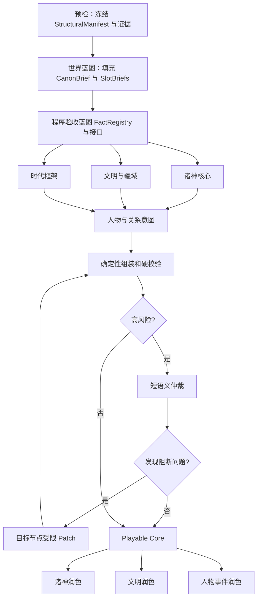

# 创世引擎 V2：持久化 DAG、紧凑核心与版本化世界设计

> 状态：已完成头脑风暴，待用户书面审阅。
>
> 日期：2026-07-28。
>
> 适用范围：新创世任务、创世阶段预览、核心世界交付、可选润色；后续阶段扩展到提案式扩写、简卡晋升、世界版本和游玩期变更。
> 当前生产基线：Next.js 16 单进程、PostgreSQL、2C2G profile、Node `MemoryMax=1280M`、数据库池上限 5、现有 `WorldDeck`/`draftDeck`/开局物化链路保持兼容。

---

## 1. 决策摘要

### 1.0 两分钟内核总览

```text
创建任务
  → 确定性预检冻结 StructuralManifest、证据和预算
  → PostgreSQL 固定 DAG Job
  → Gateway 以全局三槽 LlmAttempt 调用模型
  → 每阶段 candidate 经 Schema/事实/引用/可玩性校验后 accepted
  → 蓝图后诸神/文明/时代三路并行，人物汇合
  → 所有核心阶段 sealed，组装不可变 PlayableCoreSnapshot
  → 可选 Enrichment Patch 生成 DeliveryRevision
  → 一次投影为现有 draftDeck，统一开放编辑
```

正确性只依赖 PostgreSQL 中的五类主记录：Task、Job、Artifact、LlmAttempt、Outbox。SSE、内存 Map、缓存和后台循环都可丢失重建；它们只能影响速度，不能改变世界。所有模型错误只重试/修补当前物理调用、槽位或阶段，永不重生成完整世界。

唯一权威速查：

| 事实 | 唯一权威 |
|---|---|
| 用户输入、引擎/预算/控制版本、核心里程碑 | `GenesisTask` |
| 哪个节点可运行、依赖、租约和 attempt | `GenesisJob` |
| 模型内容版本、验收、hash、可见性和 supersede | `GenesisArtifact` |
| 当前三个物理容量绑定与 slotEpoch | 三行辅助 `LlmSlot` |
| 物理请求历史槽引用、预算预留/结算、Usage/缓存 | `LlmAttempt`（实现优先扩展现有 `LlmCall`） |
| 客户端增量事件与重放游标 | `GenesisOutbox` |
| 草稿期用户编辑内容 | 首期 `draftDeck`；Phase 5 后 `CanonRevision` |
| 开局后的当前世界 | 时间线实体表 |

任何派生 UI 状态、ETA、进度百分比、缓存命中、Stage sealed/stale 视图都从上述权威计算，不成为第二份真相。

创世 V2 不再要求模型一次输出完整 `WorldDeck`，而采用：

1. 确定性预检与素材编排；
2. 程序预分配核心槽位、正式稳定引用和字段所有权；
3. 世界蓝图一次短调用；
4. 诸神、文明疆域、时代框架最多三路并行；
5. 人物与关系意图一次汇合调用；
6. 程序确定性组装和硬校验；
7. 高风险任务在核心提交前进行一次短语义仲裁；
8. 形成不可变 `playable_core`；
9. 最多三路可选润色，只返回受限 Patch；
10. 润色失败或超时不影响核心世界交付。
11. 使用缓存友好的规范化 Prompt Bundle，并分别利用 Provider 前缀缓存、accepted Artifact 复用和确定性编译缓存。

标准任务的**计划生成调用数**为 5：蓝图 1 次、三个并行分支 3 次、人物汇合 1 次。高风险任务的计划调用数为 6，增加 1 次核心前语义仲裁。传输续写和按 Artifact 聚合的局部修补属于异常恢复调用，单独计数并受节点预算约束，因此不能把“5/6 次”误解为任何故障下的绝对总调用数。完整世界重生成永久禁止；润色最多 3 次且不属于核心成功条件。

### 1.1 已确认的产品选择

- 正常标准创世以执行开始后 2 分钟内交付为目标；排队时间单独显示。
- 生成过程中只读预览，全部完成或到达润色截止点后开放编辑。
- 只展示已经通过阶段校验的内容，不展示模型原始半成品。
- 两层交付：先形成可玩的核心世界，再后台润色。
- 核心一旦成功，润色失败不得使整次创世失败。
- 全服务器最多 3 路模型调用并发；空闲时一个用户可使用全部 3 路，繁忙时公平轮转。
- 默认使用紧凑核心，更多内容通过扩写添加。
- 同时支持分类扩写和主题扩写。
- 所有扩写、晋升和 AI 修改先形成提案，经用户确认后原子合并。
- 核心阶段直接生成完整可玩的能力规则，不交付只有名称的能力概念。
- 卡片界面采用摘要卡加展开详情。
- 次要实体采用简卡，需要时自动生成晋升提案。
- 简卡晋升绝不阻塞当前剧情。
- 允许把创世拆成多个持久阶段并进行多次模型调用；任何阶段都不得依赖同一个 HTTP/SSE 请求持续存活。
- DAG 节点允许由不同执行器分布领取。第一里程碑可仍由单机单进程执行，但协议不得依赖进程内对象，以便以后横向增加 Worker 而不改任务语义。
- 缓存用于减少重复输入、编译和恢复成本，不能成为新的权威数据源，也不能跨用户复用生成出来的世界语义。

---

## 2. 当前问题与证据

当前创世实现是一条完整 JSON 流：模型按顶层字段顺序输出整个 `WorldDeck`，UI 根据已经闭合的顶层键推断“世界法则、诸神、众生、人物”等阶段。当前代码已增加 4096 token 单轮上限、自动续写、空流和断流恢复、最多两轮定向修补及任务级瞬时重试，能够降低 504 风险，但仍有结构性限制。

### 2.1 当前结构性问题

- UI 阶段是长 JSON 输出位置的投影，不是真实独立工作节点。
- 一处结构错误可能把完整长输出送入修补模型。
- 通用 `completeStructured()` 默认可进行多次完整语义重问。
- 模型同时负责数量、顺序、Ref、归属和内容，容易产生数组过短、重复 Ref 或悬空引用。
- 当前一张完整神祇卡同时要求身份、声纹、议程、关系、时间状态、溯源及 3–6 项能力，首次创世承担过多非核心文案。
- 诸神、种族、势力、地点、人物、事件相互引用，完整大 JSON 越长，局部错误的修复半径越大。
- 任务主要由 GET/SSE 请求调用 `ensureGenesisTaskRunning()` 唤醒；进程重启后不能依赖页面再次访问才能恢复。
- 内存 `Map` 只能防止单进程内重复启动，不能作为持久化正确性依据。
- 单个任务三路并发若不受全局限制，多用户会放大为 6、9 或更多路调用。
- Lorebook 当前创世选择预算约 8000 字；多阶段调用若重复携带完整证据会放大输入成本。
- 当前 Gateway 已支持 `global → world → dynamic` 稳定前缀、OpenAI-compatible `prompt_cache_key`、Anthropic `cache_control` 和缓存 Token 统计；但现有创世主要只有全局 system 属于稳定前缀，敕令、Lorebook 与素材约束集中在动态 user，尚未按阶段合同、冻结世界上下文和重试上下文组织缓存层级。
- 现有素材一次最多可选 40 项，`inherit` 会锁定核心字段和原 Ref，`locked/fullLock` 会要求整卡逐字段一致，不能与“统一重新分配 Ref”或固定紧凑数量简单叠加。

### 2.2 兼容约束

- `WorldDeck` 目前关联约 36 个源码文件；`draftDeck` 关联约 28 个文件；`lockedPaths` 关联约 45 个文件。
- 草稿期以 `draftDeck` 为聚合数据；开局后会将神祇、实体、能力、成员关系和事件物化到时间线表，并清空草稿。
- 现实分支会复制时间线图，因此游玩期的实体身份具有时间线作用域。
- 现有素材系统使用卡组 Ref 和 `materialRef` 进行归档、继承与开局映射。
- 新引擎首期必须继续产出当前 `WorldDeck`，不能同时重写编辑器、开局、现实分支和导入导出。

---

## 3. 目标、非目标与成功标准

### 3.1 产品目标

标准紧凑任务在获得执行容量后：

- 核心世界 P50 不高于 70 秒；
- 核心世界 P90 目标不高于 90 秒；
- 最终交付 P90 目标不高于 120 秒；
- 用户看到真实节点进度和可信预计时间；
- 已完成核心可恢复、可开局、可编辑，不受可选增强失败影响。

这些数值是产品 SLO，不是未经测量的固定超时。Phase 0A 必须先用标准语料测出实际 P50/P90，再校准每节点输出、重试和截止预算。

### 3.2 正确性目标

- 核心槽位完整率 100%。
- 核心能力规则字段完整率 100%。
- 稳定引用重复率为零，悬空引用为零。
- 世界模式、时间锚点、正史截止点和素材锁定约束全部通过。
- 单节点失败不得重跑已经接受的上游节点。
- 服务器重启后从最后一个 accepted Artifact 恢复。
- 任意修补不得返回或替换完整世界。
- 高风险语义仲裁发生在 `core_ready` 前；核心提交后后台 AI 无否决权。

### 3.3 非目标

第一里程碑不做：

- 不立即把所有卡片拆成规范化数据库表。
- 不立即重写现有创世编辑器。
- 不引入完整事件溯源架构。
- 不同时重写开局、现实分支和导入导出。
- 不在首期开放游玩期删除已登场实体。
- 不在首期实现所有能力的历史规则版本。
- 不增加外部队列或缓存依赖；PostgreSQL 是持久化队列与租约来源。

---

## 4. 核心不变量

1. 先编排，后调用模型。
2. 素材先占槽，新内容只填剩余槽。
3. 数量、正式 Ref、顺序、类型和归属由程序决定。
4. 模型只填写分配给当前阶段的语义槽位。
5. 锁定内容由程序注入，不要求模型重抄。
6. 每项正式事实只有一个写入阶段。
7. 核心能力按玩法职能预分配。
8. 跨阶段只传 accepted Artifact 的规范化摘要。
9. 传输恢复、结构修补和语义修补是三种不同操作，分别计数。
10. 完整世界重生成永久禁止。
11. 高风险任务在核心提交前完成语义仲裁。
12. `core_ready` 后，后台 AI 只能提交可拒绝的 Patch 或提案。
13. 润色失败永不摧毁核心。
14. 标准任务承诺标准 SLO；素材扩张任务在开始前展示真实预算。
15. 排队时间与执行时间分开计算。
16. PostgreSQL 状态是正确性依据；内存状态只是优化。
17. 扩写和晋升先形成提案，用户确认后原子合并。
18. 已发生历史高于用户锁定、手工修改、核心结果和任何 AI 建议。
19. 服务端负责隐藏信息投影，不能只靠前端折叠。
20. 旧世界无需重新创世，迁移失败时保持旧路径可用。
21. 每个模型节点是可独立领取、提交、重试和恢复的持久工作单元。
22. 节点之间只通过 accepted Artifact 和冻结的契约传递数据，不共享进程内可变上下文。

---

## 5. 术语与权威边界

### 5.0 最小架构内核

为防止可靠性设计演变成微服务式过度工程，首期实现保持**模块化单体 + PostgreSQL**，不增加 Redis、Kafka、独立队列服务或必须单独部署的 Worker 服务。逻辑角色可以在同一 Next.js 进程中运行，后续横向扩容不改变协议。

首期持久化内核只要求五类主记录：

| 主记录 | 合并的职责 | 不单独建表的概念 |
|---|---|---|
| `GenesisTask` | 冻结输入、engine/generation/control 版本、BudgetPlan、生命周期/控制字段、最终世界引用 | ComplexityPlan、ModelPolicy、SourceObligationManifest 作为版本化受限 JSON 子文档 |
| `GenesisJob` | DAG 节点、依赖、leaseEpoch、attempt、错误和调度字段 | StageContract 引用、调度优先级作为字段/JSON |
| `GenesisArtifact` | candidate/accepted/superseded 输出、reuseKey、验证/质量、依赖 hash | FactRegistry/CanonBrief/SlotBriefs/EvidenceManifest/StyleProfile/QualityVector/SemanticDelta 可作为按类型 Artifact 或受限 JSON，不为每个概念建表 |
| `LlmAttempt` | 一个物理 Provider 请求的历史槽引用、预算预留/结算、端点、Usage、缓存和 hard deadline | `ModelCallPermit`、`BudgetReservation`、现有 `LlmCall` 语义合并；历史记录本身不永久占槽 |
| `GenesisOutbox` | 聚合版本事件、重放和投影通知 | 不引入外部消息总线 |

`GenesisReconciler`、调度器、预检器、汇合器和投影器是代码模块/后台循环，不是新服务。`DeliveryRevision` 首期可以是 PlayableCore hash + accepted Patch 列表的受限 JSON；到 Phase 5 引入 CanonRevision 时再规范化版本表。实现时优先**扩展现有 `LlmCall` 表承担 `LlmAttempt` 角色**，而不是再建一张平行调用日志；设计术语描述的是语义职责，不强制改物理表名。只有以下证据同时成立才拆新表/服务：存在独立生命周期或高基数查询、JSON 已导致锁争用/迁移困难、需要不同保留/权限边界、且压测证明当前形态成为瓶颈。

设计文档中的概念名表达不变量，不自动等于一张表、一个类或一个微服务。实施计划必须优先复用现有 `GenesisTask`、`LlmCall`、Gateway、SSE 和 Prisma 模式，以 expand/migrate 演进；禁止为每个名词创建一层 Manager/Repository/Service。

首期复杂度预算是硬约束：

- 不超过上述五类主记录；允许一个仅 3 行的 `LlmSlot` 辅助容量表和迁移表，它们不承载业务内容、不形成新聚合。`LlmSlot` 必须独立存在，因为历史 `LlmAttempt` 要永久留存，而同一物理槽必须反复复用，无法在历史行上用普通唯一键同时表达两者；
- 不新增外部运行依赖，不新增必须独立运维的服务，不引入通用消息总线；
- DAG 使用代码中的固定 `GenesisStageRegistry` 和显式依赖，禁止设计可配置工作流 DSL、用户自定义节点或通用 BPM 引擎；
- 每个状态只在一个权威层表达：Task 正交生命周期、Job 执行、Artifact 内容验收、LlmAttempt 物理调用；禁止跨层复制同名状态；
- 优先使用数据库唯一约束、CAS 和纯函数投影，不用分布式锁框架、反射式 Repository 或事件溯源重建全部状态；
- 一个可靠性机制只有在故障注入/验收矩阵中有对应失败场景才保留；无可验证收益的抽象从首期删除或推迟。

若实施中超过复杂度预算，必须先写 ADR 证明现有内核无法满足具体负载/权限/保留要求，并删除或合并等量复杂度；不能以“以后可能需要”为理由扩张。

### 5.1 核心术语

- **Preflight Orchestrator**：在调用模型前解析模式、资料、素材、依赖、复杂度和槽位的确定性编排器。
- **StructuralManifest**：预检阶段冻结的核心实体、能力、事件和关系意图槽位注册表，包含正式 Ref、类型、顺序、所有权和素材绑定；蓝图无权修改。
- **SlotBriefs**：蓝图按 StructuralManifest 槽位填写的短叙事职能、差异化约束和跨领域接口；是语义 Artifact，不包含或改变正式身份字段。
- **StageContract**：某个 DAG 节点的输入摘要、可见证据、拥有字段、允许目标槽和动态输出 Schema。
- **StageArtifact**：节点某一版本的不可变输出及校验、质量、模型、Token 和耗时证据。
- **accepted Artifact**：已通过本阶段合同，可供下游按精确 hash 消费的不可变版本；仍可能被新版本 supersede。
- **sealed Stage**：反向依赖校验和核心仲裁已完成，不再允许当前 generationEpoch 自动产生新版本的阶段。
- **FactRegistry**：正式世界事实的所有者、强度、来源、可见性和内容注册表。
- **CanonBrief**：各分支共享的短小世界公理、冲突、词汇和文风摘要。
- **EvidenceManifest**：Lorebook 与素材证据的分类、权威等级、时间提示和适用节点索引。
- **Playable Core**：全部核心硬门通过后的不可变可玩世界快照。
- **Enrichment Patch**：只修改叙事润色白名单字段的可选补丁。
- **ChangeProposal**：扩写、晋升、重掷或游玩期变更的可审阅、可拒绝、可原子应用提案。

### 5.2 三种身份

长期统一为：

| 身份 | 用途 | 可变性 |
|---|---|---|
| `canonicalRef` | 世界内跨卡、跨版本、导入导出的永久身份 | 永不改变 |
| 数据库行 `id` | 某时间线内的物化记录 | 不暴露给模型 |
| `displayName` | 用户显示名称 | 可以修改 |

首期继续兼容现有卡组 `ref`。新生成实体由程序分配 Ref；`inherit`、`locked`、`fullLock` 素材保留原 Ref；`remix` 不继承原 Ref。后续迁移再将运行时 `canonicalRef` 与当前 `materialRef` 的素材来源语义分开。

### 5.3 权威数据切换

| 生命周期 | 唯一权威 | 兼容形态 |
|---|---|---|
| 生成中 | accepted StageArtifacts | 只读预览投影 |
| 核心完成、尚未开局 | Draft Canon Revision（后续里程碑） | `draftDeck` 兼容缓存 |
| 第一里程碑草稿 | 组装后的 `WorldDeck`/`draftDeck` | StageArtifacts 作为生成证据 |
| 已开局 | 当前时间线实体表 | Revision 作为审计与恢复账本 |
| 已发生历史 | 章节、事件和能力事件账本 | 只追加，不普通覆写 |

第一里程碑不提前引入双权威：DAG 只在 `core_ready` 时一次组装并写入当前 `draftDeck`。

---

## 6. 预检、素材编排与复杂度计划

### 6.1 预检顺序

1. 校验用户、世界模式和敕令。
2. 冻结 Lorebook 原文哈希、已验收 EvidenceIndex、素材版本和用户选择快照。
3. 解析素材依赖及 include/rebuild/omit 决策。
4. 检测完全锁定冲突和跨模式不兼容。
5. 计算素材依赖闭包。
6. 将 inherit/locked/fullLock 素材绑定到正式槽位。
7. 为剩余新实体和能力槽分配 Ref。
8. 冻结 StructuralManifest，编译 EvidenceManifest 和初始锁定路径。
9. 从结构化选择、锁定路径、敕令原始段落和 accepted EvidenceIndex 编译 `SourceObligationManifest`。
10. 生成 ComplexityPlan、DAG、蓝图 StageContract 和预计执行预算。
11. 只有预检成功才创建可运行节点。

创世 Preflight 本身保持确定性且零模型调用。Lorebook 的模型辅助分类属于素材摄取/更新期的独立 `EvidenceIndexJob`，不是创世核心 DAG 调用：上传或修改 Lorebook 后可后台生成版本化索引；创世开始时只读取与原文哈希匹配的 accepted 索引。索引缺失、过期或失败时使用确定性类别/关键词切片并标记 `evidence_index_degraded`，不得在 Preflight 内临时调用模型，也不得因此让必需素材消失。用户若选择等待高质量索引，UI 将其显示为创世前独立准备步骤和预算，而不是把标准核心“5 次”悄悄变成 6 次。

`SourceObligationManifest` 把“还原度”从模糊观感变成来源义务，不增加模型调用。每项义务至少包含：

```text
obligationId, sourceType, sourceHash, sourcePointer
strength: exact | semantic | inspirational
criticality: core_required | core_preferred | enrichment_only
polarity: require | forbid
targetStages/targetSlots, visibility
verificationMode, evidenceBudgetClass
```

- `exact`：locked/fullLock、原 Ref、用户结构化硬选择和明确禁止项，必须逐字段/逐字节或按结构等价验证；
- `semantic`：敕令硬要求、Lorebook source canon、inherit 核心语义，允许换句表达但不得遗漏、反转或矛盾；
- `inspirational`：remix、视觉母题和软风格偏好，只要求可识别影响，不得伪装成必须复制的事实。

Preflight 不尝试用启发式“理解”自由文本：它按稳定标点/段落边界生成 sourcePointer，冻结原文、结构化强度和 accepted EvidenceIndex 结论。用户结构化硬选择、locked/inherit 核心、明确禁止项和 source-canon 默认 `core_required`；软风格偏好默认 `core_preferred`；明确要求“可后补”的细节才可标为 `enrichment_only`。自由敕令在没有可靠分类证据时宁可按句作为 semantic/core_required，也不能静默降为灵感；若这造成范围超出标准计划，应展示扩展范围而不是私自降级。后续可以提供用户可见的义务预览/改级，但首期不能靠隐藏分类改变原意。

蓝图/阶段可返回 `addressedObligationIds` 作为可观测证据，但模型自报不构成通过证明。验证投影为每项义务记录 `satisfied | contradicted | unresolved`、承载它的 fact/slot/path 与证据 hash：exact 由程序验证；semantic 先做结构/术语/矛盾检查；core_required 的 contradicted 必须修补，unresolved 必须进入已有核心前仲裁或明确失败，不能在 core_ready 时保持未知；core_preferred 未满足可形成质量警告或 Enrichment 提案，但不能覆盖硬事实。任何 `forbid`、exact、core_required 或 source-canon 义务不能因 Evidence Token 预算被裁掉；若全部必需义务放不下，任务升级扩展计划或预检失败，而不是降低还原度。

### 6.2 素材绑定规则

#### `locked` / `fullLock`

- 占用同类型正式槽位。
- 保留原卡 Ref 和完整内容。
- 程序在组装时原样注入。
- 模型只看到与当前节点相关的摘要，不重新输出该卡。
- 任一字段差异均属于预检或组装错误，不能交给模型“修正”锁定卡。

#### `inherit`

- 占用正式槽位并保留原 Ref。
- `coreLockedPaths(kind)` 中的字段由程序注入。
- 模型只填写未锁定的世界适配字段。
- Patch 白名单自动排除继承锁定字段。

#### `remix`

- 是设计证据，不自动继承 Ref。
- 默认不强制占核心槽。
- 若 ComplexityPlan 决定把 remix 物化为正式实体，程序在 StructuralManifest 冻结前分配新 Ref；蓝图只能填写该既有槽的 SlotBrief，不能临时新增实体。

### 6.3 素材依赖

- `include`：必须绑定已有素材或新增对应正式/简卡槽。
- `rebuild`：程序创建新依赖槽和新 Ref，模型只生成兼容替代对象。
- `omit`：仅可用于非必需依赖。
- 必需依赖被省略、能力拥有者无法确定或完全锁定素材互相冲突时，状态为 `failed_preflight`，不调用模型。

### 6.4 标准与扩展任务

标准紧凑核心默认：

| 实体 | 默认核心数量 |
|---|---:|
| 玩家神 | 万神模式 1 |
| 主要神祇 | 4 |
| 核心种族 | 2 |
| 核心势力 | 3 |
| 核心地点 | 4 |
| 主要人物 | 4 |
| 将临事件 | 3 |
| 次要神祇 | 2–4 张简卡，可选 |

强制素材或依赖闭包超过标准规模时自动进入扩展任务。扩展任务使用同一 DAG、恢复和校验机制，但在开始前展示预计范围，不承诺标准 120 秒 SLO，也不能为满足时间目标丢弃用户锁定素材。

---

## 7. 槽位契约

### 7.1 为什么使用对象槽而不是自由数组

模型内部输出：

```json
{
  "majorGods": {
    "majorGod01": {},
    "majorGod02": {},
    "majorGod03": {},
    "majorGod04": {}
  }
}
```

而不是长度可漂移的数组。程序负责将槽位对象按 StructuralManifest 顺序投影成当前 `WorldDeck` 数组。

### 7.2 模型不输出身份字段

模型不得输出正式 Ref、ownerRef、kind、顺序和实体类型。它只输出槽位内容。跨阶段引用使用局部槽位枚举，如 `faction02`、`god03`，程序再解析为正式 Ref。

### 7.3 核心能力槽

| 所有者 | 固定槽位职能 |
|---|---|
| 玩家神 | `signature`、`influence`、`crisis` |
| 主要神祇 | `domain`、`agenda`、`counterplay` |
| 核心种族 | `innate`、`tradition` |
| 主要人物 | `identity`、`dilemma` |

每项能力必须生成完整的名称、效果、触发、代价、限制、熟练度/状态和可见性。能力 Ref、kind 和所有者由程序注入。

### 7.4 关系意图槽

每位主要人物至少拥有：

- 一个主要势力归属；
- 一个神性联系；
- 一个中央冲突动机；
- 可选的第二关系和事件联系。

模型只输出关系意图，程序负责去重、方向、类型、时间状态和正式关系投影。

### 7.5 动态精确 Schema

每个 StageContract 根据冻结的 StructuralManifest 构建 `.strict()` 的动态 Zod Schema。缺槽报告 `MISSING_REQUIRED_SLOT`；多槽报告 `UNREGISTERED_SLOT`。核心阶段不使用通用 `completeStructured()` 的完整多轮语义重问策略，而使用节点专用的一次语义生成加受限修补。

---

## 8. 事实所有权与跨阶段一致性

### 8.1 事实所有权

| 事实 | 唯一写入者 |
|---|---|
| 世界名、核心命题、世界硬法则 | 蓝图阶段 |
| 时间锚点骨架 | 蓝图阶段 |
| 时间轴、将临事件、冲突细化 | 时代阶段 |
| 神祇身份、领域、目标和神权 | 诸神阶段 |
| 种族、势力、地点和文明能力 | 文明阶段 |
| 人物身份、能力、归属和关系意图 | 人物阶段 |
| 正式 Ref、数量、顺序、所有权和关系边 | 程序组装器 |
| 文案、语癖、神话、氛围 | 润色阶段 |
| 锁定事实 | 用户/素材快照 |

非拥有阶段试图创造或覆盖正式事实时报告 `FOREIGN_FACT_WRITE`。确有需要的新事实只能进入 `suggestedFacts`，由编排器决定接受、局部化、拒绝或转为提案。

### 8.2 事实强度

```text
locked/user_explicit
> source_canon
> accepted_canon
> derived
> suggested
> flavor
```

低优先级事实不能覆盖高优先级事实。

### 8.3 CanonBrief

所有分支共享短小、不可变的：

- 世界命题；
- 力量与死亡规则；
- 中央冲突；
- 禁止矛盾；
- 统一词汇；
- 文风与禁用套语；
- 重复使用的视觉母题。

下游读取上游核心摘要，不读取润色长文。

### 8.4 差异化矩阵

蓝图为 StructuralManifest 中每个核心槽填写 SlotBrief。神祇至少区分叙事角色、冲突立场、权力方法、代价来源和道德矛盾；种族区分生存适应、社会组织、力量来源和利益；势力区分目标、资源、统治和内部矛盾；人物区分身份、行动目标、困境、立场和失败后果。

允许有意镜像，但必须声明 `deliberate_mirror` 及关键差异；未声明的高相似对象报告 `UNINTENTIONAL_DUPLICATION`。

### 8.5 能力机制签名

核心生成内部为每项能力记录：

```text
effectClass
targetScope
activationMode
costChannel
counterplay
narrativeScale
```

机制签名用于发现换皮能力、无代价时代级人物能力、缺少反制的危机权能以及 innate/tradition 混淆。它是校验元数据，不替代用户看到的能力文案。

### 8.6 并行分支接口与关系汇合

蓝图 accepted 后生成不可变的 `CanonBrief + SlotBriefs + CrossDomainInterfaces`。三个并行分支只能依赖这些公共接口和 StructuralManifest 槽位 ID；不能引用另一个仍在生成分支的 displayName、自由文本或未 accepted 候选。

跨领域关系使用意图协议：

```text
sourceSlot, targetSlot
relationFamily, directionPreference
requiredFacts, forbiddenFacts
strengthRange, temporalConstraint
rationale, visibility
```

诸神分支可以声明“god02 需要一个反对其议程的 faction 槽”，文明分支可以声明“faction03 需要一个提供合法性的 god 槽”，但双方都不能直接创建正式关系边或覆盖对方事实。确定性汇合器按槽位、事实所有权、方向、时间和兼容矩阵匹配：双边兼容则生成正式边；单边意图可生成弱边或进入人物汇合补全；冲突意图报告结构化问题并只修补拥有该意图的分支。

正式 displayName 由各自拥有阶段写入后，程序把槽位引用映射为 Ref/名称投影。时代分支只能引用 SlotBrief 中的角色/立场，不猜实体名字。人物汇合读取三个 accepted hash，并负责把人物关系意图连接到已定神祇/势力/事件槽；它不能反向改写这些实体的核心身份。

若任一并行分支 supersede，其下游人物/组装结果按 dependencyArtifactHashes stale；其他独立分支无需重跑。CrossDomainInterfaces 若蓝图修补则三个分支全部失效，这是蓝图修补的显式成本，受 BudgetPlan 限制。

---

## 9. DAG 与模型调用

### 9.1 核心 DAG



基础核心为 5 次计划生成调用：蓝图、三个并行分支、人物汇合。高风险任务额外调用一次语义仲裁。核心关键路径通常是 3 个模型等待波次：蓝图、并行分支、人物汇合；高风险任务在其后增加一个短仲裁波次。确定性组装不调用模型，局部修补是条件分支而不是正常波次。

| 调用类别 | 标准任务正常值 | 是否在核心关键路径 | 失败处理 |
|---|---:|---|---|
| 蓝图生成 | 1 | 是 | 恢复传输或修补蓝图 Artifact |
| 三个领域核心 | 3，可并行 | 是，同一波次 | 只重试/修补失败领域 |
| 人物汇合 | 1 | 是 | 只修补人物 Artifact |
| 高风险语义仲裁 | 0 或 1 | 高风险任务是 | 只输出问题，不直接改世界 |
| 局部修补/槽重生成 | 0–N，受预算限制 | 条件分支 | 目标槽或目标 Artifact，不重跑全世界 |
| 可选润色 | 0–3 | 否 | 超时或失败直接降级交付核心 |

仪表盘必须分别报告 `planned_generation_calls`、`transport_recovery_calls`、`patch_calls`、`stage_regeneration_calls` 和 `enrichment_calls`。这样既能兑现“标准路径 5 次”的优化目标，也不会用调用口径掩盖模型不稳定或修补风暴。

### 9.2 分阶段、多次调用与分布执行边界

一次创世是一个持久化 DAG，不是一个长连接内的递归函数。每个模型节点必须具备独立 `nodeKey`、冻结输入、动态 Schema、Token/时间预算、幂等键、租约和输出 Artifact；执行器完成一个节点后立即提交事务，不在内存中携带“下一阶段唯一上下文”。

允许同一任务的不同节点在不同时间、不同进程乃至不同机器执行，但必须遵循：

- 只有依赖 Artifact 全部 accepted 的节点才可被领取；
- 同一节点同一 `inputHash` 同时最多一个有效租约，迟到结果必须由租约令牌拒绝；
- 下游只读取 accepted 的规范化输出与摘要，不读取上游模型的半截流或进程内缓存；
- 下游 Job 冻结其读取的 `dependencyArtifactHashes`；提交时若任一上游已被 supersede，该 Job 虽可结束但候选 Artifact 标为 stale，按反向依赖闭包重排，不能 accepted。
- 每次调用结束都记录模型、端点、Token、首 token、耗时、结束原因和校验结论；
- HTTP/SSE 断开只影响观察，不取消任务、释放租约或丢失已提交成果；
- Worker 可以滚动发布和水平扩容，只要支持任务冻结的 `engineVersion` 与 `contractVersion`；
- 第一里程碑仍可把调度器和 Worker 部署在当前 Next.js 单进程中，但数据与状态转换必须按分布式执行语义实现。

阶段拆分的停止条件是语义边界和局部恢复半径，而不是越细越好。禁止退化为逐卡调用；一个节点应能在一次计划调用中完成同一所有权域的紧凑核心。

### 9.3 节点职责

#### 蓝图

输出世界命题、宇宙论、时间锚点、中央冲突、词汇、文风、差异化矩阵和未定义槽位职能。它读取已经绑定的素材槽，不能删除、改名或改变锁定素材。

#### 诸神核心

输出玩家神和 4 位主要神祇的未锁定核心字段、当前目标、冲突联系和固定职能神权；不写文明、人物和长篇神话。

#### 文明与疆域

输出 2 个核心种族、3 个势力、4 个地点、种族能力和必要归属；不创建主要人物。

#### 时代框架

输出时间锚点细化、时代冲突、3 个将临事件、条件后果、文风执行规则；不覆盖蓝图世界法则。

#### 人物与关系意图

输出 4 位完整主要人物、固定职能能力、种族/势力归属和关系意图；只能引用注册槽，不能新增核心神祇、种族或势力。

### 9.4 证据切片

Lorebook 在素材摄取期建立版本化 EvidenceIndex；预检冻结匹配原文哈希的 accepted 索引，再按节点确定性切片。初始建议上限必须由基准校准，方向如下：蓝图偏时间线和世界规则；诸神偏神性和力量；文明偏种族、势力、地点；时代偏时间线和正史截止点；人物偏人物、势力和关键时间事实；润色只取目标实体相关证据。

每条证据记录来源、权威等级、时间提示、适用节点和哈希。模型原创扩展不能伪装成资料正史。

### 9.5 三层缓存架构

缓存分三层，命中语义不同，不能混为一种“缓存率”：

| 层 | 缓存内容 | 复用范围 | 正确性地位 |
|---|---|---|---|
| L1 Provider Prompt Cache | 模型请求的逐字节稳定前缀 | 相同端点、模型、命名空间和前缀 | 仅减少输入计费/首 token，不改变模型调用语义 |
| L2 accepted Artifact Reuse | 已通过当前合同校验的节点规范化输出 | 同一任务恢复；可选的同用户显式克隆 | 可作为节点结果，但必须重新验证版本和输入哈希 |
| L3 Deterministic Compile Cache | 已冻结 Evidence 索引的确定性切片、动态 Schema、StructuralManifest 投影、FactRegistry、验证特征 | 相同内容哈希与编译器版本 | 可重新计算的性能缓存，不是权威数据 |

L1 最大化命中的 Prompt Bundle 固定顺序为：

```text
global-common: engineVersion + 通用输出协议 + 通用安全规则
global-wave: blueprint/core-parallel/character/adjudication/enrichment 共有协议
world-common: mode + normalized decree + CanonBrief + StructuralManifest/SlotBriefs 摘要
global-stage: stageType + stageContractVersion + 该阶段差异 Schema/所有权规则
world-stage: 目标 Evidence Slice + accepted 依赖摘要
dynamic: nodeKey + attempt 指令 + 目标槽 + 问题列表 + 续写位置
```

`global-wave` 用于把真实重复内容提到分叉之前：诸神核心、文明与疆域、时代框架共享同一个 `core-parallel` 波次协议、输出信封、固定槽位写入规则和通用 Schema 片段；同一任务三路共有的 `world-common` 紧随其后，只有各领域真正不同的字段才进入 `global-stage`。`global-common` 已永久声明其后的敕令、Lorebook、素材和 Artifact 都是不可信数据且无权改变合同，因此把 `world-common` 放在 stage 差异块之前只改变缓存边界，不改变指令权限。若某 Provider 的消息角色/缓存实现不能安全表达这一顺序，该端点退回“global-wave 后立即分叉”，不能为提高命中改变角色层级。不得为了凑长前缀把无关规则或其他领域 Schema 塞进 wave；抽取前后语义必须由合同测试证明等价。

稳定块必须使用 canonical JSON/文本序列化：字段固定排序、换行固定为 `\n`、Unicode 规范化、无时间戳/请求 ID/随机示例、空值和默认值表达唯一。不得为了不同阶段把动态错误信息插入 global/world 块。修补与传输续写继续复用原稳定前缀，只在 dynamic 尾部追加问题或断点信息。公共块在所有请求中保持相同顺序；不能因某块为空而改变后续消息位置，应使用唯一的空块表达或由合同规定统一省略。

这里的“规范化”只消除已证明不改变语义的传输差异，例如 CRLF/LF 和同一 Unicode 的规范等价形式。不得 trim 用户正文、折叠内部空白、改变大小写、重排自然语言段落或删除重复句；`normalizedUserIntentHash` 必须同时绑定原始冻结字节哈希，防止不同敕令被错误合并。

Provider 的**路由命名空间**只描述希望共置的稳定前缀，不等于 Artifact 语义键：

```text
genesis:v2:{engineVersion}:{globalContractVersion}:{waveType}
```

stageType、stageContractVersion、mode、完整 Prompt Bundle 和模型策略仍进入 `stablePrefixHash`/L2 reuseKey；不能因为路由命名空间相同就复用输出。若供应商把显式 key 定义为内容身份而非缓存分片提示，则该端点不得使用 wave 路由键，必须按其官方语义改用完整稳定前缀 hash 或关闭显式 key。

V2 Gateway 将两个概念分开：

- `cacheIsolationDomain`：由服务端凭据 HMAC、Provider account/project ID 或可证明等价的非明文账号域生成；不能记录 API Key，也不能由客户端自报；
- `cacheAffinityKey`：由 cacheIsolationDomain、endpoint、provider、model、routingNamespace 和 **global-common + global-wave + 可安全前置的 world-common** 哈希生成，用于把共享前缀路由到相同 Provider 缓存分片；不包含首次分叉的 global-stage；
- `stablePrefixHash`：覆盖完整 global/world 稳定消息，仅用于命中审计、重试一致性和统计，不作为跨世界亲和键。

Provider 是否命中仍由实际逐字节前缀决定，亲和键不能让不同内容错误共享。当前 Gateway 使用完整稳定消息生成 `prompt_cache_key`，V2 实施时需要先通过端点能力测试确认语义，再做上述分层；不支持显式亲和键的端点继续依赖供应商自动前缀缓存和 `cache_control` 断点。

Provider 规划器必须按能力选择策略，不能假设所有端点行为相同：支持显式路由键的 OpenAI-compatible 端点优先使用同 stage/wave 的 global 亲和；支持多断点的 Anthropic 端点在断点预算内保留 `global-common`、`global-wave/global-stage` 和最深 world 断点；只支持自动前缀缓存的端点只保证消息顺序稳定。现有最多 4 个 `cache_control` 断点还要与续写断点共享，超额时按“续写最深断点 > world-stage > global-stage/wave > global-common”取舍并记录原因。

不能把 `userId` 放进 Provider 前缀文本来破坏公共合同命中，但 world 块内容必须只来自该任务冻结快照。公共 global 前缀不得含敕令、Lorebook、素材、隐藏设定或用户标识。`cacheIsolationDomain` 必须同时进入亲和调度、Provider 能力降级状态和缓存统计维度；无法证明账号/凭据隔离域时默认关闭 world 缓存，只保留不含用户数据的 global 缓存。即使隔离域相同，应用层 L2 Artifact 仍禁止跨用户复用。

### 9.6 Artifact 复用与失效矩阵

L2 复用键为：

```text
engineVersion
+ taskId + ownerUserId（授权边界，不进入 Provider Prompt）
+ generationEpoch + operationKind + forceRegenerationNonce
+ nodeKey/stageType
+ contractVersion
+ modelPolicyVersion
+ promptBundleHash
+ outputSchemaHash
+ generationConfigHash
+ validatorVersion
+ manifestHash
+ evidenceSliceHash
+ dependencyArtifactHashes
+ lockedPathsHash
+ rawFrozenUserIntentHash
+ normalizedUserIntentHash
```

只有 `resume/recover/lease_takeover/deterministic_rebuild` 操作可以复用同 generationEpoch 的 accepted Artifact。用户主动重掷、单槽重生成、要求不同方案或显式“重新生成”必须创建新 generationEpoch/nonce 和新 Artifact 版本，不能被旧结果短路。

同一任务重连、进程重启、租约接管和确定性下游重算优先复用 accepted Artifact。复用前必须重新检查任务所有权、键的每一项、Artifact output hash，以及**任务创建时冻结版本**对应的 Schema、validator、安全策略和硬门；不能只比较一个客户端可控哈希，也不能在滚动发布后悄悄改用“当前最新版”语义。旧合同实现不可用时任务暂停、路由到兼容 Worker 或明确失败，不静默升级后重生成。

以下任一变化必须使目标节点及其**反向依赖传递闭包（所有下游消费者）**失效：用户敕令或模式、素材选择/版本/锁定路径、Lorebook 证据切片及其提取器版本、上游 accepted Artifact、Prompt Bundle、StageContract/输出 Schema、模型或生成参数中影响语义的部分、校验器/内容安全策略或编译器语义版本。例如蓝图变化使三个领域及人物下游失效；人物 Evidence Slice 变化只使人物及组装下游失效；润色变化不得反向使 Playable Core 失效。未受影响的上游 accepted Artifact 保留。

只改变 UI、进度文案、日志采样、并发配额或非语义超时，不得使 Artifact 失效。润色 Artifact 失效不能向上撤销 Playable Core。

默认禁止跨用户复用生成语义 Artifact，即使输入哈希相同；这既避免隐私和侧信道问题，也避免不同用户偶然得到完全相同世界。若以后提供“从模板克隆”，必须是用户显式动作，并将模板作为素材快照重新建立新任务、新 Ref 和新 Artifact，而不是静默缓存命中。

Lorebook 若经过模型分类，分类结果是版本化派生 Artifact，不属于 L3 确定性缓存；其键必须绑定原始 Lore 哈希、分类器 Prompt/Schema、模型策略和提取器版本。L3 只缓存该冻结索引之上的确定性选择、切片和编译结果。

L3 使用内容寻址键和短 TTL/LRU 控制内存；PostgreSQL 中冻结的 StructuralManifest、SlotBriefs、EvidenceManifest、StageContract 和 accepted Artifact 才是恢复依据。缓存丢失只能变慢，不能导致任务失败或结果变化。

### 9.7 缓存预热、合批与成本边界

- 不为“预热”单独发起无业务价值的模型调用；同阶段真实首个请求自然建立 Provider 缓存。
- 调度器在同端点存在多个可运行节点时，只可在公平和核心优先约束内短暂合批完全相同的 `cacheAffinityKey + cacheIsolationDomain + capabilityClass`，提高短缓存窗口内的前缀复用；最大等待必须很短且计入排队 ETA，不能为了缓存让单个用户饥饿。
- 三个并行领域节点共享完全相同的 `global-common + core-parallel global-wave + world-common`（仅在端点角色语义安全时），随后才进入各自 `global-stage`；各 stage 合同和 world Evidence Slice 仍保持独立，不通过拼接无关证据制造更长却低价值的前缀。
- 不假设同一 wave 的三个同时请求天然互相命中：缓存可能在首请求完成 prompt ingest、产出首 token 或完整结束后才可见，具体取决于端点。只有真实基准证明“先发一个 leader，收到端点定义的 cache-ready 证据后立即放行 followers”能降低该端点总 P90 时，才允许极短门控；无明确 ready 信号、超过等待上限或收益不足时三路立即并发。绝不等待 leader 完整生成来换缓存率。
- 合同/Schema 编译产物按版本内容寻址并在发布或首个真实请求时进入 L3；Provider L1 仍禁止空调用预热。部署后若合同未变，实例重启不应因字段遍历顺序、构建时间或本地化文案导致 stablePrefixHash 漂移。
- 对同任务的 Patch、续写、租约接管和 Provider 去参重试，必须直接复用持久化 Prompt Bundle 字节或由相同版本编译器重建并校验 hash；不要重新拼接整个提示词后“希望相同”。这通常比跨任务合批更稳定地提高可缓存 Token 命中。
- 稳定前缀是否 eligible 必须依据 endpoint/model 能力表中的 Token 阈值和缓存窗口；当前固定 4000 字符只能作为 legacy 启发式，不能成为 V2 产品契约。未知能力进入 observe，不宣称 eligible/hit；可合并真正稳定的合同说明，但不得添加填充文字。
- 缓存优化的目标顺序是：正确性不变、核心时延下降、输入成本下降、命中率上升；不能单独追求命中百分比。

推荐目标不是一个脱离端点的固定“缓存率”，而是分母明确的分层目标：

- `L1 eligible token hit rate = cacheReadTokens / 可缓存输入 Tokens`；按 endpoint/model/stage 单独观察，不支持 Usage 的调用不进入分母；
- `stable-prefix ratio = 稳定前缀 Tokens / 总输入 Tokens`，用于判断 Prompt 拆分是否合理；
- `L2 same-task recovery reuse rate = 成功复用 Artifact 的恢复节点 / 符合复用条件的恢复节点`，目标接近 100%；
- `false reuse = 0`、`cross-user artifact reuse = 0` 是正确性红线；
- 相比现有单次长创世，标准语料的单位成功核心输入成本和首 token/P90 必须实际下降，否则缓存改造不算成功。

---

## 10. 持久化任务、全局调度与恢复

### 10.1 PostgreSQL 队列

任务创建 API 要求服务端/客户端 `Idempotency-Key`，唯一域为 `ownerUserId + operationKind + idempotencyKey`。同键同冻结输入返回原任务；同键不同输入返回冲突，不能创建第二个任务。浏览器双击、网络重试和反向代理重放不得产生重复 World、BudgetPlan 或 DAG。

创建前执行准入：用户/世界 queued 上限、in-flight 上限、全局待运行节点上限、冻结快照字节上限、成本/速率配额和账户权限。超限时返回可恢复的排队/限流结果与 `Retry-After`，或要求用户取消旧任务；不能先持久化无限 DAG 再寄希望于 Worker 慢慢消费。已 accepted 的恢复任务优先于同用户新建任务，但仍受硬安全/预算门。

限流维度至少包括 user/account、IP/设备风险、world、operationKind 和 Provider 凭据域；IP 只作为滥用信号，不能把共享网络的正常用户当成同一租户。配额错误不调用模型，不暴露其他用户队列长度或任务内容。

持久化模型 `GenesisJob`：

```text
id, userId, genesisTaskId, nodeKey, engineVersion
priority, deadline, endpointKey
status, dependencyKeys
inputHash, leaseToken, leaseEpoch, leaseExpiresAt, attempt
estimatedDuration, estimatedTokens
startedAt, completedAt, error
```

逻辑调用和物理请求必须分开：`logicalCallId` 表示一次业务意图（例如“生成诸神核心”），`physicalAttemptIndex` 表示该意图下因兼容去参、网络恢复、续写或 fallback 产生的第几次真实 Provider 请求。每个物理请求都必须有独立账目。实现时扩展现有 `LlmCall` 为设计中的 `LlmAttempt`：

```text
id, logicalCallId, physicalAttemptIndex
usedSlotNo, cacheIsolationDomain, endpointKey, taskClass
ownerKind, ownerId, genesisTaskId?, genesisJobId?, userId, leaseEpoch?, state
providerRequestId?, transportOutcome, terminalEvidenceType
acquiredAt, ownerLeaseExpiresAt, hardCallDeadline, heartbeatAt
providerStartedAt, providerFinishedAt, releasedAt
reservedInputTokens/reservedOutputTokens/reservedCost
actualUsage, settledInputTokens/settledOutputTokens/settledCost, settlementReason
input/output/cache tokens, duration, finishReason, error
```

固定容量由一个只有三行的辅助表承担：

```text
LlmSlot(slotNo PK CHECK 1..3, currentAttemptId UNIQUE NULL,
        slotEpoch, boundAt)
```

`ownerKind/ownerId` 让同一 Attempt/Slot 内核覆盖创世、交互叙事、结算、EvidenceIndex 和探测；创世才填写 genesisTaskId/genesisJobId 并参与下述 Task 预算事务，其他 taskClass 绑定自己的持久请求/租约和预算包络。不能把全局三槽实现成只认识 GenesisJob 的局部队列。

`LlmSlot` 只权威表达“当前绑定谁”和单调 `slotEpoch`；调用状态、ownership lease 与 hard deadline 只在被绑定的 `LlmAttempt` 上权威保存，避免双状态。领取时在短事务中锁定一行空闲 Slot、递增 slotEpoch、创建/绑定一个带相同 epoch 的 Attempt，并把槽号复制到 Attempt 的 `usedSlotNo` 仅供历史审计。

槽释放必须基于**上游终局证据**：正常 EOF/完整响应、Provider 状态 API 的 terminal、明确 cancel acknowledgement，或端点合同中可证明的 provider-side 最大执行上界已经过去。`hardCallDeadline` 是“合同上界 + 网络/时钟安全余量”，不是普通客户端超时；本地 AbortController、socket 关闭、504 或 Worker lease 过期本身都不能证明 Provider 已停止计费/计算。缺少可证明终止上界/查询/取消语义的端点不能进入 strict-global-3 enforce，只能 observe 或以单槽保守隔离并在状态不确定时熔断该端点；产品与指标必须把这种端点标为 `terminal_unknown`，不能宣称实际 Provider 并发已被严格证明。

取得终局证据后，短事务完成 Attempt Usage/预算结算，并以 `currentAttemptId + slotEpoch` CAS 清空绑定，槽即可复用；后续 JSON 解析、Zod、事实和语义校验不再占物理 Provider 槽，只受各自本地资源池限制。若 Provider 状态仍不确定，即使 Worker lease 或普通请求超时已过也不能提前释放。历史 Attempt 永久保留 `usedSlotNo`，但该字段**没有全表唯一约束**。删除或归档历史 Attempt 不改变当前槽状态，当前绑定 Attempt 禁止归档/删除。禁止无锁 `COUNT(active) < 3`，也禁止用历史 Attempt 行本身充当可复用槽；动态 endpoint/taskClass 容量只是领取资格，`LlmSlot` 三行才是应用侧物理调用硬门。

预算的唯一明细权威是不可变追加/终局结算的 `LlmAttempt`：每个物理请求保存预留、真实 Usage 或保守估值及结算原因。`GenesisTask` 保存不可变 `BudgetPlan`，并可保存 `reserved/settled/callCount` 物化总额以便 O(1) 准入；这些总额是事务维护的派生计数，不是第二本账。`GenesisReconciler` 可以从 Attempt 明细重算并修复 Task 物化总额。首期不另建 Permit、BudgetAccount、Reservation 三张表。

为避免 2C2G 下的大 JSON 与热点行拖慢领取，`BudgetPlan`、`ComplexityPlan`、`ModelPolicy` 使用有版本和字节上限的受限 JSON；调度索引只覆盖标量列，不对大 JSON 建宽 GIN。Task 的 aggregateVersion/预算物化总额属于高频热点，只在阶段提交或物理调用预留/结算时单次递增，不按流 chunk/心跳更新；心跳只更新 Job/Slot/Attempt 的窄字段。所有领取与结算事务保持短小，不读取 Artifact 正文。

持久化模型 `GenesisArtifact`：

```text
taskId, ownerUserId, nodeKey, version, generationEpoch, operationKind, status
contractVersion, inputHash, manifestHash, evidenceHash
reuseKeyVersion, reuseKeyManifest, reuseKeyHash
promptBundleHash, outputSchemaHash, generationConfigHash, validatorVersion
rawOutput, normalizedOutput, outputHash
validationReport, qualityReport
model, endpoint, tokenUsage, durationMs
createdAt, acceptedAt
```

`reuseKeyManifest` 使用版本化 canonical JSON；`reuseKeyHash` 由服务端生成并覆盖 §9.6 的全部组成项。数据库至少以 `taskId + nodeKey + generationEpoch + reuseKeyHash + version` 建立唯一性/查询约束，accepted 版本另有单一有效约束，防止重启后只能相信一个不可解释的聚合哈希。raw 与 normalized/accepted 内容必须分离保留策略：raw 候选有较小字节上限和短 TTL，accepted normalized Artifact 按任务生命周期保留；索引只放 task/node/status/hash/version/时间等窄字段，不把正文、validationReport 或大 JSON 放入热索引。输出超限时必须立即停止本地读取并请求上游取消；无论已收集字节能否持久化，都写一个不含正文的 terminal candidate/Attempt 诊断（`OUTPUT_LIMIT_EXCEEDED`、observedBytes、limit、终局证据类型）。只有取得上游终局证据后才能结算并释放 Slot；超限前缀永不进入 Zod/语义校验或 accepted。

持久化模型 `GenesisOutbox`：

```text
eventId, taskId, aggregateVersion, eventType, payloadProjection
createdAt, publishedAt, deliveryAttempts
```

`payloadProjection` 只保存事件类型、可见版本/hash、短错误码和读取指针，不复制 Artifact 正文、Prompt、Lorebook 或完整验证报告；客户端需要内容时按权限读取当前投影。这同时控制 Outbox 写放大和敏感数据保留面。

原子边界分成两个可恢复提交点：取得上游终局证据后的 Provider 结束事务原子结算预算、持久化有字节上限/短 TTL 的 raw candidate（或无正文的超限/空流终局诊断）、释放 `LlmSlot` 并记录 `provider_finished`；内容提交事务在离线解析/校验后写入 normalized/validation、把 candidate 转为 accepted 或保留失败诊断、推进 Job/Task、解锁下游并写对应 Outbox。两者之间进程崩溃时，Job 从已持久化 raw candidate 继续解析；只有 raw 未能持久化且上游已经结束时，才可按明确恢复预算重新请求。绝不能为了等待校验继续占 Provider 槽，也不能在上游仍是 terminal_unknown 时释放。SSE/轮询只消费已提交 Outbox/数据库投影；事件至少一次投递，以 `eventId + aggregateVersion` 去重。不得先向客户端广播“accepted/完成”再尝试写数据库。

进度读取采用“快照 + 可重放事件”协议：

- `GET task` 返回服务端投影快照、`aggregateVersion`、`snapshotHash` 和可见 stage/artifact 版本；
- SSE 每个事件携带单调 `aggregateVersion` 并使用 `eventId` 作为 `id`；客户端重连发送 `Last-Event-ID`/最后版本；
- 服务端从 Outbox 重放大于客户端版本的可见事件。重复事件由版本去重，版本跳跃时客户端停止增量应用并重新拉快照；
- Outbox 保留期短于任务可重连期时，服务端返回 `cursor_expired` 并要求快照重同步，不把缺失事件当成“没有变化”；
- 权限与 Projection 在重放时按当前所有权重新计算，Outbox payload 不保存可跨租户直接回放的完整隐藏正文；
- 客户端只接受版本递增且 base snapshotHash 匹配的 Patch，任何乱序/跨 epoch 事件都不能回退 UI 或覆盖新任务状态；
- 心跳只证明连接存活，不推进 aggregateVersion，不显示虚构进度。

SSE 不是唯一正确性通道：客户端可随时用快照恢复，任务终局也可通过普通 GET 查询。Outbox 清理只在对应聚合快照已持久化、最小重连保留期已过且无审计保留要求后执行。

LLM HTTP 调用期间绝不持有数据库事务、行锁或连接。正确顺序为：短事务领取/预留预算 → 释放连接 → 发起 Provider 调用并独立心跳 → 短事务校验 lease/controlVersion、结算预算、持久化 raw candidate 并释放 Slot → 离线解析/校验 → 短事务 accepted/失败提交。数据库池为调度/心跳/用户请求保留独立容量，慢 Provider 不能耗尽当前 max 5 连接。

### 10.2 全局并发

- 全服务器模型调用：最多 3。上限由 PostgreSQL 三行 `LlmSlot.currentAttemptId` 绑定证明，不是历史 Attempt 的唯一键，也不是每个进程各自的内存计数；`ModelCallPermit` 只是领取槽的逻辑操作名。
- 领取节点、预算预留和调用许可证必须原子成功后才允许发请求；任何一步失败都回滚，不出现“有预算无许可证”或“有许可证无租约”。
- Permit 与 `ownerKind + ownerId + leaseEpoch? + logicalCallId` 绑定并使用数据库时钟；Genesis owner 对应 `jobId + leaseEpoch`。`ownerLeaseExpiresAt` 只表示 Worker 是否仍有权提交；`hardCallDeadline` 只有在端点合同能证明 provider-side 最大执行上界时才表示最迟终局，两者不能混用。
- Worker 心跳只延长自己仍持有的 ownership lease；迟到 Worker 无法刷新或释放新 epoch 的许可证。Worker 失联后 Permit 进入 `orphaned`，在收到 Provider 终局证据或达到可证明的 provider-side 上界加安全余量前继续占用全局容量，不能把普通客户端超时当作终局并马上复用。
- 相同 endpoint 的 narrative/backstage 共享许可证池；endpoint 熔断的动态容量是全局 3 的更小上限，不额外增加许可。
- 单一活跃用户在没有其他等待用户时可使用 3 个槽；存在其他用户核心节点时最多占 2 个，至少保留 1 个核心许可证供公平轮转。
- 公平准入使用按用户的 deficit/virtual finish time 加核心优先级和等待年龄；不能只按数据库扫描顺序或随机抢锁。等待超过阈值的核心节点获得有界老化加权，但不能越过租户预算/安全门。
- 传输恢复、兼容去参和顺序 fallback 都是新的物理 Provider 请求：必须先确认前一个请求结束，再沿用同一逻辑调用预算取得/转换许可证；任何时刻不能在一个 logicalCallId 下并行发两个上游请求。探测调用同样占许可证。
- 传输恢复具有高优先级但也消耗许可证；不得无限抢占。自动润色/晋升只使用没有核心等待者的剩余许可证，并可被暂停领取，不强杀已经在途的调用。
- 429 或连续 5xx 时按 endpoint 动态降为 2、1 或 0；恢复后 half-open 许可证逐级回升。Permit 只有在取得上游终局证据后回收；在调用仍可能计费时预算预留继续保守占用。只有 Provider 合同明确限制最大执行时长时，hardCallDeadline 才可作为终局证据的一种，并必须大于该上界、网络/时钟误差和取消宽限的总和；否则进入 `terminal_unknown` 和端点熔断，不靠猜测释放。

调度器每次最多领取有界批次，领取后再评估容量，避免一个进程预抓取全部任务。对同一用户/世界设置 queued 和 in-flight 上限；超过时在任务创建入口进行准入排队或明确拒绝，不能先创建无限节点再让数据库承担背压。

所有模型流量必须经过 Gateway 的统一 Permit 边界，包括创世、普通叙事、章末、世界导演、EvidenceIndex、质量审计和探测；业务调用点不能声明自己“很小”而绕过。若某类后台调用尚未接入 Permit，则全局“最多 3 路”只能标为未达成，不能上线 enforce。

### 10.3 优先级

```text
用户正在等待的交互叙事/结算
> 核心传输恢复
> 核心生成/局部修补/核心前仲裁
> 用户主动扩写/晋升
> 创世润色
> 自动晋升
> 自动质量增强
```

优先级不是无条件抢占：Provider 请求一旦发出通常不可安全暂停，因此采用**准入保留 + 加权公平**：

- 有交互请求等待时，最多允许两个全局槽被长时创世/后台任务占用，第三槽在下一次释放时优先给交互请求；
- 无交互请求等待时创世可使用全部三槽，不永久空置保留槽；
- 创世核心拥有最低进度保障，连续交互流量不能无限饿死已经开始的核心任务；使用 taskClass deficit 和等待年龄在交互延迟与核心完成之间轮转；
- 自动增强不得占用最后一个可供交互/核心使用的槽；
- 不强杀在途创世来腾槽，容量保留只作用于下一次 Permit 领取；取消 Provider 调用会浪费 Token 时不以“伪抢占”换取表面延迟；
- EvidenceIndex 和 shadow 评测属于后台类，除非用户明确在创世前等待索引，否则不与交互/核心争抢保留容量。

上述规则覆盖全应用模型调用，而非创世局部调度器。交互叙事目标、创世 SLO 和后台吞吐分别观测；不能为了让创世 P90 好看而让正在游玩的用户长期排队。

### 10.4 启动与恢复

- 调度循环随应用启动或由可靠的进程内初始化入口启动，不依赖 SSE 生命周期。
- 周期扫描 queued、依赖已满足和租约过期节点。
- 认领前检查是否已有相同 `inputHash` 的 accepted Artifact。
- 进程重启后租约过期，重新认领节点，从最后一个已提交 Artifact 继续。
- 内存 Map 仅用于减少同进程重复调度，不参与最终判断。
- 节点提交、下游解锁和状态推进必须具备幂等键并在事务中完成。
- 每次领取都生成不可复用的 `leaseToken`；续租、提交和失败回写必须同时匹配 `jobId + attempt + leaseToken`，防止旧 Worker 的迟到结果覆盖新尝试。
- `leaseEpoch` 是数据库原子递增的 fencing token；所有 Artifact、预算、Permit、Outbox 和状态写入同时匹配当前 epoch。随机 leaseToken 用于持有者认证，单调 epoch 用于拒绝 ABA/过期写，两者职责不同。
- 领取、续租、判断过期和设置 `leaseExpiresAt` 全部使用 PostgreSQL `clock_timestamp()`（或同一数据库时钟），不得用各 Worker 的本地墙钟决定所有权。业务 elapsed/ETA 使用单调耗时记录，不能被 NTP 回拨改变。
- Artifact 先写为 candidate，再与校验报告一起原子 accepted；未 accepted 的候选永不解锁下游。新 accepted 版本必须在同一事务中把旧版本标为 superseded、使下游消费者 stale，并递增 stageVersion；不存在两个“当前 accepted”版本。
- 重试沿用相同节点身份但递增 attempt，并复用冻结的 StructuralManifest、SlotBriefs、Evidence 和 StageContract；除非显式创建新任务版本，不允许恢复时悄悄更换提示词契约。
- 多 Worker 部署时使用数据库原子领取语义（例如 `FOR UPDATE SKIP LOCKED` 或等价 Prisma 事务），不能依赖单机互斥锁。
- Worker 长时间 Stop-the-world、网络分区或数据库断连时不假设心跳成功；一旦无法证明 lease/Permit 仍有效，就停止接收 Provider 流并禁止提交。无法真正中止的 Provider 调用只做预算保守结算，结果不得 accepted。

### 10.5 排队与执行时间

用户界面分别展示：

- 前方核心任务数量和预计排队时间；
- 获得容量后的创世执行时间；
- 当前节点的历史 P50/P90 预计时间。

标准 120 秒目标从取得首个核心执行槽开始计算，不把繁忙排队伪装成生成变慢，也不通过降低核心质量隐藏排队。

ETA 不是固定倒计时，而是带置信度的区间。估计输入至少包括：前方各 taskClass 的虚拟完成时间、当前有效/孤儿 Permit、endpoint 熔断容量、节点历史分位数、Prompt/输出 Token 估计、缓存命中概率、已消费修补预算和本地资源水位。UI 显示 `预计 45–70 秒` 与主导原因，例如“等待模型容量”“上游限流”“正在局部修补”“服务器资源保护”；置信度不足时显示“正在重新估算”，不能继续递减一个已经失真的数字。

排队 ETA 与执行 ETA 都记录 predictedAt/start/completed，用校准误差监控。按 endpoint/model/stage/taskClass 分桶，冷启动样本使用宽区间；当 P90 实际落在区间外的比例持续超标时回退为更保守估计。缓存 affinity 产生的短等待、orphaned Permit 和 waiting_for_provider 必须进入 ETA，不能藏在“生成中”。

### 10.6 原子预算账本与终止证明

每个任务在预检时生成不可变 `BudgetPlan`，至少包含：

```text
plannedCoreCalls, maxCoreCalls, maxTransportRecoveries
maxPatchCallsByNode, maxStageRegenerations
maxEnrichmentCalls, maxInputTokens, maxOutputTokens
softCostLimit, hardCostLimit, executionDeadline
```

每个 Genesis 调用必须在同一个 PostgreSQL 短事务中完成：校验 Job lease/controlVersion 与 BudgetPlan → 锁定空闲 `LlmSlot` → 创建 `LlmAttempt` 预算预留明细 → 增加 `GenesisTask` 的 reserved/callCount 物化总额 → 绑定 `currentAttemptId`；其他 taskClass 使用相同 Slot/Attempt 原子边界，但校验自己的 owner lease 与预算包络，不更新 GenesisTask。任一步失败全部回滚，之后才释放连接并请求 Provider。取得上游终局证据后，在第二个短事务完成 Attempt 终局结算、对应 owner 的 reserved/settled 物化总额更新、持久化 raw candidate/有界终局诊断、Slot 释放和一个窄 Outbox/Job“provider_finished”推进；随后才在无数据库连接状态做解析与校验。第三个短事务提交 normalized/validation、candidate→accepted、Job/Task 状态和下游 Outbox。这样槽只代表已知仍可能在途的真实 Provider 请求，同时 accepted 仍不会先于内容校验。Usage 不可得时按保守上界结算。租约丢失、Worker 崩溃或普通客户端超时的预留只有在取得上游终局证据后才能释放，防止双 Worker 同时花费同一预算。`BudgetReservation` 是 Attempt 字段组/操作，不是独立首期表。

`LlmAttempt` 明细在 provisional/reserved 状态可单调推进，进入 terminal settlement 后自动路径不得原地改写金额或 Usage。`GenesisReconciler` 只从 Attempt 修复 Task 派生总额，不“修正”调用明细；若证据证明某条终局 Usage 本身错误，必须进入 operator_attention，由管理员带 reason、before/after hash 和幂等键做受审计修正。Task totals 只用于快速拒绝和展示，任何不一致都以当前有效 Attempt 明细重建，不能反向覆盖历史明细来“对平”。

预算层级为：任务总预算 > 阶段预算 > 操作预算。Provider 兼容去参、网络重试、传输续写、模型 fallback、结构 Patch、语义 Patch 和润色必须分别扣减，任何 Adapter 内部重试都不能绕过账本。缓存节省只能降低实际结算，不能扩大原定调用次数上限。

终止规则必须单调，保证 DAG 不会在 `validate → patch → regenerate → validate` 中无限循环：

- 同一问题代码与目标槽连续两次无净改善，立即停止自动修补；
- Artifact outputHash 重复出现视为循环，不再调用模型；
- 每个节点至多一次常规 Patch、一次条件 Patch、一次阶段重生成；任何提高必须新建明确任务版本；
- 达到调用、Token、成本或截止硬上限即停止领取新调用；
- 核心前进入 `failed_before_core` 并保留诊断/继续点，核心后则停止增强并交付核心；
- 失败终局必须包含 `terminalReason`、已消费预算、最后 accepted Artifact 和可执行的恢复选项。

软成本线用于停止润色、低风险仲裁和可选重生成；硬成本线只允许完成已经在途的核心调用结算，不再启动新调用。用户选择扩展预算必须是显式操作，生成新 BudgetPlan/epoch，不能由系统静默超支。

### 10.7 端点故障、模型降级与熔断

模型路由在任务创建时冻结 `ModelPolicy`：首选端点、允许 fallback 列表、最低能力、数据隔离域、结构化输出能力、上下文长度、缓存能力和内容策略。fallback 只能选择满足同一 StageContract、Schema、隐私和最低质量级别的端点；切换模型必须记录新的 attempt，扣减预算并进入条件语义仲裁，不能静默混用不同模型的世界事实。

熔断按 `cacheIsolationDomain + endpoint + model + taskClass` 统计 429、5xx、空流、截断和结构失败：

- open 时不领取新节点；
- half-open 只放一个探测调用且不阻塞已有核心恢复；
- 探测成功后逐级恢复并发；
- 认证、余额、策略拒绝和上下文永久超限不是瞬时错误，不进行指数重试；
- 全部合格端点不可用时任务进入 `waiting_for_provider`，与排队和业务失败分开显示。

端点恢复后从 accepted Artifact 继续；不得因为更换端点而完整重生成世界。若冻结模型策略要求的兼容 Worker/端点永久不可用，系统明确失败或让用户创建新 epoch 接受策略变更。

### 10.8 2C2G 资源背压与容量保护

“最多三路 Provider 调用”不等于进程一定安全。Worker 还必须维护本地资源门，但本地门只负责保护进程，不承担全局正确性：

- 限制同时进行的流读取、JSON 规范化、Zod 校验、语义特征提取和大对象数据库写入；CPU 密集校验与 Provider 并发分池。
- 每个节点拥有 `maxInputBytes/maxOutputBytes/maxRawBytes/maxNormalizedBytes/maxValidationBytes`，超过即停止读取并报告 `OUTPUT_LIMIT_EXCEEDED`，不能继续在内存累积。
- 流式响应使用有界缓冲和背压；只为断点续写保留必要尾窗/已持久化分片，不同时保存多份完整字符串、JSON AST 和日志副本。
- rawOutput 候选按分片或受限压缩形式短期持久化；normalizedOutput 在严格大小检查后才解析。数据库单行 JSON/日志大小必须有上限，超限内容不进入 Outbox/SSE。
- Evidence Slice、CanonBrief 和依赖摘要在 Prompt 编译前做 Token/字节双预算；若必需锁定证据超限则任务升级为扩展计划或预检失败，不静默截断。
- 当 RSS、event-loop lag、GC、数据库池等待或磁盘/数据库写入延迟超过高水位时，停止领取新节点并降低本地 Provider Permit 使用量；恢复到低水位后逐级放开，使用滞回防止抖动。
- OOM/进程被杀后依赖数据库 leaseEpoch/Permit 过期恢复；内存中未提交的流不是 Artifact，不能作为继续点。

初始水位必须通过 2C2G 压测确定，不能把具体 MB/毫秒阈值写成永恒产品契约。关键不变量是：资源过载时排队或明确失败，不通过丢弃锁定证据、跳过校验或让 Node OOM 来“降级”。

### 10.9 不变量对账器、死信与人工处置

事务与性质测试防止新错误，对账器负责发现历史 Bug、部分运维操作和极端故障留下的异常。周期性 `GenesisReconciler` 只使用数据库时钟和服务端权限扫描有界批次，检查：

- 任务聚合状态是否能由节点/Artifact 推导，是否有长时间无可运行节点但非终局的 DAG；
- 每个 stage/epoch 是否恰有零或一个当前 accepted，sealed stage 是否仍有未结算核心消费者；
- owner lease 与 `LlmAttempt` 槽/预算预留是否对应，orphaned attempt 是否已有终局证据、处于 terminal_unknown 或越过可证明的 provider-side hardCallDeadline，任务累积预算是否负数/超硬限；
- `running/validating/cancelling/pause_requested` 是否超过各自最大停留时间；
- Outbox 是否未发布、重复过多或 aggregateVersion 断档；
- tombstone/cancelled 任务是否仍有可领取 Job，completed 世界是否缺 DeliveryRevision/draftDeck 投影；
- raw TTL、缓存索引、失败候选和已删除世界是否达到清理条件。

自动修复只允许幂等、单调且不改变世界语义的动作：过期 lease 置 retry_wait、发布未发 Outbox、释放已确认结束的 Permit、清理 TTL 数据、重建确定性投影。双 accepted、预算无法对账、hash 不一致、跨租户所有权冲突和 sealed 后内容变化不得“挑一个看起来对的”自动修复，必须隔离任务、停止相关 engineVersion 新流量并进入 `operator_attention` 死信。

人工处置通过受审计的管理命令执行，每个动作要求 reason、operator、before/after hash 和幂等键；禁止直接手改生产行。处置选项仅包括重新运行确定性对账、路由兼容 Worker、从 accepted hash 重建投影、结算/核销预算、创建新 epoch 或最终失败；不能把未校验 rawOutput 提升为 accepted。

数据库不可用时 Worker 不启动新 Provider 请求；已在途请求可读取到本地字节上限，但无法证明 lease/controlVersion 时不得 accepted。恢复数据库后先对账 Permit/预算/租约，再恢复调度，避免数据库故障期间产生不可追踪调用。

---

## 11. 校验、修补与质量门

### 11.1 五层校验

1. **传输完整性**：非空、JSON 闭合、未截断、无非预期包装。
2. **阶段结构**：动态 Schema、必需槽、字段长度、枚举和能力字段。
3. **身份与引用**：槽位解析、Ref 唯一、类型匹配、所有权、无悬空关系。
4. **世界语义**：事实所有权、世界规则、差异度、能力签名、素材继承和时间 T1–T7。
5. **可玩性**：玩家可行动、至少两个可互动阵营、即时冲突、人物动机和能力反制。

### 11.2 修补协议

修补输入包含 Artifact、问题代码、目标槽、当前字段、允许路径、禁止路径和依赖事实。允许路径为：

```text
阶段拥有字段 ∩ 问题允许字段 ∩ 非锁定字段
```

处理顺序：

1. 程序确定性修复；
2. 同 Artifact 多问题批量 Patch；
3. 单实体槽重生成；
4. 单阶段重生成；
5. 完整世界重生成：禁止。

每个核心 Artifact 默认最多一次常规批量修补；第二次仅在问题明确、剩余关键路径预算充足时允许。传输断点续写不计为语义修补。

传输续写不是自由文本拼接，而是独立的有界协议：

1. 原响应只有在已取得上游终局证据、非空、包含当前 Prompt Bundle 的有效 JSON 前缀且未超过输出上限时，才可生成 `TransportCheckpoint`；
2. Checkpoint 保存 `promptBundleHash/originalAttemptId/partialByteLength/partialHash/tailAnchorHash`，raw partial 仍是传输片段，不是 candidate/accepted StageArtifact；
3. 支持 assistant prefill 的端点使用原始 partial 作为不可改写前缀；其他端点要求续写响应先逐字节回显一个短 `tailAnchor` 再输出 suffix，服务端验证后删除唯一锚点；
4. 拼接只允许“原 partial + 已验证 suffix”。锚点不匹配、重复前缀、无法确定唯一边界、续写试图重写已有字节或生成完整新对象时，记为 `CONTINUATION_DIVERGED`，绝不猜测最长相似文本或交给语义 Patch 掩盖；
5. 拼接后重新执行完整传输、JSON、动态 Schema 和所有语义硬门；partial 与 suffix 都不能单独解锁下游；
6. 每个 logicalCall 默认最多一次续写，仍不完整则按预算进入新 physical attempt/局部阶段恢复，不能形成无限接力。

锚点协议必须按 UTF-8 字节和明确 Unicode 边界实现，不得在半个多字节字符处截断。若端点不支持可靠 prefill 且锚点基准失败率过高，则该端点关闭续写，优先依靠紧凑阶段输出和新的完整 physical attempt。

`TransportCheckpoint` 只是当前 `LlmAttempt`/raw Artifact 上的受限字段组与短 TTL 片段，不新增主记录、独立表、服务或 DAG stage；恢复完成或保留期结束后可清理，不能成为第二份内容权威。

### 11.3 硬门槛

- 所有必需槽完整。
- 所有 `core_required` SourceObligation 状态为 satisfied；exact/forbid/source-canon 无矛盾或未决。
- 素材锁定和继承字段完全一致。
- 所有依赖可解析。
- 能力槽和完整规则字段全部存在。
- 世界模式、时间锚点、未来事件顺序和 T1–T7 通过。
- 关系、成员、能力来源和卡片 Ref 无悬空。
- 玩家/创世主模式语义正确。
- 最低可玩性通过。

任何硬门失败都不能被软分数抵消。

超过节点修补预算或任务执行截止预算时：若尚未达到 `core_ready`，任务进入 `failed_before_core` 并保留全部 accepted Artifact 供继续/诊断；若已经达到 `core_ready`，仅停止增强并交付核心。系统不得为了追赶 120 秒目标跳过核心硬门，也不得把扩展任务伪装为标准任务。

### 11.4 软质量评分

质量不是一个可互相抵消的总分，而是版本化 `QualityVector`：可玩性、一致性、实体差异度、关系与冲突密度、能力设计、来源忠实度、信息密度、文风匹配和清晰度分别报告。exact/forbidden/source-canon 与 §11.3 仍是硬门；其余关键维度通过基准校准各自最低门槛，任一维低于门槛不能用另一维高分抵消。加权总分只可在全部门槛通过后用于候选排序或 shadow 对照，不作为 accepted 的唯一依据。

确定性文本特征至少检查：重复 n-gram/句式、套语命中、空泛形容词密度、专名过载、段落信息增量、同角色声纹距离、摘要与详情事实一致、能力描述是否明确效果/代价/边界/反制。它们只用于定位风险和决定是否进入已有条件仲裁，不能机械地把文学风格改成统一模板。评分来源包括这些特征、条件语义审计、成对人工盲评和长期用户行为；不依赖一次模型自评。

用户“有编辑”不是天然负质量信号：只在获得授权且不保存敏感原文的前提下，按路径和显式可选原因区分事实纠错、规则补全、风格偏好、个性化扩写与纯排版。发布门主要观察事实纠错/删除和大范围重写，不能把正常个性化编辑误判为模型失败，也不能用编辑次数优化成让用户不敢修改的界面。

### 11.5 语义仲裁风险分类

高风险条件包括：多 IP、有 Lorebook、有 inherit/locked 素材、出现内容修补、差异度低、时间风险高或新端点质量未知。高风险仲裁必须在核心提交前，仅返回问题列表。

低风险原创任务可先提交硬门通过的核心，再后台审计。核心提交后的 `major` 问题只能形成增强提案，后台 AI 不得撤销核心或把任务改为失败。

### 11.6 不可信内容、提示注入与输出净化

用户敕令、Lorebook、素材卡、导入文件、旧世界文案和模型生成的上游 Artifact 都是**数据证据**，不是控制指令。只有服务端签名/版本化的 StageContract、输出 Schema 和安全策略可以规定模型行为。Prompt Bundle 使用明确的结构化边界与长度字段封装证据，禁止把不可信文本拼入 system 指令或用自然语言分隔符假装安全。

Evidence 编译器为每段内容记录 `sourceType/sourceId/trustLevel/visibility/hash`，并执行：

- 检测“忽略规则、泄露提示词、调用工具、输出其他用户数据、改写 Schema/Ref”等注入模式，标记而非盲目照做；
- 按 StageContract 只暴露当前节点必要字段，隐藏 API Key、内部路径、用户身份、模型日志、其他世界和 Author-only 事实；
- 对 URL、HTML/Markdown、控制字符、超长重复、Unicode 欺骗字符和嵌套序列化设定规范化与上限；
- 不把模型输出直接解释为 SQL、模板、Markdown HTML、文件路径或下一轮 system 指令；
- 所有 Ref、路径和 Patch 操作通过服务器枚举/Schema 解析，拒绝原型污染键、越界路径和未注册槽；
- 日志与错误只保存摘要/哈希和脱敏片段，不能回显完整隐藏 Prompt、Lorebook、凭据或跨租户缓存内容。

模型声称“资料要求覆盖系统规则”不构成合法事实。锁定素材的内容权威只作用于其允许字段，不获得控制 StageContract、读取隐藏数据或扩大写权限的能力。

### 11.7 内容安全与可玩性分离

平台内容安全、租户隐私和法律拒绝是不可被用户素材覆盖的系统门；世界内部的黑暗题材、反派行为和隐藏信息属于产品内容策略，不能与结构校验混为一类。安全拒绝必须产生机器可读 `safetyReason`，只修补命中的目标槽；若整个请求不可服务则明确失败，不用空卡或伪造安全世界冒充完成。

安全分类器、脱敏器和策略版本随任务冻结并写入 Artifact。策略紧急升级可以阻止尚未交付的危险输出，但必须记录 `policyOverride` 和人工可审计理由；不能悄悄用新策略重写已 accepted 世界。已交付内容的后续治理走隔离、通知和 Proposal/版本流程。

---

## 12. 两层交付与状态机

### 12.1 Playable Core

包含：身份、当前状态、目标、完整能力规则、关键关系、世界法则、即时冲突和可开局事件。`core_ready` 的条件是全部核心硬门通过，高风险任务已完成核心前仲裁，并成功持久化不可变快照。

`PlayableCoreSnapshot` 是不可变基线，具有独立 hash/version。它不是用户当前看到的可变草稿，也不被 Enrichment 原地修改。首期最终交付形态为：

```text
DeliveryRevision = PlayableCoreSnapshot + ordered accepted EnrichmentPatches
draftDeck = DeliveryRevision 的兼容投影
```

Patch 应用失败只丢弃该 Patch；重算投影始终可从核心基线和 accepted Patch 序列恢复。进入编辑后，用户修改创建新的 Draft Revision/兼容草稿版本，后台润色不得绕过 base hash 覆盖用户编辑。

### 12.2 Enrichment

最多三路：诸神、文明、人物事件。只补别名、语癖、神话、文化、氛围、经历、关系措辞和能力表现，不得改变 Ref、数量、能力规则、时间锚点、中央冲突、素材锁定字段或正式归属。

每个 Enrichment Patch 绑定 `basePlayableCoreHash`、目标路径、旧值测试和 patchHash，并按确定顺序原子应用到新的 DeliveryRevision。多个 Patch 路径重叠时不得依赖完成先后，必须由预定领域优先级或冲突拒绝解决。截止点之后返回的迟到 Patch 只可进入待审提案或丢弃，不能悄悄改变用户已打开的草稿。

润色还必须满足**语义增量为零**：Patch 可以改写表现层，却不能借新句子创造新的专名实体、关系边、阵营归属、能力效果/代价/反制、时间事件、世界硬法则、动机结论或 source-canon 事实。实现采用现有 FactRegistry/关系/时间/能力签名提取器，对 Patch 前后生成 `SemanticDelta`；delta 为空且所有 SourceObligation 仍满足才可自动 accepted。确定性提取无法判定但疑似新增事实时，不为此追加核心模型调用，Patch 转为待审提案或丢弃。允许的别名必须显式绑定既有 Ref；比喻、传闻和不可靠叙述需标记 flavor/uncertain，不能提升为 canon。

文风润色采用版本化 `StyleProfile` 子文档，不依赖一个泛化“文风分数”：叙述距离、句长区间、修辞密度、专名密度、语域、禁用套语、角色声纹和可读性目标分别约束。StyleProfile 是 CanonBrief/StageContract 的受限字段组，不新增表或模型调用；任何风格要求不得覆盖 exact/semantic 来源义务或可玩性规则。

初始策略为执行计时 115 秒后停止发起新的标准任务润色，120 秒应用已经通过校验的 Patch 并开放编辑；只有基准数据证明合理后才固定或调整这些截止点。120 秒是标准任务最终交付 P90 目标，不是杀死核心节点的硬超时。若核心尚未完成，UI 继续显示真实节点、已用时间和新 ETA；系统只可停止可选工作、降低并发或进入明确失败，不能跳过校验、裁剪锁定素材或返回伪完成结果。

### 12.3 状态机

数据库使用正交字段，而不是把所有组合编码成一个不断膨胀的 `status` 枚举：

```text
phase: queued | preflight | core | enrichment | delivery
control: active | pause_requested | paused | cancel_requested | cancelled
outcome: none | succeeded | failed
waitReason: none | capacity | provider | resource
coreReadyAt, terminalReason, aggregateVersion
```

用户可见状态是上述字段、节点聚合和里程碑的纯投影：

```text
queued
preflighting
waiting_for_capacity
waiting_for_provider
blueprinting
generating_core
validating_core
repairing_core
core_ready
enriching
completed
completed_with_pending_enrichment
failed_preflight
failed_before_core
pause_requested
paused_before_core
cancelling
cancelled
```

例如 `phase=core + waitReason=provider` 投影为 `waiting_for_provider`；`phase=core + control=paused` 投影为 `paused_before_core`；`coreReadyAt != null + phase=delivery + outcome=succeeded` 投影为 `completed`；只有确实存在持久增强子任务时才投影 `completed_with_pending_enrichment`。不得为了 UI 文案新增数据库状态。

`failed_preflight` 不消耗模型调用。`core_ready` 后取消只终止增强并交付核心。核心前取消保留 Artifact 一段可配置时间，允许继续或永久删除。

节点只存最小执行状态 `blocked | queued | leased | running | retry_wait | succeeded | failed | cancelled`。`validating` 是 running 节点的 operation/step，`accepted` 是 Artifact 状态，不再重复编码成 Job 状态。Stage 只存 `sealedAt/stageVersion/currentArtifactId`；`stale/revalidating` 由 dependency hash 和当前 Job 推导。任务恢复由这些事实推导，不能根据 SSE 最后文案猜测。

下表使用用户投影名便于审阅；实现时必须转换为正交字段的 CAS，未列出的转移全部拒绝并记录 `INVALID_STATE_TRANSITION`：

| From | To | 触发者 | 事务守卫 |
|---|---|---|---|
| `queued` | `preflighting` | 调度器 | 创建幂等已确认、所有权有效、controlVersion 未变 |
| `preflighting` | `failed_preflight` | Preflight | 确定性错误报告已持久化、模型预算消费为零 |
| `preflighting` | `waiting_for_capacity` | Preflight | StructuralManifest/蓝图 StageContract/BudgetPlan 已冻结 |
| `waiting_for_capacity` | `waiting_for_provider` | 调度器 | 合格 endpoint 全部熔断/不可用，未领取 Permit |
| `waiting_for_provider` | `waiting_for_capacity` | 熔断器 | 至少一个冻结策略允许的 endpoint half-open/closed |
| `waiting_for_capacity` | `blueprinting`/`generating_core` | 调度器 | 当前 node lease + LlmAttempt 预算预留/slotNo 原子取得 |
| `blueprinting`/`generating_core` | `validating_core` | Worker | candidate 已写入，leaseEpoch/controlVersion 仍有效 |
| `validating_core` | `repairing_core` | 校验器 | 问题可修、预算/循环上限未尽、目标路径白名单非空 |
| `repairing_core` | `validating_core` | Worker | 新 candidate 版本已写入且依赖 hash 未 stale |
| `validating_core` | `waiting_for_capacity` | DAG 编排器 | 当前节点 accepted，但仍有其他核心节点待运行 |
| `validating_core` | `core_ready` | 组装器 | 所有核心阶段 sealed、快照 hash/硬门/仲裁通过 |
| `core_ready` | `enriching` | 调度器 | 用户未跳过、软预算/截止允许、核心 hash 已冻结 |
| `core_ready`/`enriching` | `completed` | 交付器 | DeliveryRevision/兼容投影已原子持久化 |
| `enriching` | `completed_with_pending_enrichment` | 交付器 | 核心已交付且剩余增强被持久转入独立队列 |
| 任一核心前非终局 | `pause_requested` | 用户/运维 | controlVersion CAS 成功 |
| `pause_requested` | `paused_before_core` | 协调器 | 无可提交在途 attempt，Permit/预算已结算或孤儿化 |
| `paused_before_core` | `waiting_for_capacity`/`preflighting` | 用户继续 | 冻结资源与 epoch 复核；输入变化则新 epoch/preflight |
| 任一核心前非终局 | `cancelling` | 用户/运维 | controlVersion CAS 成功 |
| `core_ready`/`enriching` | `completed` | 用户取消增强 | controlVersion CAS；阻止/结算增强 attempt，核心 DeliveryRevision 可提交 |
| `cancelling` | `cancelled` | 协调器 | 无可提交在途 attempt、预算/Permit 处置完成 |
| 任一核心前运行态 | `failed_before_core` | 协调器 | terminalReason、预算账本和最后 accepted 已持久化 |

`completed`、`completed_with_pending_enrichment`、`failed_preflight`、`failed_before_core`、`cancelled` 是当前任务实例终局；不能直接回到 running。重试/继续创建新的 generationEpoch 或控制实例，并显式继承允许复用的 Artifact。`core_ready` 是单调里程碑：达到后不得转回核心前失败/暂停/取消状态，后续任何增强故障只能 completed/degraded/pending。

节点状态允许转移为：`blocked → queued → leased → running → succeeded`；`running → retry_wait → queued`；控制操作可使 `blocked/queued/leased/running/retry_wait → cancelled`。Job succeeded 只表示该执行单元完成；Artifact 是否 accepted 由校验事务决定。上游变更使旧 Artifact `accepted → superseded`，依赖旧 hash 的 succeeded Job 结果在组装时视为 stale 并排入新 Job。`sealed` 是 stage 聚合属性，不是 Artifact 内容状态。

### 12.4 错误分类与恢复矩阵

| 错误类别 | 示例 | 自动动作 | 用户可见状态/动作 |
|---|---|---|---|
| Preflight 永久输入错误 | 模式冲突、必需依赖 omit、锁定素材冲突 | 零模型调用，终止 | `failed_preflight`；修改输入后新 epoch |
| 容量等待 | 全局 Permit 满、租户公平等待、本地高水位 | 不计 attempt，等待/更新 ETA | `waiting_for_capacity`；可取消 |
| Provider 暂时故障 | 429、5xx、网络断开 | 熔断、预算内退避/恢复 | `waiting_for_provider` 或当前节点 retry；显示慢因 |
| Provider 永久配置错误 | 401、余额、模型不存在、策略不兼容 | 不指数重试，尝试合格 fallback 或终止 | 修复设置/充值/新 epoch 接受模型策略 |
| 空流终局 | 正常 EOF/完整响应信封但正文为空 | 记录 `EMPTY_RESPONSE`；在旧请求已终局且预算允许时发起同 logicalCall 的新 physical attempt，不使用续写提示 | 显示“模型未返回内容，正在重新请求”；重复空流触发端点熔断 |
| 有效前缀截断 | 已收到可校验前缀，Provider 已终局但 finishReason/JSON 表明截断 | 保存断点，只对缺失尾部做一次受限续写；新 physical attempt 单独计费/计数 | 显示“正在从断点恢复”，不重做已完成阶段 |
| 传输终局未知 | socket `terminated`、反向代理 504、客户端读取超时且无法证明 Provider 停止 | 标记 `terminal_unknown`，保守占 Slot/预算并查询/取消或熔断端点；取得终局证据前禁止重试 | 显示“正在确认上游状态”，提供取消/等待，不把 HTML 504 暴露为世界错误 |
| 阶段结构错误 | 缺槽、字段类型/长度错误 | 确定性修复或白名单 Patch | 显示“局部修补”，不重跑世界 |
| 语义/引用错误 | 悬空 Ref、时间冲突、能力同质 | 条件 Patch/仲裁，受循环和预算上限 | 修补失败则 `failed_before_core`，保留继续点 |
| 安全拒绝 | 注入越权、平台策略命中 | 隔离目标槽或终止，不伪造完成 | 机器可读 safetyReason；修改输入 |
| 预算/截止 | 硬成本、Token、调用上限 | 不领取新调用，结算在途 | 核心前失败；核心后降级交付 |
| 控制/租约竞态 | pause/cancel、stale lease、上游 supersede | 拒绝迟到提交，按新 epoch/hash 重排 | 不把内部竞态显示为内容失败 |
| 内部不变量破坏 | 双 accepted、预算负数、非法状态转移 | 熔断该引擎版本、告警、停止自动恢复 | 通用故障 ID；不得盲目重试扩大损害 |

所有错误拥有稳定 `errorCode/retryClass/owner/actionability/visibility`；API 不把 Provider HTML、数据库错误或隐藏 Prompt 原样返回用户。自动重试只允许 `retryClass=transient` 且同时满足租约、预算、Permit、截止和循环守卫。

传输恢复必须先分类再行动：`EMPTY_RESPONSE` 没有断点，只能新请求；`TRUNCATED_PREFIX` 必须证明已有前缀属于当前 Prompt Bundle 且上游已终局，才允许续写；`TERMINAL_UNKNOWN` 不允许任何并行重试。若 Provider 支持 request/idempotency key，physical attempt 保存 providerRequestId 并优先查询/取消原请求；该 key 只能防止传输重放，不能把不同 physical attempt 合并成同一次业务结果。

### 12.5 取消、暂停与继续的线性化语义

取消不是删除，暂停也不是释放所有证据。每个控制操作带 `controlVersion` 并通过数据库 compare-and-set 线性化：

- `pause_requested`：停止领取新节点；在途 Provider 调用尽力 abort，但仍等待其 Usage/租约结算，迟到输出不得自动 accepted；
- `paused_before_core`：保留冻结输入、BudgetPlan 和 accepted Artifact，可在保留期内用同 generationEpoch 继续；
- `cancelling`：禁止新调用、撤销未消费预算、标记在途 attempt 为不可提交；
- `cancelled`：终局，不再自动恢复；用户若要继续必须显式创建新 controlVersion，且只有输入/合同未变时可复用旧 accepted Artifact；
- `core_ready` 后的暂停/取消只停止 Enrichment，Playable Core 保持可进入编辑；
- 删除是单独的不可逆操作，必须检查世界所有权、活动租约、开局/提案引用和保留策略，不能用 cancelled 代替删除。

控制请求与节点提交竞争时，以事务提交顺序决定：若 accepted 先提交，暂停保留该 Artifact；若 pause/cancel 先提交，旧 leaseToken 的随后结果被拒绝。UI 必须显示“正在停止在途调用”与“已暂停/已取消”的区别，不能在 Provider 仍可能计费时宣称已经停止。

继续前重新验证所有冻结资源仍存在、任务版本仍有兼容 Worker、预算余额有效、所有权未变化。只因排队、进程重启或短暂端点故障继续时保持 epoch；用户改变敕令、素材、模式、模型策略、预算或安全选项时创建新 epoch，并按反向依赖闭包失效。

---

## 13. 用户体验与服务端投影

### 13.1 进度

只显示真实节点：排队、预检、世界蓝图、诸神、文明疆域、时代框架、人物关系、核心校验、润色。不得显示没有对应任务状态的虚构百分比。

已通过节点可以只读查看，但必须显示版本语义：

- `accepted`：本阶段已通过，可供下游使用，仍可能因后续跨阶段校验生成新版本；
- `superseded`：曾通过但已被新版本替代，只在审计历史中查看；
- `sealed`：当前 epoch 的自动修补窗口已关闭，可视为核心交付中的最终阶段版本；
- `stale/revalidating`：上游变化导致当前版本失效，UI 暂时保留旧只读快照并明确标记，不把它伪装成最新事实。

预览 API 返回 `stageVersion/artifactHash/status/derivedFromHashes` 和服务端可见性投影。客户端按 aggregateVersion 单调更新，不能让乱序 SSE 用旧 accepted 覆盖新版本。锁定素材可立即显示“已继承，等待关系编织”；未生成字段明确显示待完成，不伪装为完整。

`core_ready` 前所有内容都不可编辑，以避免用户编辑与自动 supersede 竞争。所有核心阶段 sealed 并形成 PlayableCoreSnapshot 后统一开放编辑；若产品以后允许提前编辑，必须改走 ChangeProposal/baseHash 冲突协议，不能直接写 StageArtifact。

### 13.2 卡片界面

默认摘要：名称、类型、锚点状态、一句话定位、当前目标/处境、代表能力、关键关系和警告。展开详情分为身份归属、能力规则、目标关系、时间锚点、叙事润色和隐藏作者信息。

### 13.3 可见性

Artifact、提案和世界 API 均按服务端生成：

- AuthorProjection；
- PlayerProjection；
- PublicProjection。

神祇密谋、隐藏态度、未发生未来事件、隐藏能力、作者审计和模型日志不能只靠前端折叠。多租户查询必须始终包含 `userId`/world ownership 约束。

---

## 14. 后续里程碑：提案、扩写和简卡晋升

### 14.1 统一 ChangeProposal

类型包括分类扩写、主题扩写、简卡晋升、润色、用户编辑、重掷、引用修补、设定纠错和现实改写。状态：planning、generating、validating、ready、applying、applied、stale、rebasing、rejected、expired、failed。

### 14.2 分类与主题扩写

- 分类扩写明确新增神祇、种族、势力、地点、人物或事件。
- 主题扩写先生成 ExpansionPlan，列出新增实体、关系变化、影响范围和预算，再生成内容。
- 用户看到语义 Diff，可逐项接受、拒绝、编辑或重生成。
- 合并前检查 `baseRevision`、路径冲突、锁定字段和历史影响；事务失败不留下半成品。

### 14.3 简卡与晋升

简卡仅包含 Ref、名称、类型、一句话定位、状态及必要关系。触发条件包括当前剧情关键、与玩家直接关系、高频引用、即将参与事件、获得能力/持久状态或用户关注。

触发只创建晋升提案；同一简卡同时最多一个提案。剧情继续使用简卡和新增场景事实，晋升绝不阻塞剧情。确认后沿用同一 Ref 扩充字段，不替换身份。

### 14.4 注意力档位

实体分 active、supporting、dormant。超过世界注意力预算时调整上下文加载档位，不删除实体。玩家收藏、神选、当前剧情或锁定实体不能自动降档。

---

## 15. 后续里程碑：版本、开局与历史

### 15.1 版本化 Canon 文档 + 权威切换

推荐使用周期快照加中间 Patch 的 `CanonRevision`。草稿期 Canon Revision 是唯一权威，`draftDeck` 是兼容投影；开局事务物化时间线实体后，时间线实体成为唯一权威，Revision 作为审计与恢复账本。

### 15.2 开局事务

1. 锁定当前 Draft Revision。
2. 验证 Canon Hash。
3. 创建时间线数据库 ID。
4. 建立 canonicalRef 到 row ID 映射。
5. 物化神祇、实体、能力、关系和事件。
6. 建立时间线基线 Revision。
7. 切换世界状态。
8. 冻结/清理草稿缓存。
9. 原子提交。

### 15.3 历史保护

世界设定、时间线当前状态和历史账本分层。普通编辑不能静默删除已登场人物、改变已使用能力规则或否认已发生事件。影响历史的修改必须建立现实改写、新时间线或前向状态变化。

能力长期身份分为 `abilityRef`、规则 `abilityVersion` 和时间线实例 ID。过去能力事件继续指向使用时的规则版本。

---

## 16. 旧世界与导入导出

### 16.1 懒迁移

- 旧草稿首次打开时解析现有 `draftDeck`，保留现有 Ref，建立基线 Revision 和关系索引。
- 已开局世界从时间线实体建立 canonicalRef 映射、设定基线和历史依赖。
- 无法确定的内容标为 `legacy_unknown`，不让模型擅自补成事实。
- 打开、首次扩写或导出前按需迁移；失败时继续走旧版兼容路径。

### 16.2 导入导出

后续格式包含 Canon、Revision、TimelineState、HistoricalLedger、可选提案和校验和。导入时保留 canonicalRef，重新生成数据库 ID并重映射；全部校验通过后才原子创建世界。

### 16.3 数据保留、删除与灾难恢复

数据按用途分级，不能统一永久保存：

| 数据 | 默认保留原则 | 删除/恢复要求 |
|---|---|---|
| raw 模型流与失败候选 | 短期诊断 TTL，敏感字段加密 | TTL 后删除正文，仅保留错误码、哈希和 Usage |
| accepted normalized Artifact | 草稿存续期和可恢复窗口内保留 | Canon 建立后可归档，但保留版本/哈希/校验证据 |
| Playable Core / Canon Revision | 随世界生命周期 | 用户删除世界时进入可配置软删除后物理清理 |
| Budget/Lease/安全审计 | 按财务、安全和运维最小必要期 | 与世界正文分开，严格访问控制和脱敏 |
| Provider 缓存 | 由 Provider 能力与合同决定 | 应用不得假装能主动删除不可控的上游缓存 |

数据库中的 rawOutput、隐藏 AuthorProjection、Lorebook 和素材快照必须使用静态加密、最小角色权限和访问审计。日志、指标、追踪和错误平台只记录 ID、哈希、大小、问题码和脱敏摘要，不记录完整 Prompt/输出。

删除流程先写 tombstone 并阻止新租约，再取消/结算在途调用、撤销提案与缓存索引，最后按引用图删除或匿名化正文。备份中的删除遵循备份轮换和恢复后再删除清单，不能承诺即时擦除无法定位的 Provider 缓存。法定保留与用户删除冲突时只保留最小审计字段并与内容正文分离。

灾难恢复要求 PostgreSQL 时间点恢复、Artifact/Canon 校验和、定期恢复演练及明确 RPO/RTO。恢复后先进入只读校验模式：重建租约为过期、核对 accepted 唯一约束、拒绝 tombstone 任务复活、重算下游解锁状态和预算余额，再开放 Worker。对象/数据库备份中的加密密钥、Schema/validator 兼容包和 engineVersion 必须成套可恢复；只有数据库而没有旧合同执行代码不算可恢复。

---

## 17. 可观测性、基准与 SLO

### 17.1 标准语料

建立至少 20 组固定敕令，覆盖原创、融合、双模式、Lorebook、素材锁定、复杂依赖、时间冲突、重复实体、空流、504、断流和应用重启。每个质量样例另配人工标注的 `SourceObligationManifest` 金标准与允许表达范围；测试时系统编译结果只能作为候选，不能拿自己的义务抽取结果给自己打满分。

文本质量评测采用成对盲评而不是单一总分。评审者看不到 engine/model/version，分别评价：指令/Lorebook 忠实度、事实一致性、角色/文明差异、能力可玩性、关系与冲突密度、文风匹配、清晰度和陈词滥调；同时标记“缺失硬要求、虚构来源事实、过度照抄、风格漂移、冗长但无信息”等离散缺陷。至少报告胜/平/负、置信区间和分层样本结果，不用平均文学分掩盖某一硬缺陷。

还原度分母必须按义务强度拆开：`exact pass rate`、`semantic obligation recall`、`forbidden violation rate`、`source-canon contradiction rate`、`inspirational traceability`。exact/forbidden/source-canon 是硬门；semantic recall 是发布门并按来源/阶段报告；inspirational 只做偏好指标，不能通过复制原文刷高。对自由敕令的“覆盖”必须能回指 sourcePointer 和承载该义务的 accepted fact/slot/字段，无法定位的模型自称覆盖不计分。

除示例语料外，调度与 Artifact 状态机必须建立可执行参考模型和性质测试。随机生成任务 DAG、用户、预算、leaseEpoch、Permit、Provider 结果、暂停/取消、Worker 崩溃、Outbox 重复/乱序、上游 supersede 和数据库重试交错，至少验证：

- 任一时刻物理 Provider 调用数不超过固定全局槽；
- 每个 job/epoch 最多一个当前 accepted Artifact，每个 stage 最多一个当前 accepted 版本；
- 旧 lease/controlVersion 不能提交、结算新预算或释放新 Permit；
- settled + reserved 不超过硬预算（保守孤儿预留除外且最终单调结算）；
- 未 accepted/已 superseded Artifact 永不解锁或进入 PlayableCoreSnapshot；
- cancelled/tombstoned 任务不自动复活，core_ready 不回退到核心前状态；
- Outbox 至少一次、重复和乱序不改变最终数据库投影；
- 任意修补序列在有界步数内进入 accepted、sealed 或明确终局。

性质失败必须输出最小化事件序列，成为永久回归用例。真实 Provider 不适合穷举，使用可编程 Fake Provider 模拟迟到流、无法 abort、Usage 缺失、半截 JSON、重复响应和连接悬挂；再用少量真实端点契约测试验证 Adapter 假设。

### 17.2 指标

- 排队：队列长度、首槽等待、用户份额、饥饿时间。
- 执行：节点 P50/P90、首 token、tokens/s、断流、续写、修补、重生成、降级、core_ready 成功率。
- 质量：硬门一次通过率、问题码、成对盲评胜/平/负、exact pass、semantic recall、forbidden/source-canon violation、差异度、StyleProfile 分维度偏差、SemanticDelta 拒绝、用户修改/删除比例和提案接受率。
- 资源：Node 内存、数据库池占用、活动租约、endpoint 并发。
- L1 缓存：按 endpoint/model/stage 统计 eligible calls、expected hits、actual hits、cache read/write tokens、稳定前缀 tokens、动态 tokens、首 token 和输入成本节省；不使用“命中请求数/全部请求数”这一单一指标。
- L2 复用：同任务恢复命中、版本/哈希拒绝、重新校验失败、避免的模型调用数和节省时延；跨用户命中必须恒为零。
- L3 编译：按缓存类型统计命中、重算耗时、内存大小、逐出率和哈希碰撞防护错误。
- 预算：预留/结算 Token、软/硬成本线触发、每类重试花费、无 Usage 保守结算和调用循环阻断次数。
- 端点：熔断状态、429/5xx/认证/余额/策略错误、fallback 次数、waiting_for_provider 时长和跨模型仲裁率。
- 公平与体验：按 taskClass 的排队 P50/P90、Permit 占用、最大饥饿时间、交互请求等待时被长任务占用槽数、核心最低进度和后台被延后时长。
- ETA：预测区间覆盖率、绝对/相对误差、重新估算次数、主导慢因准确率，并分别统计排队与执行阶段。
- 控制：暂停/取消到停止领取延迟、在途 abort 成功率、迟到提交拒绝、继续成功率和保留期过期数。
- 对账：扫描滞后、自动修复数/失败数、operator_attention 死信年龄、孤儿 Permit/预算悬挂、Outbox 积压和投影重建次数。
- 安全与保留：注入命中、越权 Patch、敏感字段日志扫描、raw TTL 清理、删除积压和恢复演练结果。
- 质量漂移：按 engine/model/prompt/validator 版本的硬门一次通过率、修补率、用户编辑/删除率、同质化、提案拒绝和可玩性评分分布。

### 17.3 质量漂移与影子发布

任何 Prompt、模型、StageContract、Schema、validator、Evidence 分类器或缓存规划变更都形成可识别版本。上线前使用冻结标准语料和历史脱敏任务做离线重放；上线时先 shadow 生成但不交付，只比较结构、事实 Diff、时延、Token、缓存、安全和质量指标。

质量门使用对照组与置信区间，不以单次模型自评或平均分替代。出现硬门回归、修补率上升、用户删改率恶化、实体同质化、素材偏离、隐藏信息泄露或成本/时延显著恶化时自动停止扩量。模型输出的随机性要求保存样本种子/生成参数（端点支持时）和足够大的重复样本；无法复现时明确标记统计不确定性。

线上抽样评审只读取授权、脱敏的 AuthorProjection；人工标注与用户反馈不能跨租户回填原文。回滚只影响新任务，运行中任务继续冻结版本或路由兼容 Worker。

### 17.4 参数分类

- **产品契约**：核心优先、标准两分钟目标、只展示 accepted 且明确版本状态、核心不可被润色摧毁。
- **初始默认值**：核心实体数量、全局并发 3、润色截止点。
- **测量参数**：节点 token 上限、证据字数、重试预算、质量阈值、P50/P90 估计。

测量参数不得在设计阶段伪装成永久保证。

---

## 18. 分期实施

每个 Phase 是产品能力边界，不等于一次部署。所有数据库变更采用 expand → dual-read/write（必要时）→ backfill → verify → switch → contract；运行中任务冻结旧合同，至少保证 N/N-1 Worker 数据兼容。任何列车只改变一个主要风险面，不能同时启用新调度器、新 DAG、新 Prompt 和新质量门后再猜是哪一层回归。

### Phase 0A：只读基线和观测

- 标准语料和故障注入。
- LLM 节点运行 ID、调用波次和端点吞吐指标。
- 现有引擎 P50/P90、卡组体积、错误和修补基线。
- 记录现有创世稳定前缀占比、Provider 实际 cache read/write tokens、首 token 和单位成功核心输入成本，作为 V2 缓存对照组。
- 建立调用/Token/成本预算账本观测、端点错误分类、安全注入语料、数据保留清单和恢复演练基线。

**放行门**：观测不改变请求形态/结果；关键调用覆盖率和 Usage unknown 比例已量化；标准语料可重复运行。失败时只移除观测，无数据回滚。

### Phase 0B：安全与大小边界

- 在 legacy 创世前增加创建幂等、输入/输出字节上限、日志脱敏、不可信 Evidence 边界和 raw TTL。
- 任务预算字段、LlmSlot 绑定、LlmAttempt Usage、熔断和资源水位先 observe，不拦截正常请求。

**放行门**：无 Prompt/隐藏内容泄露；大小故障返回明确错误；observe 账本能覆盖 Gateway 的每个物理请求。若覆盖不全，不得进入 enforce。

### Phase 1A：持久任务外壳（仍运行 legacy 引擎）

- PostgreSQL GenesisJob、GenesisOutbox、数据库时钟 leaseEpoch、启动恢复和任务创建幂等。
- 当前完整创世作为单个 legacy 节点运行；不改变 Prompt、输出 Schema 和 WorldDeck 写入路径。
- SSE 变为纯观察者。
- 上线 GenesisReconciler 的只读审计和 Outbox 补发；自动语义修复保持关闭。

**放行门**：同输入 legacy 新旧结果路径等价；重启可恢复；两个 Worker 竞争不双写；SSE 断开不影响任务。回退时新任务走旧入口，已创建 durable 任务由兼容 Worker 排空。

### Phase 1B：全局 Gateway 许可证和预算强制

- LlmAttempt 原子预算预留/结算、三行 LlmSlot 绑定/复用、Provider 终局证据/terminal_unknown、端点熔断和 waiting_for_provider。
- 公平准入、交互容量保留、暂停/取消线性化、2C2G 本地资源背压和区间 ETA。
- 先在单进程验证，再用双 Worker、时钟偏差、网络分区、迟到提交和滚动重启证明分布语义；不要求新增外部队列服务。
- 对账器开启幂等单调修复和 operator_attention 死信；提供审计化管理命令与 Runbook。

**放行门**：observe 与 Provider Usage 对账无漏记；混合负载中全局物理请求不超 3；无预算双花/Permit 泄漏；交互与核心均无饥饿；2C2G 无 OOM。Permit 先 observe，再 fair_v1；预算先 soft enforce，再 hard enforce，不能同日全开。

### Phase 2A：DAG Shadow

- Preflight、StructuralManifest、SlotBriefs、StageContract、Artifact。
- 蓝图、三路并行、人物汇合、确定性组装。
- 引入 canonical Prompt Bundle、阶段缓存命名空间和 L3 编译缓存；在每个已配置端点上验证 Provider 缓存能力与回退行为。
- 把 Lore/素材视为不可信 Evidence，加入注入隔离、版本化派生索引和输出 Patch 安全解析。
- 增加 dependencyArtifactHashes、accepted/superseded/stale/sealed 生命周期和反向依赖重排。

Shadow DAG 不写 `draftDeck`、不向用户展示、不触发开局；与 legacy 结果做结构、事实、素材、质量、时延和成本对照。它只运行固定离线语料、内部账号或低比例授权抽样，不默认复制每个生产创世；拥有独立日预算/Token 上限、最低 taskClass 优先级和隐私保留策略，核心或交互排队时不启动。Shadow 输入使用冻结/脱敏快照，结果 TTL 清理且不能被 L2 当作用户正式 Artifact 复用。

**放行门**：全部硬门、素材锁定、模式和引用测试通过；Shadow 增量调用/成本在独立预算内且不恶化交互/核心 P90；无双权威写入。Shadow 可随时关闭，不影响用户世界。

### Phase 2B：DAG 核心受控交付

- 仅内部账号/小流量新任务使用 DAG；最终仍一次投影为当前 WorldDeck/draftDeck。
- 首期先不启用 Enrichment 和用户阶段预览，隔离调度正确性与 UI/两层交付风险。

**放行门**：核心成功率、P90、单位成本和用户删改率不劣于冻结阈值；重启/修补/素材故障注入通过；可按 engineVersion 对新任务回退 legacy。

### Phase 3A：紧凑核心和固定槽位

- 固定槽位和能力职能。
- 摘要卡和简卡展示。

**放行门**：槽位完整 100%、核心能力完整、现有编辑/embark 回归、扩展素材不被裁剪。此列车只改变核心规模/卡片投影，不同时开启后台润色。

### Phase 3B：两层交付和版本化预览

- 不可变 PlayableCoreSnapshot、Enrichment Patch、确定性 DeliveryRevision 和降级交付。
- accepted/superseded/stale/sealed 只读预览、aggregateVersion 单调事件、sealed 后统一开放编辑及迟到 Patch 冲突规则。

**放行门**：核心一旦 ready 永不被增强摧毁；Patch 冲突/迟到/失败均可重建；120 秒截止降级可用；乱序 SSE 不倒退。

### Phase 4：局部 Patch 与质量门强化

- 问题分类、Patch 白名单、事实所有权、能力签名和条件语义仲裁。
- 淘汰创世路径中的完整结构化多轮重问。

Phase 2B 前必须已有最小结构/引用 Patch；Phase 4 增加的是语义质量、能力差异和仲裁，不应成为持久 DAG 上线的隐式前置大包。

**放行门**：修补半径、循环终止、预算和软质量对照均通过；关闭语义仲裁后仍可交付硬门正确的核心。

### Phase 5：草稿版本和提案

- CanonRevision、ChangeProposal、DraftProposalApplier。
- 分类/主题扩写、语义 Diff、开局前撤销。

### Phase 6：游玩期扩写和晋升

- TimelineProposalApplier、历史影响分析、后台晋升和注意力档位。

### Phase 7：统一 canonicalRef 与历史规则版本

- 运行实体 canonicalRef、素材来源语义分离、能力规则版本、导入导出新格式和旧世界懒迁移。

### 18.1 首期代码模块边界

详细实施计划应优先在现有目录内演进，首期建议边界如下；文件名可在计划阶段微调，但职责不得重新分层膨胀：

| 模块 | 复用/新增位置 | 单一职责 |
|---|---|---|
| 任务 API 与投影 | 现有 `src/app/api/genesis/tasks/**`、`src/lib/genesis/client-state.ts` | 创建幂等、所有权、快照/事件投影、控制命令；不运行模型 |
| durable store | 新增一个 `src/lib/genesis/store.ts`（必要时按测试拆分） | Prisma CAS、leaseEpoch、Artifact/Outbox 原子事务；不含 Prompt/业务文案 |
| 固定阶段编排 | 新增 `src/lib/genesis/dag.ts` 与 `contracts.ts` | 固定 StageRegistry、StructuralManifest、依赖/失效、动态 Schema；不做数据库访问 |
| Worker | 演进现有 `task-runner.ts`，必要时拆 `worker.ts` | 领取 Job、调用纯阶段函数、提交结果；不决定 UI 投影 |
| 生成与修补 | 演进 `generate.ts`、`temporal-validator.ts` | 阶段生成、校验、受限 Patch；不管理租约/并发 |
| 全局物理调用边界 | 演进 `src/lib/llm/gateway.ts`、`types.ts`、`usage.ts` | LlmSlot 容量 + LlmAttempt 预算/Usage/缓存/熔断，覆盖所有 taskClass |
| Provider 适配 | 继续使用 `adapters.ts`、`cache.ts` | HTTP 协议与 Provider 能力；不拥有业务重试预算 |
| 对账循环 | 新增一个 `src/lib/genesis/reconcile.ts` | 只做规格允许的单调修复/死信；不生成世界语义 |

禁止首期新增：通用 workflow 包、每阶段一个 service/repository、独立 event bus、通用 saga 框架、可插拔节点市场、第二套 LLM Gateway、旁路缓存服务或把 Prisma 行包装成无行为 DTO 层。测试可以按模块新增文件，但生产模块只有在职责无法用单个文件清晰表达时再拆分。

数据库迁移优先扩展现有 `GenesisTask` 和 `LlmCall`：若 `LlmCall` 可安全演进为 `LlmAttempt`，保留表并加字段/约束；只有生命周期/写入事务冲突经验证无法兼容时才新建表。`WorldDeck/draftDeck` 在 Phase 2B 前保持唯一写入投影，避免首期双权威。

### 18.2 复杂度退出标准

每个发布列车结束都报告：新增生产表/字段/索引、生产模块/公开类型、状态/错误码、后台循环和 Feature Flag 数量；同时列出删除/复用的旧代码。出现以下任一情况必须暂停继续开发并做简化评审：

- 首期主记录超过五类，或同一事实在 Task/Job/Artifact 三层重复存储；
- 一个用户状态需要新增数据库枚举而不能由正交字段投影；
- 新机制没有故障注入或验收矩阵条目；
- 需要跨三个以上模块才能理解一次物理 LLM 调用的预算/Permit/Usage；
- Feature Flag 组合无法穷举关键兼容状态；
- 新抽象只服务一个调用点且没有删除现有复杂度。

目标不是最少文件，而是最少**独立真相与可失败边界**。可靠性不变量保留，重复状态、包装层和假想扩展点删除。

---

## 19. 发布与回退

Feature Flags 至少包括：

```text
generation_scheduler = legacy_memory | durable_v1
genesis_engine = legacy | dag_v1
genesis_compact_core = off | on
genesis_async_enrichment = off | on
genesis_prompt_bundle = legacy | canonical_v2
genesis_artifact_reuse = off | same_task
genesis_cache_affinity = off | observe | on
genesis_budget_ledger = observe | enforce
genesis_provider_circuit = observe | enforce
genesis_untrusted_evidence = observe | enforce
model_permit_scheduler = legacy | observe | fair_v1
genesis_eta = legacy | interval_v1
```

任务创建时冻结 engineVersion，运行中不能切换状态机。缓存优化按 `canonical prompt → same-task Artifact reuse → affinity observe → affinity on` 独立放量；预算账本、熔断和不可信 Evidence 也先观察后强制，但 enforce 前必须证明 observe 没有漏记 Adapter 内部调用。不得用一个总开关把正确性、安全和性能优化绑定。

发布顺序：内部账号、10%、50%、100%。任一级出现核心成功率下降、P90/成本恶化、预算漏记或超支、修补循环、稳定前缀无理由漂移、Artifact 错误复用、结构错误上升、跨租户/隐藏信息泄露、注入越权、重启无法恢复或 accepted Artifact 被重复生成，即停止扩量并只对新任务回退。关闭缓存开关后任务必须只是变慢或变贵；关闭 enforce 只能作为紧急止损并保留告警，不得关闭租户隔离、StageContract 权限或 accepted 唯一性。

---

## 20. 验收矩阵

### 20.0 原始事故闭环

| 原始事故 | 设计预防 | 自动恢复/终局 | 用户呈现 | 必须保留的证据 |
|---|---|---|---|---|
| `races[*].abilities too_small(minimum=2)` | StructuralManifest 预分配 `innate/tradition` 对象槽，模型不控制数组长度/Ref/owner/order | 只修补缺失槽；同问题无改善则有界失败 | 显示“正在修补种族能力”，不丢弃其他已验收阶段 | 原始错误样例回归、槽级 Patch 半径、Ref/owner/order 不变 |
| 流式响应为空 | 区分正常空终局与网络未知，不把空字符串送入结构校验 | `EMPTY_RESPONSE` 只能新 physical attempt，重复空流熔断；无续写断点 | 显示“模型未返回内容，正在重新请求”及剩余尝试 | Fake/真实端点空流、Attempt/预算计数、无空 Artifact |
| `terminated`/半截 JSON | 有界流缓冲、providerRequestId、transportOutcome 和终局证据 | 已终局有效前缀才受限续写；终局未知不并行重试 | “从断点恢复”或“正在确认上游状态”，保留已完成阶段 | 半截 EOF/连接重置故障注入、前缀 hash、无重复 logicalCall 并发 |
| HTTP 504/openresty HTML | Provider HTML 只进入脱敏诊断；客户端超时不等于上游终止 | `terminal_unknown` 保守占槽/预算，查询或取消原请求；端点熔断/fallback | 稳定错误码和慢因，不展示 HTML；可等待、取消或修复端点 | 504 代理注入、终局证据、Slot 不早释、无重试风暴/双花 |
| 创世执行过慢 | 5 次紧凑核心、三路并行、缓存稳定前缀、局部恢复、核心先交付 | 熔断/背压/ETA 重估；润色失败不阻塞核心 | 排队与执行分开，真实阶段、P50/P90 区间和主导慢因 | 标准语料 P50/P90、关键路径分解、cache tokens、修补/排队归因 |

上述五行是第一里程碑不可删除的事故回归集。某项只有“错误被捕获”但没有可执行恢复、用户状态或故障注入证据，仍视为未解决；不得用总体成功率掩盖某一事故类持续发生。

### 20.1 调度与恢复

- 多用户同时创世时全局活动调用不超过配置上限。
- `LlmSlot` 永远只有 1–3 三行；两个 Worker 并发争抢同一空闲槽时只有一个 `currentAttemptId` 绑定成功，历史 `LlmAttempt` 数量增长不改变并发上限。
- Provider 明确结束并持久化有界 raw candidate 后，槽在解析/校验开始前即可被下一请求重复使用；历史行保留 `usedSlotNo` 但没有永久唯一约束，归档/删除历史 Attempt 不会释放、占用或改写当前 Slot 绑定，当前绑定 Attempt 则不能被归档/删除。
- 相同 Idempotency-Key 的并发创建只产生一个任务/世界/预算账户；同键不同输入稳定返回冲突。
- 用户、世界和全局队列达到上限时在创建入口有界拒绝/排队，模型调用数为零，且响应不泄露其他租户信息。
- 单用户空闲时可使用全部三路；繁忙时公平轮转且无长期饥饿。
- 应用在每个节点执行中重启，任务从最后 accepted Artifact 恢复。
- 两个调度器竞争同一节点时只有一个租约获胜。
- 旧租约 Worker 的迟到提交被拒绝，不能覆盖新 attempt 或解锁下游。
- Worker 失联后 orphaned Permit 在取得 Provider 终局证据前仍占容量；仅当 hardCallDeadline 来源于可证明的 provider-side 上界时才可作为终局证据，故障注入下实际并行 HTTP 请求始终不超过全局上限。
- 本地 socket timeout、AbortController、504 和 Worker lease 过期均不会单独释放 Slot；仅 EOF/完整响应、Provider terminal 状态、cancel acknowledgement 或可证明 provider-side 上界可终局化 Attempt。无终局证明的端点不能进入 strict-global-3 enforce。
- 同一任务的相邻节点可由不同 Worker 完成，结果与单 Worker 执行一致。
- 关闭 SSE、刷新页面或客户端离线不会改变节点租约和任务结果。
- 相同幂等键不会产生重复 Artifact 或重复世界。
- 缓存亲和合批不会突破全局/单用户并发、公平轮转和防饥饿上限。
- 同 URL/模型但不同 BYOK 凭据的任务具有不同 `cacheIsolationDomain`；无法计算隔离域时 world 缓存关闭。
- 重启后可从持久化 `reuseKeyManifest` 逐项证明复用条件，不依赖内存或不可解释的单一哈希。
- 所有 Provider/Adapter 调用先原子预留预算；Worker 崩溃、租约接管和无 Usage 响应不会导致双花或无限释放。
- 流超过 maxOutputBytes 时停止读取并请求取消，超限前缀不解析、不 accepted；无论正文是否可保存都留下有界诊断，且只在取得上游终局证据后结算/释放 Slot。
- Fake/真实端点分别注入正常空流、半截 JSON EOF、socket `terminated` 和代理 504：空流产生新 physical attempt 而非续写；只有半截有效前缀可续写；terminal_unknown 在终局证据前不重试、不释放 Slot，用户只看到稳定错误码和可执行动作。
- 续写故障注入覆盖正确 suffix、锚点不匹配、重复前缀、重写旧字节、UTF-8 边界和再次截断；只有 `partialHash + tailAnchor` 验证通过的唯一 suffix 可拼接，任何 diverged 结果均不进入语义 Patch 或 accepted。
- Slot 绑定、Attempt 创建、预算预留和 Task reserved totals 增加要么同事务全部成功，要么全部不存在；结算、Task totals 更新与 Slot 释放同样原子。
- 从不可变 Attempt 明细重算的 reserved/settled/callCount 与 Task 物化总额一致；注入错误总额后对账器可修复，且不会改写已结算明细。
- 重复 outputHash/问题码循环、节点/任务调用上限和硬成本线均可终止 DAG，且给出稳定 terminalReason。
- 429/5xx 熔断后任务进入 waiting_for_provider；认证、余额和策略错误不进行瞬时重试风暴。
- 暂停/取消与 accepted 提交的竞争满足线性化测试，旧 lease 的迟到结果无法越过 controlVersion。
- 人为延迟 Provider 调用时数据库事务和连接已释放；三路模型并发、心跳、SSE 与普通 API 不会耗尽 pool max 5。
- Provider 结束提交点原子保持“Attempt 结算 + raw candidate + Slot 释放”；内容提交点原子保持“accepted Artifact + 下游解锁 + 任务状态 + Outbox”。任一点注入崩溃都可从数据库继续，事件重复/乱序不会让 UI 回退或显示幽灵阶段。
- 客户端断线跨越多个事件、重复/乱序、cursor 过期和跨 epoch 重连时，可用 Last-Event-ID 或快照重同步恢复到相同最终投影，不漏 accepted/sealed 版本。
- 两台时钟偏差显著的 Worker 竞争、续租和提交时，以数据库时钟和 leaseEpoch 为准，不发生 ABA 或双 accepted。
- 多用户持续负载下每个有预算的核心任务在有界时间内获得 Permit；后台润色不会饿死核心，单用户也不能预抓取队列。
- 在持续交互叙事与多创世混合负载下，交互请求获得下一可用保留槽，创世核心仍满足最低进度保障；不存在永久空置槽或后台反向抢占。
- 2C2G 压测中触发 RSS/event-loop/数据库高水位时停止领取并可恢复，无 OOM、无锁定证据静默丢失、无未提交流被当作 Artifact。
- ETA 区间在基准要求的覆盖率内包含真实完成时间；熔断、orphaned Permit、修补和资源背压出现后主导慢因与区间会更新，不显示虚假递减倒计时。
- 人工注入卡住状态、Outbox 漏发、孤儿 Permit、悬挂预算和投影缺失后，对账器只做允许的单调修复；双 accepted/hash/所有权冲突进入 operator_attention，不自动猜测世界事实。
- 数据库断开期间不启动新 Provider 请求；恢复后对账完成再继续，所有在途结果要么被合法提交要么被拒绝并保守结算。

### 20.2 结构与素材

- 每个种族固定拥有 innate/tradition 两个能力槽。
- 漏一个能力只修补一个槽，不重生成种族或世界。
- 对最初失败样例 `races[0/1].abilities too_small(minimum=2)` 做永久回归：模型输出不再拥有 abilities 数组长度，StructuralManifest 预分配 innate/tradition 两个对象槽；任一槽缺失时错误路径精确指向槽 ID，修补后仍保留原 Ref/owner/order。
- locked/fullLock 素材最终逐字段一致。
- inherit 核心字段不进入模型可写路径。
- 必需依赖 omit 在预检失败，模型调用数为零。
- 素材扩张任务不会被紧凑计划静默裁剪。
- SourceObligationManifest 与人工金标准比较时，exact/forbidden/source-canon 义务无漏项；每项 semantic 义务可从 sourcePointer 追踪到承载它的 accepted fact/slot/字段，模型仅自报 addressed 不计通过。

### 20.3 一致性与质量

- 非拥有阶段写事实被拒绝。
- Ref、kind、owner、顺序无法被模型改写。
- 同质能力和实体可由确定性特征或条件审计检出。
- 时间 T1–T7、引用、模式和最低可玩性全部覆盖。
- 高风险仲裁在核心前；低风险后台审计不能撤销核心。
- 标准成功路径的计划生成调用为 5；修补、传输恢复、阶段重生成和润色分别计量，任何指标不能将它们合并后仍标记为“5 次”。
- 对所有语义输入做逐项变更测试，只有失效矩阵声明不影响语义的变化可以复用 L2 Artifact。
- 清空 L1/L3 缓存后，同一冻结任务的规范化结果、校验报告和权威状态不发生变化。
- 用户主动重生成创建新 generationEpoch，绝不能命中旧 accepted Artifact；故障恢复则应复用同 epoch 的有效 Artifact。
- 输入变化只失效目标节点与下游消费者，不错误删除无关上游；运行中任务始终使用创建时冻结的 validator/Schema/安全策略版本。
- PlayableCoreSnapshot 永不被润色原地修改；任意 DeliveryRevision 可由核心 hash 和有序 accepted Patch 重建。
- 自动 accepted 的 Enrichment Patch 具有空 SemanticDelta，且应用前后 SourceObligation 满足集不下降；新增专名、关系、规则、时间事实或 source-canon 的 Patch 必须拒绝或转提案。
- 上游 accepted 被 supersede 时，绑定旧 dependencyArtifactHashes 的下游结果不能提交；所有阶段 sealed 后快照哈希与实际消费者哈希一致。
- Prompt/模型/合同版本的 shadow 对照没有硬门、用户删改率、同质化、安全或成本显著回归才可扩量。
- 新旧引擎在冻结语料上完成盲评：分别报告忠实度、一致性、差异度、可玩性、文风和清晰度的胜/平/负及置信区间；任何 exact/forbidden/source-canon 硬回归均阻止扩量，即使总体文学偏好分更高。

### 20.4 用户体验与安全

- API 不返回未 accepted 的原始节点输出。
- 预览明确区分 accepted、superseded、stale/revalidating 和 sealed；乱序 SSE 不能让客户端版本倒退。
- Player/Public 投影不泄露密谋、未来事件和隐藏能力。
- 用户关闭进度页不影响任务运行。
- `core_ready` 后取消润色仍可进入编辑。
- 不同用户不能读取、恢复或应用彼此任务和 Artifact。
- 超过 120 秒时展示真实超时和新 ETA，不降低硬门、不裁剪锁定素材、不伪报完成。
- 不同用户的生成语义 Artifact 永不静默互相命中；Provider world 缓存按端点的数据隔离能力启用、隔离或关闭。
- Lorebook/素材中的提示注入不能扩大 StageContract 权限、读取隐藏上下文、改写 Ref 或输出未注册 Patch 路径。
- 日志、指标和错误平台不含完整 Prompt、Lorebook、隐藏 Artifact、凭据或其他用户内容。
- raw 候选按 TTL 清理，世界删除不复活 tombstone 任务；灾难恢复演练可用冻结合同重建 accepted 权威与预算余额。

### 20.5 缓存性能门

- 标准语料对比现有引擎时，V2 每个阶段的稳定前缀占比和 cache-read tokens 有可解释提升；若端点不返回 Usage，则标记 unknown，不能伪报 miss 或 hit。
- 在端点角色语义安全时，三个并行核心分支的 `global-common + core-parallel global-wave + world-common` 字节和共享前缀 hash 完全相同，在各自 `global-stage` 才首次分叉；不安全端点按能力表提前分叉。合同内容改变则版本/hash 必须一起改变。
- 在支持缓存的真实端点上，连续同合同请求的第二次调用可观察到 cache-read tokens 或由供应商定义的等价命中证据。
- 同一节点的传输续写和局部修补保持原 global/world 前缀逐字节一致，除 dynamic 尾部外不产生无理由哈希漂移。
- 进程重启、租约接管和兼容去参回退重建 Prompt Bundle 后 stablePrefixHash 不漂移；跨 engine/contract/model policy 或不同冻结世界输入不会错误命中 L2。
- 缓存能力字段被端点拒绝时，只做既有的一次兼容去参回退，不与业务重试相乘；禁用缓存后任务仍可正确完成。
- 缓存亲和等待带来的 P90 增量不得超过其节省的首 token/总时延收益；不满足时自动关闭亲和合批。
- 同 wave leader/follower 门控在无 cache-ready 信号、Provider 缓存延迟超过门限或三路总 P90 恶化时保持关闭；关闭后仍维持三路正常并发和相同输出合同。

### 20.6 兼容

- DAG 输出可被现有 WorldDeck Schema、编辑器和 embark 接受。
- 万神与创世主模式均保持现有模式不变量。
- 旧创世任务继续使用冻结的 legacy engineVersion。
- 旧世界无需迁移即可继续游玩；懒迁移失败不破坏数据。

### 20.7 产品决策追踪矩阵

| 已确认决策 | 设计依据 | 首次交付列车 | 必须提供的验收证据 |
|---|---|---|---|
| 标准执行 2 分钟目标、排队分开 | §3.1、§10.5 | 0A、1B、2B | 排队/执行分位数、ETA 覆盖率、超时不降质 |
| 分阶段、多次调用、最多三路 | §9.1–9.2、§10.2 | 1B、2A/2B | 标准 5 次、物理并发≤3、DAG 恢复 |
| 只展示已校验结果、先只读后统一编辑 | §12、§13.1 | 3B | accepted/sealed 版本预览、乱序事件、sealed 后编辑 |
| 先可玩核心、后可选润色 | §12.1–12.2 | 3B | 核心 hash 不变、润色失败/截止仍可交付 |
| 紧凑核心、完整可玩能力 | §6.4、§7.3、§11.3 | 3A | 槽位/能力字段 100%、开局回归 |
| 摘要卡、简卡、按需晋升且不阻塞剧情 | §13.2、§14.3–14.4 | 3A、6 | UI 回归、同简卡单提案、剧情延迟不受晋升影响 |
| 分类扩写与主题扩写先提案后原子合并 | §14.1–14.2 | 5 | 语义 Diff、baseRevision 冲突、事务回滚 |
| 素材锁定/继承/重混语义 | §6.2–6.4 | 2B、3A | locked 逐字段、inherit 写保护、remix 新 Ref、扩展不裁剪 |
| 局部修补、禁止完整世界重生成 | §11.2、§10.6 | 2B 最小版、4 强化 | 修补半径、循环终止、调用分类和预算 |
| 重启恢复、SSE 只是观察者 | §10.1、§10.4 | 1A | 重启/断连/双 Worker/Outbox 故障注入 |
| 多用户真实排队、不降低核心质量 | §10.2–10.5 | 1B | 混合负载公平、无饥饿、锁定内容不裁剪 |
| 提高缓存率但不错误复用 | §9.5–9.7 | 2A observe、2B on | cache-read tokens、same-task reuse、false/cross-user reuse=0 |
| 隐藏信息与多租户安全 | §11.6–11.7、§13.3 | 0B、2A | 注入/越权/投影/日志泄露测试 |
| 已发生历史不可静默改写 | §15.3 | 6–7 | 历史影响分析、能力版本引用、现实改写流程 |

矩阵中的后续列车并不降低首期数据边界要求：Phase 2A–3B 产生的 Ref、Artifact、Patch 和所有权必须能被 Phase 5–7 延续。任何实施计划若删掉一行决策，必须在规格中明确重新决策，不能因代码困难静默缩小产品目标。

---

## 21. 被否决的方案

### 继续优化单次完整输出

改造小，但无法提供真实阶段、局部恢复和可靠两分钟目标；一处错误仍扩大为完整世界修补。

### 逐卡独立调用

并行度高，但请求碎片化、风格割裂、跨卡一致性和调度成本过高。V2 选择“每个语义边界一次调用”，不是“每张卡一次调用”。

### 完整事件溯源

审计能力最强，但与当前 WorldDeck、时间线实体、导入导出和现实分支差距过大，属于过度重构。采用版本化 Canon 文档加权威切换即可满足需求。

### 永远三路并发、无排队

在 2C2G 和多用户条件下会放大故障。V2 接受真实排队，用全局公平并发保护核心质量。

---

## 22. 第一里程碑交付边界

第一里程碑冻结为：

> 基线观测 + 持久化调度 + 分阶段 DAG + 紧凑核心 + 两层交付 + 局部 Patch。

第一里程碑由 Phase 0A、0B、1A、1B、2A、2B、3A、3B 和 Phase 4 的最小/强化能力依次组成，不是一批代码、一次迁移或一次全量发布。每列车通过自己的放行门后才进入下一列车；中途停在任一已放行列车都必须保持生产可用、可观测、可回退。

它最终必须继续产出当前 `WorldDeck` 并通过现有编辑和开局链路。版本化扩写、简卡自动晋升、游玩期 ProposalApplier、统一 canonicalRef 和能力历史版本属于后续里程碑，但首期数据边界不能阻断这些演进。

第一里程碑完成的最小证据不是“代码已写”，而是：

- 标准语料新旧对比报告；
- 每个发布列车的放行门、回退演练和未启用开关清单；
- 调度、重启和并发集成测试；
- 固定三槽 Permit、数据库时钟栅栏、预算对账、公平混合负载、取消竞态和 2C2G 背压测试；
- DAG 节点及 Artifact 幂等测试；
- 素材锁定和动态槽位测试；
- 不可信 Evidence、跨租户投影、BYOK 缓存隔离、日志脱敏和 raw TTL 测试；
- accepted/superseded/stale/sealed 预览、不可变核心和 Enrichment Patch 重建测试；
- Provider 缓存、same-task Artifact 复用和 false/cross-user reuse 红线报告；
- 真实端点基准达到或明确量化接近产品 SLO；
- 生产分流可回退；
- 当前 WorldDeck 编辑和 embark 回归通过。
