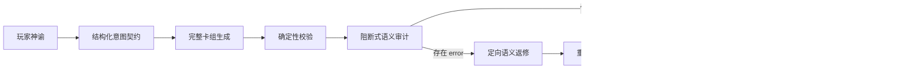

# 创世意图契约与语义质量门设计

日期：2026-07-29

## 1. 背景

现有创世流水线已经具备 JSON Schema、稳定引用、时间序号、锚点状态和材料继承校验，也会对 IP 世界执行一次报告型语义审计。但这些能力没有阻止以下问题进入草稿世界：

- 玩家神谕“无职转生，但是鲁迪是托尼斯塔克转生”被扩张为托尼版鲁迪、玩家工匠神和独立贾维斯神格三个叙事中心；
- 水神、剑神等武术称号持有者因为名称含“神”被放入神谱；
- 模型编造原作地名、人物身份、势力信仰和宇宙规则，并用 `provenance.evidence` 自我背书；
- 出生锚点已经存在地下工坊、方舟反应堆和未来人物关系；
- 科技与魔法的关系被直接宣布为等价，没有实验、材料和失败成本；
- 纪元冲突与玩家神谕没有直接因果关系。

根因不是单条提示词遗漏，而是流水线缺少两个边界：生成前没有冻结“系统如何理解玩家神谕”，生成后语义审计只报告、不返修也不阻断落库。

## 2. 已确认的产品决策

1. 保持 `pantheon` 的神祇扮演定位。玩家仍是世界内独立神明，不直接成为转生主角。
2. 当神谕指定“某角色转生为主角”时，该转生角色是叙事中心；玩家神只作为观察者、庇护者或有限干预者。
3. 原作事实采用“宁缺毋滥”策略。模型不确定时必须省略、泛化或显式降级为演绎设定，不能编造具体正史事实。
4. 严重语义错误必须自动返修；返修后仍存在严重错误时，不保存问题世界。
5. 不自动改写既有世界。新约束适用于新世界；旧世界在首次重掷时懒生成意图契约。

## 3. 目标与非目标

### 3.1 目标

- 在完整卡组生成前冻结玩家神谕的核心承诺、叙事中心、玩家角色、锚点事实和禁止扩张项；
- 防止玩家神、跨界角色和模型原创实体争夺叙事中心；
- 防止称号、职业、强者或程序被错误归类为神；
- 防止未来资产、关系、知识和技术成果泄漏到开局状态；
- 让融合设定保留未知、限制和验证过程，而不是用“量子”“代码”“回路”等词直接宣布体系等价；
- 将现有报告型语义审计升级为有界的质量门；
- 让重掷、克隆、导出和导入持续遵守同一份意图契约；
- 用稳定的模拟测试复现本次错误，不依赖真实模型随机输出。

### 3.2 非目标

- 不建设通用的外部百科检索或全 IP 正史数据库；
- 不保证模型掌握所有作品的冷门细节；
- 不新增“玩家直接扮演凡人主角”的第三种世界模式；
- 不自动重写已经生成并保存的旧世界；
- 不让语义审计无限返修或无限消耗模型额度。

## 4. 总体架构



契约负责“理解正确”，卡组生成负责“展开完整”，确定性校验负责“结构正确”，语义审计负责“世界意义正确”。四者职责不得混合。

## 5. 创世意图契约

### 5.1 数据结构

新增结构化类型 `GenesisIntentContract`：

```ts
type GenesisIntentContract = {
  sourceBasis: "original" | "single_ip" | "multi_ip";
  sourceIps: string[];
  explicitPremise: string[];
  narrativeCenter: {
    identity: string;
    role: string;
    startState: string;
  };
  playerRole: {
    type: "independent_god" | "external_creator";
    narrativeFunction: "observer_patron" | "limited_intervener" | "external_author";
    mustNotReplaceProtagonist: boolean;
  };
  forbiddenExpansions: string[];
  factsAtAnchor: string[];
  futureOnly: string[];
  fusionBoundaries: string[];
  uncertaintyPolicy: "omit_or_generalize";
  corePressures: string[];
};
```

数组字段应设置合理上限，避免契约本身变成第二份世界卡组。契约使用独立 Zod Schema，并通过结构化生成接口返回。

### 5.2 权威顺序

完整生成和后续重掷统一使用以下权威顺序：

1. 玩家原始神谕；
2. 玩家上传的权威世界书；
3. 从前两者推导并冻结的意图契约；
4. 已锁定的时间锚点和本世界已发生事件；
5. 模型自身的原作知识；
6. 自由演绎。

意图契约只能解释神谕，不能覆盖神谕。`explicitPremise` 必须保留玩家明确陈述的核心命题，不得用模型推测替换；结构校验负责模式等可判定约束，最终语义审计同时读取原始神谕和契约，负责拦截无法确定性判断的曲解。

### 5.3 模式约束

- `pantheon`：`playerRole.type` 必须为 `independent_god`，且 `mustNotReplaceProtagonist=true`；
- `creator`：`playerRole.type` 必须为 `external_creator`，玩家不得成为世界内实体；
- 每份契约必须只有一个 `narrativeCenter`；
- `factsAtAnchor` 与 `futureOnly` 不得表达同一事实；
- IP 世界的 `uncertaintyPolicy` 固定为 `omit_or_generalize`。

### 5.4 本次案例的期望契约

对“无职转生，但是鲁迪是托尼斯塔克转生”，契约至少应表达：

- 叙事中心是转生后的托尼版鲁迪；
- 玩家是独立、低调干预的神明，不是鲁迪本人；
- 托尼开局只保留人格、记忆与工程思维；
- 开局没有装甲、反应堆、地下工坊和可运行的贾维斯；
- 不得创建独立贾维斯神格或其他机械叙事中心；
- 科技知识只能提出假设，魔力与电力、符文与代码是否兼容仍待验证；
- 主要压力来自婴儿身体、资源不足、隐瞒异常、魔力实验和谨慎改变历史。

## 6. 完整卡组生成规则

### 6.1 输入

完整卡组生成同时接收：

- 原始玩家神谕；
- 冻结的 `GenesisIntentContract`；
- 可选世界书材料；
- 世界模式规则；
- 卡组 JSON Schema。

提示词明确要求逐项遵守契约，并禁止以丰富度、卡片配额或戏剧性为理由覆盖契约。

### 6.2 神谱规则

- 取消 IP 世界必须生成 6–9 位主神的要求；
- IP 世界允许只生成 1–5 位高置信神性实体；
- `minorGods` 可以为空，但每个条目仍需通过神性门槛；
- 强者、武术称号持有者、势力领袖、魔王、程序和未来角色不得用于补足神谱数量；
- 若一个实体是否真正神圣存在争议，宁可转入人物或势力卡，也不放入神谱；
- faction 的 `faith` 字段允许明确写“无统一神祇信仰”或作品内真实宗教，不得为了填字段捏造秘密信仰。

`pantheon` 模式的戏剧张力不再依赖神明数量。神明不足时，冲突可来自凡人势力、资源限制、信仰缺失和玩家神干预成本。

### 6.3 玩家神规则

- 玩家神与叙事中心必须是不同实体；
- 玩家神不得继承转生主角的专属装备、助手、身份或成果；
- 玩家神的能力只允许有限观察、启示或代价明确的干预；
- 玩家神的信仰基础、能力成本和当前关系必须在锚点时刻已经有因果来源；
- 不得引用尚未建立的工坊、信徒、技术网络或未来关系；
- 开篇默认使用契约指定的叙事中心视角，不因 `pantheon` 模式自动切换到神界概览。

### 6.4 融合规则

将 `fusionAxiom` 从“宣布体系等价”改为四类信息：

```ts
type FusionAxiom = {
  sourceIps: string[];
  establishedRules: string[];
  openQuestions: string[];
  hardLimits: string[];
  conflictRule: string;
};
```

- `establishedRules`：锚点时刻已有依据的跨世界事实；
- `openQuestions`：需要角色通过观察和实验回答的问题；
- `hardLimits`：身体、材料、工具、知识、能量和社会条件限制；
- `conflictRule`：设定冲突时采用哪一世界的底层规律。

禁止使用“量子”“代码”“回路”“高维”等词替代因果解释。专业术语出现时，必须同时说明可观察依据、限制或失败条件。

为兼容已保存的旧卡组，读取 Schema 暂时接受旧版 `axioms/powerMapping/conflictRule` 形状和新版形状；服务端把旧形状归一为只读兼容视图。只有新生成和新重掷结果必须输出新版结构，不能因为 Schema 演进导致旧世界无法打开。

### 6.5 锚点资产测试

所有当前地点、能力、关系、知识、资源和技术成果必须能回答：

> 它为什么在锚点时刻已经存在？

没有锚点原因的内容只能进入 `futureOnly`、`canonEvents`、`openQuestions` 或 `hintOnly`，不能写入当前卡片。出生开局默认禁止预先存在的个人工坊、成熟设备、未来导师关系、已识别的宿敌关系和未发生事件带来的知识。

### 6.6 因果相关性测试

每条核心冲突执行“删除神谕测试”：如果移除玩家神谕的核心变化后，该冲突仍基本不变，它只能作为背景压力，不能占据主要冲突或第一章目标。

## 7. 阻断式语义审计

### 7.1 审计类型

在现有时间语义问题之外新增：

- `premise_drift`：偏离玩家神谕或冻结契约；
- `narrative_center_duplication`：产生多个相互争夺焦点的主角或机械神格；
- `ontology_mismatch`：把称号、职业、强者、程序或普通角色放入错误类别；
- `unsupported_canon_claim`：把无依据或低置信内容断言为原作事实；
- `anchor_state_leak`：把未来资产、关系、知识或成果写成锚点当前状态；
- `power_shortcut`：绕过身体、材料、工具、学习或代价直接获得成果；
- `unsupported_fusion_rule`：用术语宣布两个体系等价而没有依据和限制；
- `causal_disconnect`：核心冲突与玩家神谕无因果联系；
- `information_leak`：公开字段、视角知识或开篇泄露作者侧秘密。

### 7.2 结果结构

每条问题包含：

```ts
type GenesisSemanticIssue = {
  type: GenesisSemanticIssueType;
  severity: "warning" | "error";
  path: string;
  evidenceRefs: string[];
  explanation: string;
  repairInstruction: string;
};
```

应用层根据问题类型和字段确定最低严重度，不完全信任模型自报：例如叙事中心重复、类别错误、当前状态泄漏和明确原作事实冲突最低为 `error`。审计结果的 verdict 由问题清单确定性归一。

### 7.3 审计范围

- IP 世界执行全部审计；
- 原创世界跳过正史类检查，但仍执行神谕偏移、类别、锚点状态、力量捷径、因果和信息边界检查；
- 审计失败不能静默视为通过。正常创世中审计调用自身失败时自动重试一次；仍失败则任务失败。

## 8. 定向语义返修

当审计存在 `error` 时，修复调用接收：

- 原始神谕；
- 冻结契约；
- 当前完整卡组；
- 问题类型、路径、证据、说明和定向修复指令；
- 玩家锁定字段和材料约束。

修复模型必须只修改问题字段及其必要的引用依赖。修复后依次执行：

1. WorldDeck Schema；
2. 稳定引用校验；
3. 时间一致性校验；
4. 材料继承校验；
5. 语义复审。

语义返修最多一次。复审仍有 `error` 时，创世任务失败且不调用 `persistWorld`。仅有 warning 时允许保存，并在确认页展示。

## 9. 持久化与兼容

### 9.1 数据库

在 `World` 增加 nullable JSON 字段：

```prisma
genesisIntent Json? @map("genesis_intent")
```

在 `GenesisTask` 同时增加 nullable JSON 字段：

```prisma
intentContract Json? @map("intent_contract")
```

新创世任务必须先获得有效契约，将其写入任务后再启动完整卡组生成，并在保存世界时复制到 `World.genesisIntent`。这样进程重启、瞬时故障重排队和租约接管都复用同一契约，不会再次解释神谕并产生漂移。

### 9.2 旧世界

- `genesisIntent=null` 的旧世界继续可读取、游玩和导出；
- 旧世界第一次重掷时，根据 `genesisInput`、mode 和可用世界书懒生成契约；
- 懒生成失败时本次重掷失败，不回退到无契约重掷；
- 不后台批量重写旧世界，不改变已有卡片内容。

### 9.3 生命周期

克隆、导出、导入和相关 ID 重映射必须保留意图契约。契约内容使用文字承诺而非数据库实体 ID，避免克隆和导入时产生额外引用修复面。

## 10. 确认页与任务反馈

确认页顶部新增只读“神谕理解”摘要，展示：

- 叙事中心；
- 玩家身份与干预方式；
- 开局状态；
- 融合边界；
- 禁止扩张项；
- 核心压力。

warning 以可展开列表展示问题路径和说明，但不阻止用户创世。error 不进入确认页：系统先自动返修；返修后仍失败时，任务页显示安全裁剪后的问题摘要。

普通公开接口不暴露完整内部契约。世界所有者在创世确认和导出场景可以获得必要摘要或完整备份。

## 11. 调用与成本边界

正常创世：

1. 一次短结构化契约调用；
2. 一次完整卡组生成；
3. 一次语义审计。

异常创世最多增加：

1. 一次语义返修；
2. 一次返修后复审。

契约调用失败和审计传输失败各允许一次基础设施重试；语义内容返修只允许一次。结构性生成修复保留现有上限，但不得绕过最终语义质量门。

## 12. 测试策略

### 12.1 契约单元测试

- Schema 接受合法的 pantheon/creator 契约；
- pantheon 拒绝玩家成为凡人主角；
- creator 拒绝玩家成为世界内实体；
- 检测 `factsAtAnchor` 与 `futureOnly` 的直接重复；
- IP 世界固定 `omit_or_generalize`；
- 契约提示词包含原始神谕、世界书和模式边界。

### 12.2 生成提示词测试

- 完整生成和修复提示词都包含冻结契约；
- 神谱规则明确允许少于六位神，并禁止按名称中的“神”分类；
- 玩家神不得继承转生主角的助手、装备和成果；
- 融合规则包含已知、问题、限制和冲突裁决四部分；
- 重掷提示词携带契约和锚点资产测试。

### 12.3 语义质量门测试

使用固定错误卡组模拟本次案例，断言审计能表达：

- 独立贾维斯神格导致叙事中心重复；
- 水神和剑神称号持有者进入神谱属于类别错误；
- 虚构领地和错误人物身份属于无依据正史断言；
- 新生儿宅邸已有地下工坊属于锚点状态泄漏；
- 婴儿直接构建反应堆属于力量捷径；
- “魔力回路即集成电路”属于无依据融合规则；
- 税收与种族偏见只能作为背景压力。

流水线测试使用模拟审计结果，验证：

- 仅 warning 时直接保存；
- error 触发一次定向返修；
- 返修后通过时保存修复卡组；
- 返修后仍有 error 时不调用 `persistWorld`；
- 审计调用持续失败时不静默落库。

### 12.4 生命周期测试

- 新世界保存 `genesisIntent`；
- 创世任务重启或租约接管后复用已冻结的 `intentContract`；
- 旧世界读取兼容；
- 旧版 `fusionAxiom` 可读取，新生成结果只写新版结构；
- 旧世界首次重掷懒生成契约；
- 克隆、导出、导入保留契约；
- 单卡重掷不能重新引入契约禁止项。

### 12.5 固定回归神谕

固定案例：

> 无职转生，但是鲁迪是托尼斯塔克转生

测试不调用真实模型，而使用固定契约、错误卡组、审计输出和修复输出，确保结果稳定可复现。验收断言为：

1. 托尼版鲁迪是唯一叙事中心；
2. 玩家是独立神明；
3. 没有独立贾维斯神格；
4. 出生锚点没有工坊、装甲和反应堆；
5. 科技与魔法关系是待验证问题；
6. 武术称号持有者不进入神谱；
7. 主要冲突与转生神谕有直接因果关系。

## 13. 上线与观测

上线后记录以下不含世界正文的聚合指标：

- 契约生成失败率；
- 首次语义审计 error/warning 比例；
- 各 issue type 出现次数；
- 语义返修成功率；
- 因残留 error 终止的任务比例；
- 平均新增调用次数和耗时。

如果残留 error 终止率过高，优先修正契约提示词、生成提示词或审计误报，不通过放宽质量门来掩盖问题。

## 14. 完成标准

- 新创世任务在完整生成前获得并冻结有效意图契约；
- 卡组生成、结构修复、语义修复和重掷均接收同一契约；
- IP 世界不再因神谱数量要求用普通强者补位；
- error 级语义问题无法进入世界草稿；
- warning 可见但不阻断；
- 旧世界保持兼容，首次重掷可懒生成契约；
- 克隆、导出、导入保留契约；
- 固定回归案例与相关单元、流水线、生命周期测试通过；
- 类型检查、相关 lint、生产构建通过。
