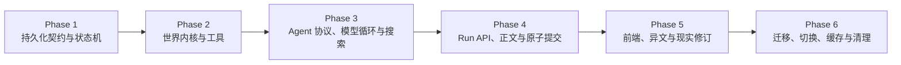

# World Director Runtime Implementation Roadmap

> **For agentic workers:** REQUIRED SUB-SKILL: Use superpowers:subagent-driven-development (recommended) or superpowers:executing-plans to implement this plan task-by-task. Steps use checkbox (`- [ ]`) syntax for tracking.

**Goal:** 用可回滚、可分阶段验证的方式，将现有“正文 + META + settlement”主链路一次性切换为持久化世界导演 Agent 运行时。

**Architecture:** 实施被拆成六个有依赖顺序的计划。前五个阶段只增加能力或在隔离路径中运行；第六阶段完成旧数据基线、正式路由切换和旧事实生成链路移除。每阶段都有独立测试门槛，未通过时不得进入下一阶段。

**Tech Stack:** Next.js 16.2.10 Route Handlers、React 19、TypeScript 5、Prisma 7/PostgreSQL、Zod 4、Vitest 4、SSE、现有 LLM Gateway

---

## 实施前保护规则

当前 `master` 工作区存在大量未提交改动。执行任何阶段前必须：

1. 先处理或保存现有工作区改动；
2. 使用 `codex/` 前缀创建专用实现分支或隔离 worktree；
3. 不修改或提交以下现有未跟踪项：

   ```text
   .superpowers/
   current-play-ui.png
   prisma/migrations/20260724053824/
   ```

4. 每次提交前运行 `git diff --cached --name-only`，只提交当前任务列出的文件；
5. 源码修改遵守 `C:/创世/AGENTS.md`：语义修改只使用原生 `apply_patch`，机械替换先 dry-run；
6. 修改 Next.js Route Handler 前，以本项目安装的文档为准：

   ```text
   node_modules/next/dist/docs/01-app/01-getting-started/15-route-handlers.md
   ```

---

## 阶段依赖



---

## 计划索引

### Phase 1：持久化契约与状态机

文件：

```text
docs/superpowers/plans/2026-07-24-world-director-phase-1-foundation.md
```

交付：

- Prisma 持久化模型；
- `WorldDirectorRun` 状态机；
- 调用与修正预算；
- Run 租约和幂等创建；
- 不接入正式游戏写路径。

完成门槛：

- schema integrity、状态机、预算、租约测试通过；
- `pnpm prisma validate` 和 `pnpm build` 通过；
- 旧 `/api/chat` 行为不变。

### Phase 2：世界内核与工具

文件：

```text
docs/superpowers/plans/2026-07-24-world-director-phase-2-kernel.md
```

交付：

- `DraftChangeSet` 变化代数；
- 确定性草案构建和序列化；
- `inspect_world`；
- 身份、状态、时间、现实和有界因果校验；
- 正式与反向 `ChangeSet` 编译；
- 同步投影计划。

完成门槛：

- 工具零副作用测试通过；
- 非法跨现实引用、重复对象、非法能力和无因果变化全部被拒绝；
- 编译结果与输入顺序无关；
- 不接入正式游戏写路径。

### Phase 3：Agent 协议、Provider 能力与外部搜索

文件：

```text
docs/superpowers/plans/2026-07-24-world-director-phase-3-agent.md
```

交付：

- L0/L1/L2/L3 Prompt Compiler；
- 追加式对话；
- 原生 Tool Calling、Structured Output、Text Agent Frame 统一协议；
- Provider 能力探测；
- 最多四次调用和两次修正的 Agent Loop；
- 受控 `search_external`；
- 隔离的规划模式和叙事模式。

完成门槛：

- 三种协议至少各有 Adapter 单元测试；
- Text Agent Frame 不会泄漏到正文；
- 搜索结果不能直接产生 mutation；
- 同一 Run 的消息链只追加、不重排；
- 仍不替换正式 `/api/chat`。

### Phase 4：持久 Run API、正文证据与原子提交

文件：

```text
docs/superpowers/plans/2026-07-24-world-director-phase-4-runtime.md
```

交付：

- Controller、Worker、恢复和 SSE；
- NarrationContract、段落暂显和双向证据审计；
- World Kernel 原子提交；
- 同步更新人物、神明、能力、关系、动态、编年史和本轮变化；
- 新 `/api/agent-runs` 路径；
- shadow mode 端到端运行。

完成门槛：

- 每个事务步骤的故障注入均不留下半轮结果；
- 刷新、断线和 Worker 接管不重复模型调用；
- shadow mode 不写正式世界；
- commit mode 在隔离测试数据库正确更新全部投影。

### Phase 5：前端流程、异文与现实修订

文件：

```text
docs/superpowers/plans/2026-07-24-world-director-phase-5-experience.md
```

交付：

- 游戏页面接入 Run API；
- 初次进入自动观察；
- 五阶段进度和暂显正文；
- 返回主菜单后恢复同一 Run；
- 异文、朱批、裁去和重新生成按 Run/ChangeSet 工作；
- 最新轮次原地重算，历史轮次自动分叉；
- 玩家界面完全按时间，不显示章节流程。

完成门槛：

- 初始正文无需点击；
- 纯查询不创建 Run；
- 修改正文不会造成状态脱节；
- 现实树不显示章节号；
- E2E 覆盖最新和历史修订。

### Phase 6：旧数据迁移、正式切换、缓存观测和旧链路移除

文件：

```text
docs/superpowers/plans/2026-07-24-world-director-phase-6-cutover.md
```

交付：

- LegacyRun 和 `CutoverBaselineCheckpoint` 迁移；
- 基线 Hash 和完整性报告；
- Provider 缓存能力真实观测；
- world-director 缓存统计；
- 正式写路径切换；
- META 和 settlement LLM 退出事实生成链路；
- 旧 `/api/chat` 写入禁用；
- 数据库备份与回滚手册。

完成门槛：

- 所有现实基线 Hash 通过；
- 正式 Provider 通过至少一种 Agent 协议探测；
- 若启用搜索，可保存真实来源；
- 至少一个支持缓存的 Provider 完成 L0/L1/Run 内命中验证；
- 旧链路无法写入新世界事实；
- 全量测试、集成测试和生产构建通过。

---

## 全局验证命令

每阶段结束运行：

```powershell
pnpm test
pnpm test:integration
pnpm prisma validate
pnpm exec tsc --noEmit
pnpm lint
pnpm build
git diff --check
git status --short
```

预期：

- 所有命令退出码为 `0`；
- `git diff --check` 无空白错误；
- staged diff 只包含当前任务文件；
- 不出现新的 META 泄漏、孤立对象或半事务数据。

---

## 正式切换前的不可逆门槛

以下条件同时满足前，不得执行 Phase 6 的正式路由切换：

1. Phase 1–5 全部提交并通过门槛；
2. 最新备份已验证可以恢复；
3. 所有活动现实已生成可信基线；
4. Agent Provider 探测结果为可用；
5. shadow mode 代表性输入全部通过；
6. 原子故障注入全部通过；
7. 前端能够恢复正在运行的 Run；
8. 异文、朱批和裁去已经按 `ChangeSet` 工作；
9. 新世界事实不再依赖第二次 LLM 整理；
10. 已准备临时只读方案，且明确禁止回退旧 META 写入。
